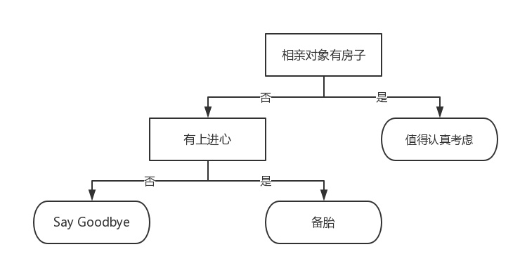
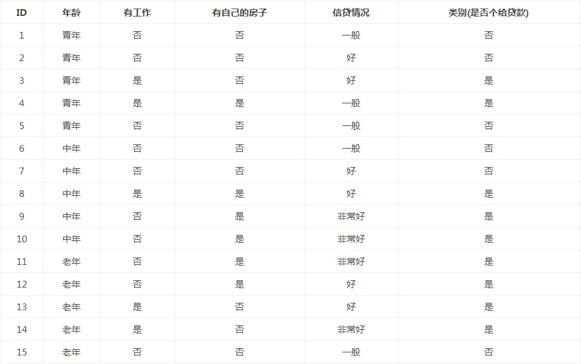

# 决策树

**决策树**(DTs)是一种用于[分类](http://scikit-learn.org.cn/view/89.html#1.10.1 分类)和[回归](http://scikit-learn.org.cn/view/89.html#1.10.2 回归)的非参数有监督学习方法。其目标是创建一个模型，通过学习从数据特性中推断出的简单决策规则来预测目标变量的值。

如下图所示的流程图就是一个决策树，长方形代表 **判断模块(decision block)**，椭圆形成代表 **终止模块(terminating block)**，表示已经得出结论，可以终止运行。从判断模块引出的左右箭头称作为 **分支(branch)**，它可以达到另一个判断模块或者终止模块。我们还可以这样理解，分类决策树模型是一种描述对实例进行分类的树形结构。决策树由 **结点(node)** 和 **有向边(directed edge)** 组成。结点有两种类型：**内部结点(internal node)** 和 **叶结点(leaf node)**。内部结点表示一个特征或属性，叶结点表示一个类。蒙圈没？？如下图所示的决策树，长方形和椭圆形都是结点。长方形的结点属于内部结点，椭圆形的结点属于叶结点，从结点引出的左右箭头就是有向边。而最上面的结点就是决策树的 **根结点(root node)**。



使用决策树做预测需要以下过程：

- 收集数据：可以使用任何方法。比如想构建一个相亲系统，我们可以从媒婆那里，或者通过采访相亲对象获取数据。根据他们考虑的因素和最终的选择结果，就可以得到一些供我们利用的数据了。
- 准备数据：收集完的数据，我们要进行整理，将这些所有收集的信息按照一定规则整理出来，并排版，方便我们进行后续处理。
- 分析数据：可以使用任何方法，决策树构造完成之后，我们可以检查决策树图形是否符合预期。
- 训练算法：这个过程也就是构造决策树，同样也可以说是决策树学习，就是构造一个决策树的数据结构。
- 测试算法：使用经验树计算错误率。当错误率达到了可接收范围，这个决策树就可以投放使用了。
- 使用算法：此步骤可以使用适用于任何监督学习算法，而使用决策树可以更好地理解数据的内在含义。

决策树的构建通常要分为3个步骤：**特征选择**、**决策树的生成** 和 **决策树的修剪**

1. **特征选择**

   简单来说就是属性与属性值，特征空间的选择。比如



我们可以对数据集进行属性标注

- 年龄：0代表青年，1代表中年，2代表老年；
- 有工作：0代表否，1代表是；
- 有自己的房子：0代表否，1代表是；
- 信贷情况：0代表一般，1代表好，2代表非常好；
- 类别(是否给贷款)：no代表否，yes代表是。

其中还有有关信息熵的数学问题，很多没学过就不在这里多说

2. **决策树的生成和修剪**

构建决策树的算法有很多，比如C4.5、ID3和CART，这些算法在运行时并不总是在每次划分数据分组时都会消耗特征。由于特征数目并不是每次划分数据分组时都减少，因此这些算法在实际使用时可能引起一定的问题。目前我们并不需要考虑这个问题，只需要在算法开始运行前计算列的数目，查看算法是否使用了所有属性即可。

决策树生成算法递归地产生决策树，直到不能继续下去未为止。这样产生的树往往对训练数据的分类很准确，但对未知的测试数据的分类却没有那么准确，即出现过拟合现象。过拟合的原因在于学习时过多地考虑如何提高对训练数据的正确分类，从而构建出过于复杂的决策树。解决这个问题的办法是考虑决策树的复杂度，对已生成的决策树进行简化。

## 分类 

**DecisionTreeClassifier（决策树分类器）** 是一个能够在数据集上执行多类分类的类。

与其他分类器一样，[`DecisionTreeClassifier`]使用两个数组作为输入：形状为`[n_samples, n_features]`的数组(稀疏或稠密)，以及整数值数组，形状`[n_samples]`，保存训练样本的类标签：

```python
from sklearn import tree
X = [[0,0],[1,1]]
Y = [0,1]
clf = clf = tree.DecisionTreeClassifier()
clf = clf.fit(X, Y)
```

经拟合后，该模型可用于预测其他样本的类别：

```python
>>> clf.predict([[2., 2.]])
array([1])
```

或者，可以预测属于每一类别的概率，即同一类的训练样本在一片叶子中的分数：

```python
>>> clf.predict_proba([[2., 2.]])
array([[0., 1.]])
```

[`DecisionTreeClassifier`] 既能够进行二分类(其中标签为[-1，1])，也能够进行多类分类(其中标签为[0，…K-1])分类。

使用Iris数据集，我们可以构建如下树：

```python
>>> from sklearn.datasets import load_iris  	//导入鸢尾花的数据集
>>> from sklearn import tree
>>> X, y = load_iris(return_X_y=True)
>>> clf = tree.DecisionTreeClassifier()
>>> clf = clf.fit(X, y)
```

**DecisionTreeClassifier（决策树分类器）** 是一个构造决策树的类。

```python
class sklearn.tree.DecisionTreeClassifier(*, criterion='gini', splitter='best', max_depth=None, min_samples_split=2, min_samples_leaf=1, min_weight_fraction_leaf=0.0, max_features=None, random_state=None, max_leaf_nodes=None, min_impurity_decrease=0.0, min_impurity_split=None, class_weight=None, presort='deprecated', ccp_alpha=0.0)
```

各个参数都有特定的意义不在此多说详见：

[sklearn.tree.DecisionTreeClassifier](https://scikit-learn.org.cn/view/784.html)

## 回归

决策树也可以应用于回归问题，使用 **DecisionTreeRegressor（决策树回归器）**

与分类的设置一样，fit方法需要参数数组X和y，只是在这种情况下，y可以有浮点数值，而不是整数值：

```python
>>> from sklearn import tree
>>> X = [[0, 0], [2, 2]]
>>> y = [0.5, 2.5]
>>> clf = tree.DecisionTreeRegressor()
>>> clf = clf.fit(X, y)
>>> clf.predict([[1, 1]])
array([0.5])
```

同样 **DecisionTreeRegressor（决策树回归器）** 也有许多参数详见：

[sklear.tree.DecisionTreeRegreessor]([sklearn.tree.DecisionTreeRegressor-scikit-learn中文社区](https://scikit-learn.org.cn/view/785.html))

