# Java学习

[TOC]

**Eclipse常用快捷键介绍**

Alt+/ 候选提示
Ctrl + i：规范代码格式单行
Ctrl+Shift+F 格式化当前代码
Ctrl + shift +M :import 类的路径(包括Java的标准类以及自己定义的类)
Ctrl+shift+T: 查找工程下某一个类的源代码,(包括Java的标准类以及自己定义的类)
Ctrl+shift+/: 注释掉一段代码块.
选择某个方法或者类对象名，按下Ctrl键, 点击鼠标,可以查看方法代码或者类的实现.
Ctrl+D删除当前行
Ctrl+1 快速修复(最经典的快捷键,就不用多说了)

## 第 2 章 基本数据类型与数组

### 2.1 标识符与关键字

**标识符**：

1. **定义**

- 给包,类,方法,变量起名字的符号

2. **组成规则**

- 标识符由字母、数字、下划线、美元符号组成

3. **命名规则**

包名：全部小写，多级包用.隔开。
举例：com.jourwon

- 类、接口：一个单词首字母大写，多个单词每个单词的首字母大写。
  举例：Student,Car,HelloWorld
- 方法和变量：一个单词首字母小写，多个单词从第二个单词开始每个单词的首字母大写。
  举例：age,maxAge,show(),getAge()
- 常量：如果是一个单词,所有字母大写，如果是多个单词,所有的单词大写,用下划线区分每个单词。
  举例：DATE,MAX_AGE
- 项目名：全部用小写字母，多个单词之间用横杆-分割。
  举例：demo，spring-boot

4. **注意事项**

- 不能以数字开头
- 不能是Java中的关键字
- Java标识符大小写敏感，长度无限制
- 标识符不能包含空格

**Java关键字**

| 关键字       | 含义                                                         |
| :----------- | :----------------------------------------------------------- |
| abstract     | 表明类或者成员方法具有抽象属性                               |
| assert       | 用来进行程序调试                                             |
| boolean      | 基本数据类型之一，布尔类型                                   |
| break        | 提前跳出一个块                                               |
| byte         | 基本数据类型之一，字节类型                                   |
| case         | 用在switch语句之中，表是其中的一个分支                       |
| catch        | 用在异常处理中，用来捕捉异常                                 |
| char         | 基本数据类型之一，字符类型                                   |
| class        | 类                                                           |
| const        | 保留关键字，没有具体含义                                     |
| continue     | 回到一个块的开始处                                           |
| default      | 默认，例如，用在switch语句中，表明一个默认的分支             |
| do           | 用在do-while循环结构中                                       |
| double       | 基本数据类型之一，双精度浮点数类型                           |
| else         | 用在条件语句中，表明当条件不成立时的分支                     |
| enum         | 枚举                                                         |
| extends      | 表明一个类型是另一个类型的子类型，这里常见的类型有类和接口   |
| final        | 用来说明最终属性，表明一个类不能派生出子类，或者成员方法不能被覆盖，或者成员域的值不能被改变 |
| finally      | 用于处理异常情况，用来声明一个基本肯定会被执行到的语句块     |
| float        | 基本数据类型之一，单精度浮点数类型                           |
| for          | 一种循环结构的引导词                                         |
| goto         | 保留关键字，没有具体含义                                     |
| if           | 条件语句的引导词                                             |
| implements   | 表明一个类实现了给定的接口                                   |
| import       | 表明要访问指定的类或包                                       |
| instanceof   | 用来测试一个对象是否是指定类型的实例对象                     |
| int          | 基本数据类型之一，整数类型                                   |
| interface    | 接口                                                         |
| long         | 基本数据类型之一，长整数类型                                 |
| native       | 用来声明一个方法是由与计算机相关的语言（如C/C++/FORTRAN语言）实现的 |
| new          | 用来创建新实例对象                                           |
| package      | 包                                                           |
| private      | 一种访问控制方式：私用模式                                   |
| protected    | 一种访问控制方式：保护模式                                   |
| public       | 一种访问控制方式：共用模式                                   |
| return       | 从成员方法中返回数据                                         |
| short        | 基本数据类型之一,短整数类型                                  |
| static       | 表明具有静态属性                                             |
| strictfp     | 用来声明FP_strict（单精度或双精度浮点数）表达式遵循IEEE 754算术规范 |
| super        | 表明当前对象的父类型的引用或者父类型的构造方法               |
| switch       | 分支语句结构的引导词                                         |
| synchronized | 表明一段代码需要同步执行                                     |
| this         | 指向当前实例对象的引用                                       |
| throw        | 抛出一个异常                                                 |
| throws       | 声明在当前定义的成员方法中所有需要抛出的异常                 |
| transient    | 声明不用序列化的成员域                                       |
| try          | 尝试一个可能抛出异常的程序块                                 |
| void         | 声明当前成员方法没有返回值                                   |
| volatile     | 表明两个或者多个变量必须同步地发生变化                       |
| while        | 用在循环结构中                                               |

**注：**true,false和null看起来像关键字，但它们实际上是文字；不能在程序中将它们作为标识符

### 2.2 基本数据类型

1. **分类**

- 基本数据类型
  - 数值型
    - 整数型(byte,short,int,long)
    - 浮点类型(float,double)
  - 字符型(char)
  - 布尔型(boolean)
- 引用数据类型
  - 类(class)
  - 接口(interface)
  - 数组([])


**注：**变量赋值时最好带上类型

```java
int x = 50;
float y = 50.1f;
long z = 1000l;
```


### 2.3 数据类型转换

- 定义

  - 数据类型的转换是在所赋值的数值类型和被变量接收的数据类型不一致时发生的，它需要从

    一种数据类型转换成另一种数据类型。

- 分类

  1. 隐式转换

     - 定义
       在运算过程中，由于不同的数据类型会转换成同一种数据类型，所以整型、浮点型以及字符型都可以参与混合运算。自动转换的规则是从低级类型数据转换成高级类型数据。

     - 转换规则

       数值型数据的转换：byte→short→int→long→float→double。
       字符型转换为整型：char→int。

     - 转换条件
       自动类型转换的实现需要同时满足两个条件：①两种数据类型彼此兼容，②目标类型的取值范围大于源数据类型（低级类型数据转换成高级类型数据）。例如 byte 类型向 short 类型转换时，由于 short 类型的取值范围较大，会自动将 byte 转换为 short 类型。

  2. 显式转换

     - 定义
       当两种数据类型不兼容，或目标类型的取值范围小于源类型时，自动转换将无法进行，这时就需要进行强制类型转换。
     - 语法格式
       目标类型 变量名 = (目标类型) (被转换的数据);
       举例：int b = (byte)(a + b);
     - 注意
       如果超出了被赋值的数据类型的取值范围得到的结果会与你期望的结果不同
       不建议强制转换，因为会有精度的损失。

### 2.4 输入、输出数据

1. **输入基本数据类型**

**Scanner**是 JDK1.5 新增的一个类，可以使用该类创建一个对象

```java
Scanner reader = new Scanner(System.in)
```

然后 **reader** 对象调用下列方法，来输入基本数据类型

```java
reader.nextBoolean(),reader.nextShort(),reader.nextInt(),reader.nextLong(),reader.nextFloat(),reader.nextDouble()
```

**例子**：

```java
//引入Scanner类
import java.util.Scanner;
public class Example{
	public static void main (String args[ ]){
		System.out.println("请输入若干数，每输入一个数回车确认");
		System.out.println("最后输入数字0结束输入操作");
		//创建一个Scanner类的对象并命名为reader
        Scanner reader = new Scanner(System.in);
        double sum = 0;
        //读入double类
        double x = reader.nextDouble();
        while(x != 0)
        {
            sum = sum + x;
            x = reader.nextDouble();
        }
        System.out.println("sum = "+sum);
	}
}
```

2. 输出基本数据类型

**System.out.println()** 或 **System.out.print()** 可输出串值、表达式的值，二者区别是前者输出数据有换行后者没换行。允许使用 **+** 将 **变量** 、**表达式** 或一个 **常数值** 与一个 **字符串** 并置一起输出，如

```java
System.out.println(m+"个数和为"+sum);
System.out.print(":"+123+"大于"+122);
```

注：**System.out.println()** 和**System.out.print()**中不能有 **空格**

JDK1.5中新增了和C语言中 **printf** 函数的输出数据的方法，格式如下：

```java
System.out.printf("格式控制部分",表达式1,表达式2,表达式3,···,表达式n);
```

格式控制符号%d,%c,%f,%s和普通字符组成 

1. %d：输出 **int** 类型数据
2. %c：输出 **cahr** 型数据
3. %f：输出 **浮点型** 数据，小数部分最多保留6位
4. %s：输出 **字符串** 数据

**注：**

1. %md：输出 **int** 型数据占 **m** 列
2. %m.nf：输出的 **浮点型** 数据占 **m** 列，小数点保留 **n** 位

### 2.5 数组

**声明数组**

```java
//声明一维数组
数组元素类型 数组名 [];
数组元素类型 [] 数组名;

eg:
float boy[];
char [] cat;
int [] a,b; 	//== int a[],b[];

//声明二维数组
char cat[][];
float [][] boy;

//注：
int [] a,b[]; == int a[],b[][];
//Java与C/C++不同，不允许在声明数组的方括号内指定数组元素的个数
int a[12];//error
int [12] a;//error
```

**为数组分配元素**

```java
//为元素分配元素格式如下
数组名 = new 数组元素的类型[数组元素的个数];

eg:
//一维数组
float boy[];
boy = new float[4]; 
或
float boy = new float[4];

//二维数组
int mytwo [][];
mytwo = new int[3][4];
或：
int mytwo[][] = new int[3][4];
或
int mytwo[][] = new int[3][];
mytwo[0] = new int[1];
mytwo[1] = new int[2];
mytwo[2] = new int[3];
```

**对于数组的一些操作**

1. **数组名.length**返回数组的长度

   ```java
   float a[] = new float[12];
   int b[] =new int[3][6];
   
   a.length==12;
   b.length==3;
   b[0].length==6;
   ```

2. **数组的初始化**

   ```java
   int [] a = {1,2,3,4};
   //相当于：
   int [] a = new int[4];
   a[0]=1;a[1]=2;a[2]=3;a[3]=4;
   //同理：
   int [][] b = {{1},{1,2},{1,2,3}};
   ```

3. **数组的引用(类似指针)**

   ```java
   int [] a = {1,2,3},b = {4,5};
   a=b;
   //a，b指向的是同一个空间(a,b的引用相同)，即浅拷贝
   //注：a,b数据类型必须相同
   
   char [] a = {'西','北','农','林','科','技','大','学'};
   System.out.println(a);
   //输出：西北农林科技大学
   System.out.println(""+a);
   //输出：a的引用(相当于地址)
   //注：想输出数组的引用，必须让a和字符串做并置运算
   ```

## 第 3 章 运算符、表达式和语句

### 3.1 运算符与表达式

与C/C++相同不赘述

### 3.2 语句概述

1. 方法调用语句,eg:

   ```java
   System.out.println("Hello");
   ```

2. 表达式语句,eg:

   ```java
   x = 23;
   ```

3. 复合语句,将一些语句括起来构成复合语句，eg:

   ```java
   {
       x = 123;
       System.out.println("World!!!");
   } 
   ```

4. 空语句,只有 `;`构成的语句

5. 控制语句

    	1. 顺序结构
    	2. 分支结构
    	1. if 条件语句
    	2. switch 开关语句
    	3. 循环结构  
    	 	1. for 循环语句
    	 	2. while 循环语句
    	 	3. do-while 循环语句

6. package语句和import语句

### 3.3 if 条件语句

 **基本与C/C++相同**

```java
// if 语句
if(表达式){
    若干语句
}
    
// if-else 语句
if(表达式){
    若干语句
}
else{
    若干语句
}

// if-else if-else 语句
if(表达式){
    若干语句
}
else if(若干语句){
    若干语句
}
·
·
·
else{
    若干语句
}
```

### 3.4 switch 开关语句

**基本与C/C++相同**

```java
switch(表达式)
{
    case 变量1 :
        若干语句
        break;
    case 变量2 :
        若干语句
        break;
  	·
    ·
    ·
    case 变量n:
        若干语句
        break;
    default:
        若干语句                 
}
```

### 3.5 循环语句

**基本与C/C++相同，for 循环语句新增了一中使用方法**

**1. for 循环语句**

```java
for(表达式1; 表达式2 ; 表达式3)
{
    若干语句
}

//新增使用方法
for(声明变量: 数组名字){
    若干语句
}
//与pyhton中遍历数组类似，eg:
int [] a = {1,2,3,4,5}
for(int i : a)
{
    System.out.println(i);
}
```

**2. while 循环语句**

```java
while(表达式)
{
    若干语句
}
```

**3. do-while 循环语句**

```java
do{
    若干语句
}while(表达式);
```

### 3.6 break 和 continue 语句

1. **break** 退出 **循环语句** 或 **switch开关语句**
2. **continue** 退出本次循环，进行下一次循环


## 第 4 章 类与对象 

### 4.1 编程语言的几个发展阶段

1. 面向机器语言

2. 面向过程语言

3. 面向对象语言

   - 面向对象编程的三个特性

   1. 封装性
   2. 继承
   3. 多态

### 4.2 类

**1. 类的声明**

与C/C++类似

```java
class 类名{
    ...
}
```

注：

1. 若类名使用拉丁字母，首字母大写 
2. 类名最好容易识别见名知意

**2.类内变量**

1. **变量的声明**

   ```java
   [修饰符] [static][final][transient] 类型 变量 [=初始值][,变量] 
   ```

2. **成员变量** 与 **局部变量**

   **局部变量**为类内声明的变量，若局部变量命名与成员变量相同，则成员变量在这个方法内失效

   **成员变量**有初值，**局部变量**无初值

```java
class A{
    int x;			//成员变量
    void a(){
        int x=0;	//局部变量
    }
    void b(int x)	//方法参数
    {
        ···
    }
}
```

**2. 类内方法**

类似函数

**方法头** 与 **方法体**

```java
[修饰符] [super][static][final][transient]返回值类型 方法名(形参列表)
{
    方法体的内容
}
```

**3**.**与C++的不同**

1. 在Java中普通变量可以在声明中直接赋值

   ```java
   class boy{
       int a = 100;
       int b ;
       b = 100; //error，Java只允许在方法体中有赋值语句
   }
   ```

**4.** **类的 UML 图**

**UML(Unified Modeling Language Diagram)**图属于结构图，常被用于描述一个系统的静态结构。一个 **UML** 中通常包含：

	1. 类（Class）的 UML 图；
	2. 接口（Interface）的 UML 图；
	3. 泛化关系（Generalization）的 UML 图；
	4. 关联关系（Association）的 UML 图；
	5. 依赖关系（Dependency）的 UML 图；

这里只介绍 **类的 UML 图**

一个标准的 **类的 UML 图**如下：

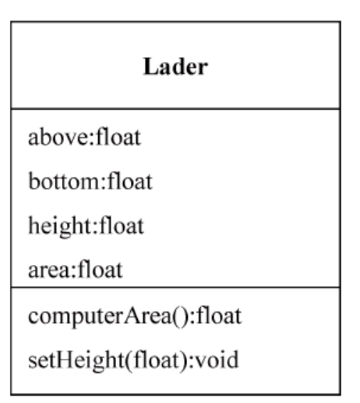

在 **类的 UML 图**中，使用一个长方形描述一个类的主要构成，将长方形垂直的分为 **三层**。

顶部 **第1层** 是名字层，若类是 **常规类**，则用常规字形，若类为 ***抽象类*** ，则用斜体字

**第2层**是变量层，列出类的成员变量及类型，格式是” **变量名字:类型** “。可以根据需要只列出最重要的成员变量的名字。

**第3层**是方法层，列出类的方法，格式是 “**方法名字(参数列表):类型**”。可以根据需要只列出最重要的方法。

### 4.3 构造方法与对象的创建

**构造方法**

1. 默认构造方法与自定义构造方法

   ```java
   class Point{
       Point() {}			//默认构造方法，Java自带不需写出
       Point(形参列表){	 //自定义构造方法，若使用自定义构造方法则Java不再提供默认构造方法，可重载
           语句
       }
   }
   ```


**创建对象**

~~~java
Point a;					//声明对象
a = new Point(形参列表);	 //为对象分配变量（根据形参列表匹配构造函数）
//或
Point a = new Point(形参列表);
~~~

**使用对象**

~~~java
对象.变量;
对象.方法;
~~~

### 4.4 类与程序的基本结构

Java 应用程序有一个主类，即含有 main 方法的类，Java 应用程序从主类的 main 方法开始执行。编写一个 Java 应用程序时，可以编写若干个 Java 源文件，每个源文件编译后产生若干给类的字节码文件。因此经常需要进行如下操作：

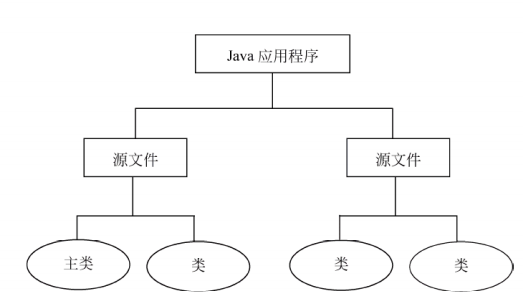

- 将应用程序涉及的 Java 源文件保存在相同的目录中，分别编译过，得到 Java 应用程序所需要的字节码文件

- 运行主类

  eg:

  **Rect.java**

  ```java 
  public class Rect{
      ...
  }
  ```

  **Lader.java**

  ~~~java 
  public class Lader{
      ...
  }
  ~~~

  **Example.java**

  ~~~java
  public class Example{
      public static void main(String args[]){
          Rect react = new Rect();
          Lader lader = new Lader();
      }
  }
  ~~~

  假设上述三个文件都保存在同一文件夹中，在编译 **Example.java** 时，Java系统会自动地编译**Rect.java**与**Lader.java**。

### 4.5 参数传值

在Java中，方法的所有参数都是传值，类似C/C++的普通传值，参数与原值互不影响

1. 基本数据类型的传值

2. 引用类型参数的传值

   Java的引用型数据包括 **数组**、**对象**和**接口**。

   相当于：当Java的参数为引用型数据时，传递的是地址

   **注：一个类声明的两个对象如果具有相同的引用，二者就具有完全相同的变量。**

3. 可变参数

   ```java
   public void f(int ... x)
   //从第一个开始都是int型
   //使用,eg:
    for(int i=0;i<x.length;i++)
        sum+=x[i];
   //或
   for(int i;x)
       sum+=i;
   
   public void f(double x,int ... y)
   //第一个为double型的x，后面都为y
   ```

### 4.6 对象的组合

在一个对象a中包含了一个对象b作为成员变量，这就是组合。若一个对象a中组合了一个对象b，那么对象a就可以委托对象b调用其方法，即对象a以组合的方式复用对象b的方法。**类似C/C++友元类**。

通过组合的方式来复用方法有以下特点：

1. 通过组合对象来复用方法也称“黑盒”复用，因为当前对象只能委托所包含的对象调用其方法，这样一来，当前对象所包含的方法的细节（算法的细节）是一无所知的
2. 当前对象随时可以更换所包含的对象，即对象与所包含的对象属于弱耦合关系

### 4.7 实例成员与类成员

**实例成员** 就是C/C++中的普通成员，**类成员** 就是静态成员

**实例成员与类成员的区别：**

1. 不同对象的 **实例变量** 互不相同
2. 所有对象共享 **类变量**
3. 通过类名直接访问 **类变量** 或 **类方法**

```java
class Dog{    float x;						//实例变量    static int y;					//类变量    float max(float a,float b){		//实例方法        ...    }    static void speak(String s){	//类方法        ...    }}//main类中{    ...    Dog wang;    wang.x=1.1f;		//调用实例变量    wang.max(a,b);		//调用实例方法    Dog.y=1;			//调用类变量    Dog.speak(s);		//调用类方法}
```

### 4.8 方法重载

与C/C++相同

1. 参数的个数不同
2. 参数个数相同，参数表中对应的某个参数类型不同

### 4.9 this关键字

与C/C++基本相同

```java
this.实例成员变量;
this.实例方法;
类名.类成员变量;
类名.类方法;
```

### 4.10 包

包是 Java语言有效地管理类的一个机制。不同的java源文件中可能出现名字相同的类，如果想区分这些类，就需要使用包

1. 包语句

包语句设计java 源文件的第一条语句，指明该源文件定义的类所在的包。如果源程序中省略了package语句，源文件所定义命名的类被隐含地认为是无名包的一部分，同属于一个包但没包名

```java
//一般格式
package 包名;
//报名可以是标识符，也可以由若干标识符加"."分隔而成
package sunrise;
package sun.com.cn;
```

2. 有包名的类的存储目录

如过一个类有包名，就不能在任意位置存放它，程序如果使用了包语句，例如:

```java
package tom.jiafei;
```

那么存储文件的目录结构必须包含如下结构：···\tom\jiafei,并且必须将源文件,例如C:\1000\tom\jiafei,编译得到的类的字节码文件保存在目录C:\1000\tom\jiafei 中（源文件可以任意存放）

3. 运行有包名的主类

如果主类的包名是 tom.jiafei,那么主类的字节码一定存放在···\tom\jiafei 目录中，那么必须要到 tom\jiafei 的上一层目录中去运行主类。定义如上eg:

```java
C:\1000> java tom.jiafei.主类名
```

下列例子使用了包语句

```java 
//Student.java
package tom.jiafei;
public class Student{
    ...
}

//Example.java 主类
package tom.jiafei;
public class Example {
    public static void main(String args[]){
        ...
    }
}

//编译
C:\1000> javac tom\jiafei\Student.java
C:\1000> javac tom\jiafei\Example.java
//或：
C:\1000\tom\jiafei> javac *.java
    
//运行
C:\1000> java tom.jiafei.Example
```


### 4.11 import 语句

一个类想要使用的类和它不在一个包中，这时就该使用 **import语句** 了

**import语句** 在 **package语句** 与类之间

```java
//一些常用包
java.lang;		//包含所有的基本语言类（第8、12章）
javax.swing;	//包含抽象窗口工具集中的图像、文本、窗口GUI类（第9章）
java.io;		//包含所有的输入/输出类（第10章）
java.util;		//包含实用类（第8章）
java.sql;		//包含操作数据库的类（第11章）
java.net;		//包含所有实现网络功能的类（第13章）

//如果要引入一个包中的全部类，用通配符（*）代替，eg：
import java.until.*;

//如果引入包中的一个类
import java.util.Date;
```

### 4.12 访问权限

同C++，有private、protected和public三种

三中访问权限的使用方法

```java
class Tom{
    private int a;			//private的int型变量
    private int b() {}		//private的int型方法
    
    protected float c;		//protected的float型变量
    protected float d() {}	//protected的float型方法
    
    public boolean e;		//public的Boolean型变量
    public boolean f() {}	//public的Boolean型方法
}
```

private（私有的）：不能除本类外的其他类使用

protected（受保护的）：只允许在同一包中的类使用

public（公有的）：所有类均可使用

不用三种修饰符修饰的成员变量和方法被称为友好变量和友好方法，与protected类似，只允许在同一包中的类使用

**public类与友好类**

```java 
public class A{ 	//public类
    ...
}

class B{		//友好类
    ...
}
```

public类可以随意创建对象，友好类只允许同一包中的类创建对象

访问权限由高到低：public、protected、友好的、private

**注：**一个源文件只有一个 **public** 类，且文件名字为 **public** 类的名称

​		一个应用程序只有一个 **main方法**

一般将类中变量设置乘 **private** ，将其 **封装** 在类对象内部，不允许外部程序直接访问，只有通过自身的方法访问

### 4.13 基本类型的类封装

Java基本数据类型包括：boolean、byte、short、char、int、long、float和double。Java同时提供了与基本数据类型相关的类，在 **java.lang** 包中分别是：Byte、Integer、Short、Long、Float、Double和Character

七种类的构造方法相似，eg：Double(double num)、Integer(int num)···

通过 **数据类型Value()** 方法可以返回该对象含有的该类型数据，eg：floatValue() 可返回该对象含有的float型数据

### 4.14 对象数组

与普通数组使用方向相同

### 4.16 文档生成器

```java 
javadoc Example.java
javadoc -d 地址 Example.java
```

通过javaoc生成Example.java的html格式文档，查看这些文档可以知道源文件中类的组成结构，如类的方法和成员变量。在使用javadoc时添加 -d 参数可以指定生成文档所在的目录


## 第5章 子类与继承

### 5.1 子类与父类

**子类的声明：**

```java
class 子类名 extends 父类名{
    ...
}

//例如：
class People{
    ...
}

class Student extends People{
    ...
}
//Student为Peolple的子类，People为Student的父类（超类）
```

1. c时b的子类，b是a的子类，则c是a的孙类

2. Object类（是java.lang包中的类）是所有类的祖先类


### 5.2 子类的继承

1. 子类与父类在同一包中的继承性

   子类可以继承父类中**不是private** 的成员变量与方法

2. 子类与父类不在同一包中的继承性

   子类只继承父类的 **protected和public** 的成员变量与方法

   **继承关系（Generalization）的UML图**

   两个类用空心三角形与实线连接

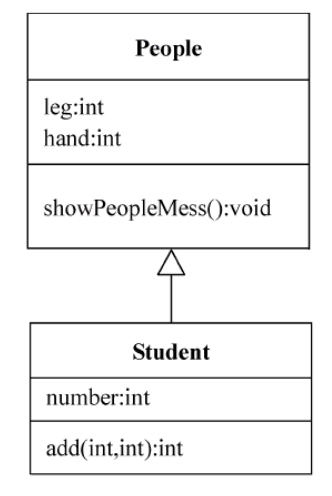

若B为A的子类，B从A继承了 **protected** 方法和变量，现在再Other类中创建一个B类的对象object

1. 对于子类D **自己声明** 的 **protected** 方法和变量，只要Other类与D类在同一包中，object对象就可访问这些 **protected** 方法和变量

2. 对于子类D **继承** 的 **protected** 方法和变量，只要Other类与A类在同一包中，object对象就可访问这些 **protected** 方法和变量


### 5.3 子类与对象

1. 子类创建对象时，父类的成员变量都分配了空间，就是能不能访问的问题

2. **instanceof** 运算符

   **instanceof** 是一个双目运算符，左面的操作元是对象，右边的操作元是类。若该对象是该类的或其子类所创建的对象时，返回true，否则返回false


### 5.4 成员变量的隐藏和方法的重写

1. 成员变量的隐藏

   编写子类时，若声明的成员变量的名字和从父类继承来的变量名字相同（声明类型可不同），在这种情况下，子类会隐藏所继承的成员变量

   子类继承的方法只能操作子类继承和隐藏的成员变量。子类新定义的方法可以操作子类继承和子类新声明的成员变量，但无法操作被隐藏的成员变量

   ```mermaid
   graph LR
   id1[父类的方法]-->id2[子类隐藏的成员变量000]
   id1-->id3[子类继承的成员变量]
   id4[子类的方法]-->id3
   id4-->子类新声明的变量
   ```

2. 方法重写

   子类继承父类的某些方法，子类就有权利重写这个方法。子类中定义给方法，这个方法的类型与父类相同或者时父类方法类型的子类，并且这个方法名字、参数个数、参数的类型和父类方法完全相同，就可以隐藏父类的方法。

   注：在重写时不可以降低方法的权限


### 5.5 super 关键字

1. 使用 **super** 操作被隐藏的成员变量与方法

   ```java 
   class A{
       int sum;
       float sam() {};
   }
   
   class B extends A {
       float sum;
       double sam() {}
       char eg(){
           super.sum=sum;		//访问被隐藏的变量
           sum=super.sam;		//调用被隐藏的方法
       }
   }
   ```

2. 使用 **super** 调用父类的构造方法

   如果子类的构造方法没有指出使用父类的哪个构造方法，默认使用不带参数的构造方法

```java 
class A{
    A(){}
    A(int a) {}
    A(int a,int b){}
}

class B extends A {
	B(int a,int b,int c)
    {
        super(a,b);		//调用A的第三个构造函数
    }
    B(int a) {
        //super();		//不指明使用那个构造函数，默认使用不带参数的构造函数
    }			
}
```


### 5.6 final 关键字

1. **final类** 

```java
final classA{
    ...
}
```

**final类** 不允许被继承

2. **final方法**

**final方法** 不允许被子类重写

3. **常量**

**final** 修饰成员变量或局部变量时，变量变为常量（类似于C/C++中的 **static**）。在声明常量时必须赋值，且之后不允许对 **final变量** 进行更新


### 5.7 对象的上转型对象

假设Animal是Tiger的父类

```java 
Animal a;
Tiger b = new Tiger();
a=b;

//或
Animal a;
a = new Tiger();
```

这时a是b的上转型对象。上转型对象有如下特点

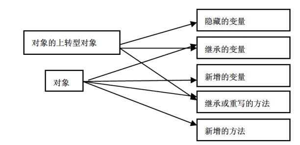

1. 上转型对象不能操作子类新增的成员变量，不能调用子类新增的方法
2. 上转型对象可以访问子类继承或隐藏的成员变量，也可以调用子类继承的方法或子类重写的石磊方法

注：假如animal是People的父类

```java
animal monkey;
People geng = new People();				
monkey = geng;						//monkey为geng的上转型对象
People people = (People)monkey; 	//将上转型对象强制转化为子类的对象
```


### 5.8 继承与多态

与C/C++类似


### 5.9 abstract 类和 abstract 方法

**abstract** 修饰的类，就称为 **abstract类(抽象类)**；**abstract** 修饰的方法，就称为 **abstract方法(抽象方法)**

类似C/C++的抽象类

1. **抽象方法** 只允许声明，不允许实现（无方法体）
2. **final** 与 **abstract** 不允许修饰同一个方法或类，不允许使用 **static** 修饰 **抽象方法**
3. **抽象类** 中可以有 **抽象方法**，普通类中不能有 **抽象方法**
4. **抽象类** 不能用 new 运算符创建对象
5. **抽象类** 的子类同C/C++
6. **抽象类** 的对象可以作为上转型对象


### 5.11 开-闭原则

 对扩展开放，对修改关闭


## 第6章 接口与实现

### 6.1 接口

1. **接口的声明**

   ```java
   interface 接口名字
   ```

2. **接口体**

   接口体中包含 **常量** 的声明（没有变量）和 **抽象方法** 两部分。允许省略 public static final 与public abstract

   ```java 
   interface Print{
       public static final int MAX = 100; 		//等价写法: int MAX = 100;
       public abstract void add();				//等价写法: void add();
       public abstract float sum(float x,float y);
   }
   ```

   

### 6.3 接口的实现

1. 类实现接口

   一个类在类声明中使用关键字 **implements** 声明实现一个或多个接口。

   ```java 
   class A implements B,C	//A实现了B，C的接口
   ```

2. 重写接口中的方法

   同抽象类中抽象方法的重写。接口中的方法访问权限一定是  **public**

3. 如果一个类声明实现一个接口，但没有重写接口中的所有方法，那么这个类必须是抽象类。即：抽象类既可以重写接口中的方法，也可以直接拥有接口中的方法

4. 程序可以直接用接口名访问接口的常量；如果一个类实现了接口，那么这个类可以直接使用接口中的常量；定义接口时可在 **interface** 前加上 **public** （加与不加与类类似）；如果父类实现了某个接口，那么子类自然的实现了该接口；接口可通过 **extends** 被继承


### 6.3 接口的 UML 图

1. 接口的 **UML图** 与类的 **UML图** 类似，使用长方形表示

   顶部第一层是名字层，接口的名字必须是斜体字，并且需要使用 **<<interface>>**  修饰名字，并且该修饰与名字分列两行

   第二层是常量层，格式是：**常量名字:类型**

   第三层是方法层，也称操作层，格式是：**方法名字(参数列表):类型**

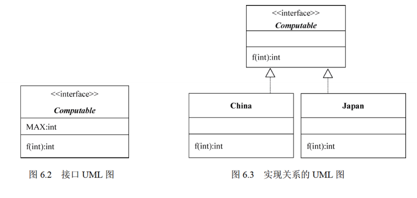

2. 实现关系的**UML图**

   如果一个类实现了一个接口，使用虚线和空心三角链接。如上图


### 6.4 接口回调

接口属于 **引用型变量** ，接口变量中可以存放实现该接口的类的实例的引用，即存放该对象的引用

声明变量：

```java
接口名 变量名;
```

假设类 ImpleCom 实现了接口Com：

```java
ImpleCom object = new ImpleCom();	//类的对象
Com com;							//接口的变量声明
com = object;						//接口回调
```

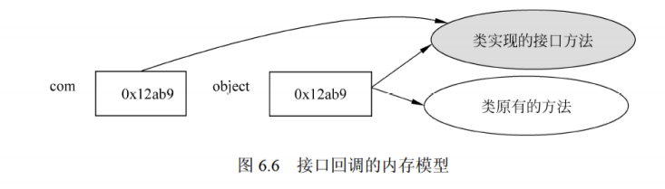

接口回调非常类似于上转型对象调用子类重写的方法

**注**：接口无法调用类中其他的非接口方法


### 6.8 抽象类与接口的比较

1. 抽象类和接口都可以有 **abstract方法**
2. **接口** 中只可以有 **常量**，不可以有变量；而 **抽象类** 中既可以有常量，又可以有变量
3. **抽象类** 中也可以有非 **abstract方法**，接口不可以


## 第7章 内部类与异常类

### 7.1 内部类

Java支持在一个类中定义另一个类，这样的类称作 **内部类**，而包含 **内部类** 的类称为 **内部类** 的 **外嵌类**

**内部类** 和 **外嵌类** 之间的重要关系如下：

1. 内部类的外嵌类的成员变量在内部类中仍然有效，内部类中的方法也可以调用外嵌类中的方法
2. 内部类的类体中不可以声明类变量和方法。外嵌类的类体中可以用内部类声明对象，作为外嵌类的成员
3. 内部类仅供它的外嵌类使用，其他类不可以用某个类的内部类声明对象

例子：

```java
public class RedCowForm{
    RedCow cow;			//内部类声明对象
    class RedCow{		//内部类的声明
        ...
    }					//内部类结束
}						//外嵌类结束
```

非static内部类不能在其他地方声明

**注：**内部类可以被修饰为 static 内部类（非内部类不可以是static类），这样一来 static内部类就是外嵌类中是一种静态数据类型，程序就可以在其他类中使用 static 内部类来创建对象了

例如：

```java
RedCowForm.Redcow redcow = new RedCowForm.RedCow();		//内部类的声明及分配内存
redcow.···				//内部类内变量与方法的调用
```


### 7.2 匿名类

假如没有显示的声明一个类的子类，而又想用子类创建一个对象，这是就产生了匿名类。Java允许直接使用一个类的子类的类体创建一个子类的对象，也就是说，创建子类对象时，除了使用父类的构造方法外还有类体，此类提被认为是一个子类去掉声明后的类体，称作匿名类。不能用匿名类声明对象，但可以直接使用匿名类船舰一个对象。

假设 Bank 是类，下列代码就是用 Bank 的一个子类（匿名类）创建对象：

```java
new Bank(){
    匿名类的类体
}
```

匿名类的特点：

1. 匿名类可以继承父类的方法也可以重写父类的方法。
2. 使用匿名类是，必然是在某个类中直接用匿名类创建对象，因此匿名类一定是内部类。
3. 匿名类可以访问外嵌类的变量和方法，匿名类的类体中不可以声明 static 成员变量与 static 方法
4. 由于匿名类是一个子类，但没有类名，所以使用匿名类创建对象时，要直接使用父类的构造方法

假如 Computable 是一个接口，可以直接使用 Computable 实现一个匿名类，可以认为实现了该接口。

```java
new Computable(){
    实现接口的匿名类的类体
}
```

注：该方法下匿名类必须重写接口中所有的方法

例如：

```java
interface SpeakHello{			//接口定义
    void speak();
}

class HelloMachine{				//函数定义
    public void turnOn(SpeakHello hello){
        hello.speak();
    }
}

public static void main(String args[]){
    HelloMachine machine = new HelloMachine();
    machine.tuenOn(new SpeakHello(){				//匿名类
       		public void speak(){					//对speak方法进行重写
           		System.out.println("hwllo,you are welcome!");
       			} 
    		}
    );
}
```


### 7.3 异常类

异常就是程序在运行时可能会出现的一些错误，异常处理将会改变程序的控制流程，让程序有机会对错误做出处理。

Java 使用 throw 关键字抛出一个 Exception 子类的实例表示异常的发生。

Java 允许定义方法时声明该方法调用过程中可能出现的异常，即允许方法调用过程中抛出异常对象，终止当前方法的继续执行。（详见第 10 章）

有关异常类的5个关键字

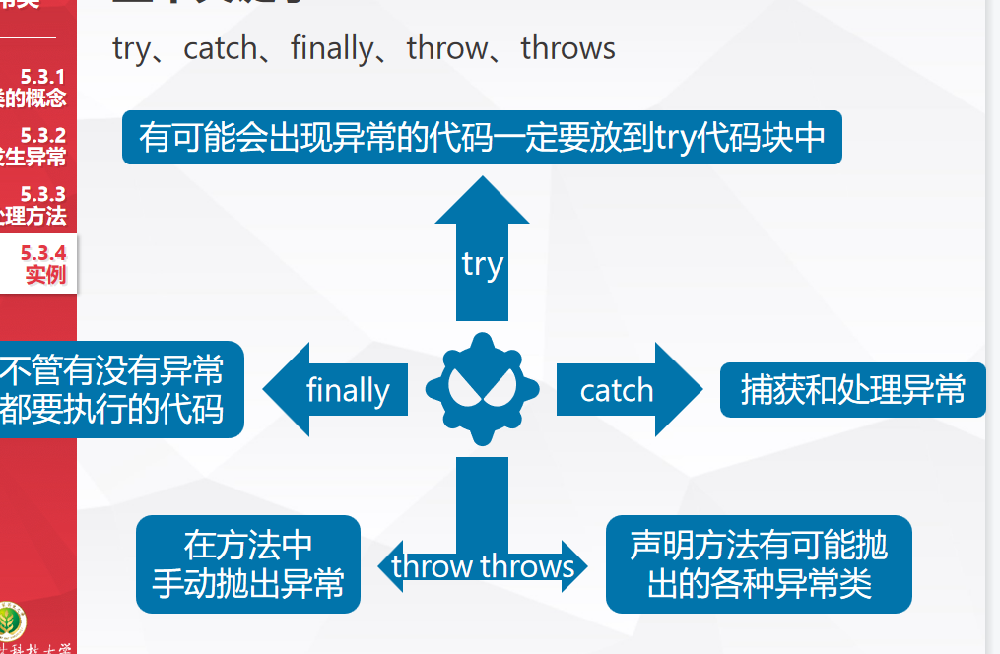

**try-catch 语句**

将可能出现异常的操作放在 **try** 部分，一旦 **try** 部分抛出异常对象，或调用某个可能抛出异常对象的方法，并且该方法跑出来异常对象，那么 **try** 部分将立刻结束执行，转向执行相应的 **catch** 部分。

模板

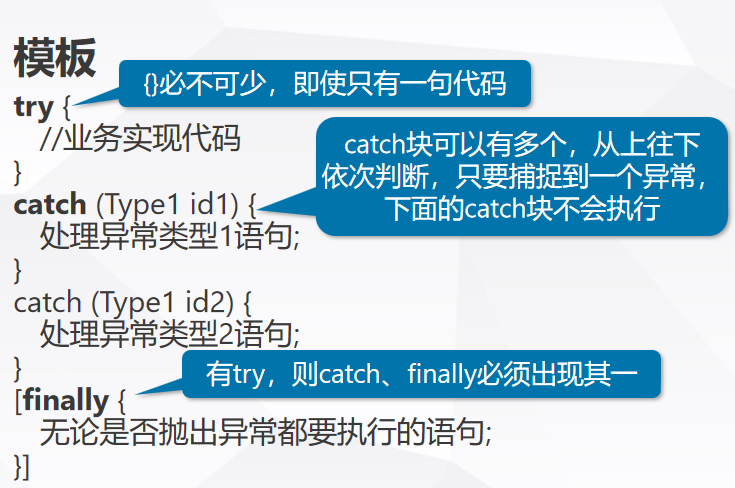

**try-catch 语句** 格式如下

```java
try{
    包含可能发生的异常语句
}
catch(ExceptionSubClass1 e){
    ···
}
...
catch(ExceptionSubClass2 e){
    ...
}
```

各个 catch 参数中的异常类都是 Exception 的某个子类，表明 try 部分可能发生的异常，致谢子类之间不能有父子关系。

例子：

```java
public class Example{
    public static void main(String args[]){
        int n = 0,m = 0,t = 1000;
        try{ m = Integer.praseInt("888");		//该方法可将括号内的Strng 变为int
             n = Integer.praseInt("ab89");		//发生异常，转向catch
             t = 7777;							//t没有机会被赋值
           }
        catch(NumerFormatException e){
            System.out.println("发生异常："+e.getMessage));
        }
    }
}
```

**自定义异常类**

在编写程序时可以扩展 Exception 类定义自己的异常类。一个方法声明时可以使用 **throws** 关键字声明要产生的若干个异常，并在该方法中具体给出产生异常的操作，，并使用 **throw** 关键字抛出该异常的对象。程序在 **try-catch** 语句中调用可能发生异常的方法。

例子：

```java
public class BankException extends Exception{	//扩展Exception类定义自己的类
    String message;
    public BankException(int m,int n){
        message = "m+n不是整数不符合要求"；
    }
    public String warnMess(){
        return message;					//返回有关异常的信息
    }
}

public class Bank{
    private int money;
    //throws接自定义类，说明该方法可能抛出异常
    public void income(int m,int n) throws BankException{
        if(m <= 0 || n >= 0 || m+n <= 0){
            throw Bankexception(m,n);  //抛出异常
        }
    }
}

public class Example{
    public static void main(String args[]){
        Bank bank = new Bank();
        try{ 
            bank.income(-200,100);
           }
        catch(BankException e){
            System.out.println("发生异常："+e.warnMessage));
        }
    }
}
```


### 7.4 断言

当发生某个错误时，要求程序必须停止执行，就可以使用断言。在代码调试阶段让断言发挥作用，正式执行时再关闭。

1. 断言的语法格式

   ```java
   //法一：
   assert booleanExpression;
   //法二：
   assert booleanExpression:messageException;
   ```

   booleanExpresseion必须是布尔表达式，messageException可以为字符串表达式

   当使用 法一 时，booleanExpresseion为true时继续运行，为false时程序从断言处停止运行

   使用 法二 时，依旧如上，但为false时会输出messageException

2. 启用与关闭断言语句

   Java解释器直接运行应用程序，默认地关闭断言语句，在调试程序是可以使用 -ea 启用断言语句
   
   ```java
   java -ea mainClass
   ```


## 第 8 章 常用实用类

### 8.1 String 类（字符串对象）

String类在 java.lang 包中，由于 java.lang 包中的类是默认引入，因此程序可以直接使用 String 类。需要注意的是 Java 将 String 类定义为 final 类，因此用户不能拓展 String 类，即 String 类不能有子类。

1. String对象

   ```java
   String s = new String("hello world"); //使用String类声明对象并创建对象，s为字符串的引用
   
   System.out.println(s);	//用户无法输出 String 对象的引用,输出的是字符串序列
   
   String tom = new String(s);	//可以用已有的String对象创建另一个String对象
   
   char [] a = {'J','a','v','a'};
   String s = new String(a);		//可以用字符串数组创建一个 String 对象
   
   char [] a = {'0','1','2','3','4','5','6'};
   String s = new String(a,2,4);	//s="2345" 采用取下标的方式创建对象
   ```

2. String 常量与变量

   使用 new 创建的会新分配内存

   ```java
   String s = new String("we are students");
   String t = new String("we are students");
   s==t	//false二者引用不同
   ```

   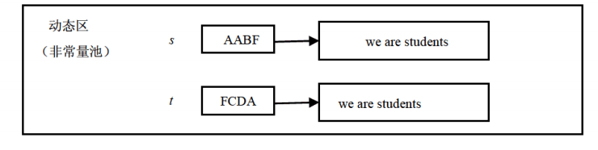

   String 常量是对象，因此可以把 String 常量的引用赋值给一个 String 对象，eg：

   ```java
   Sting s1,s2;
   s1 = "您好";
   s2 = "您好";
   s1 == s2;		//true 二者引用相同
   ```

   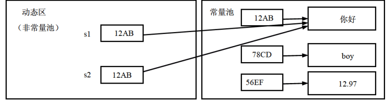

3. 字符串的并置

   ```java
   String hello = "你好";
   String testOne = "你"+"好";
   
   hello == testOne;	   //true
   "你好" == hello;		  //true
   "你好" == testOne;	  //true
   
   String you = "你";
   String hi = "好";
   String testTwo = you + hi;
   String testThree = you + hi;
   
   testTwo = hello;		//false
   testTwo = testThree;	//false
   ```

   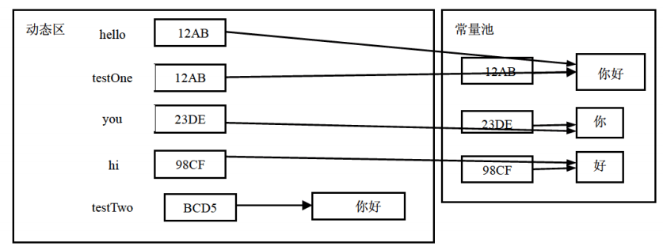

   testOne 对两个常量进行并置计算，结果就是常量池中的“你好”，testTwo 对两个变量进行计算，得出的就是在动态区存储的“你好”

4. String常用方法

   ```java
   //public in length() 返回String对象的字符序列的长度
   String number = "1234567890";
   int n1,n2;
   n1 = number.length();	//n1 == 10
   n2 = "123456".length();	//n2 == 6
   
   //public boolean equals(String s) 比较当前字符串序列与参数s是否相同,注：忽略大小写
   String tom = new String("天道酬勤");
   String boy = new String("知心朋友");
   String jerry = new String("天道酬勤");
   tom.equals(boy);		//flase
   tom.equals(jerry);		//true
   
   //public boolean startsWith(String s) 判断该字符串的前缀是否是字符串s
   //public boolean endsWith(Sting s)    判断该字符串的后缀是否是字符串s
   String tom = new String("12345");
   String jerry = new String()"54321");
   tom.stratsWith("123");			//true
   jerry.stratsWith("123");		//flase
   tom.endsWith("321");			//flase
   jerry.endsWith("321");			//true
   
   //public int compareTo(String s) 根据字典序比较String对象
   String s1 = new String("b");
   s1.compareTo("a");	//返回值大于零，如果s1的字符序列大于s则返回一个大于零的值
   s1.compareTo("b");	//返回值等于零，如果s1的字符序列等于s则返回一个等于零的值
   s1.compareTo("c");	//返回值小于零，如果s1的字符序列小于s则返回一个小于零的值
   
   //public boolean contains(String s) 判断该字符串是否含有s
   String tom = new String("student");
   tom.contains("stu");	//true
   tom.contains("ok");		//flase
   
   //public int indexOf(String s)			返回字符串中出现s的第一个位置
   //public int lastIndexOf(String s)		返回字符串中出现s的最后一个位置
   //public int indexOf(String str,int startpoint) 从startpoint开始检索
   String tom = "I am a good cat";
   tom.indexOf("a");			//2
   tom.indexOf("good",2);		//7
   tom.indexOf("a",7);			//13
   tom.indexOf("w",2);			//未找到-1
   
   //public String substring(int startpoint) 返回从startpoint开始到结束的字符串
   //public String substring(int start,int end) 返回从start到end的字符串
   String tom = "123456789";
   String str = tom.substring(1,3); 	//str == 234
   
   //public String trim() 	去掉该字符串开头结尾的空格
   ```

4. 字符串与基本数据类型的互相转化

   java.lang包中的 其他类的方法进行转化

   ```java
   String s = "123";
   int a = Integer.parseInt(s);			//转换为int型
   byte b = Byte.parseByte(s);				//转换为byte型
   short c = Short.parseShort(s);			//转换为short型
   long d = Long.parseLong(S);				//转换为long型
   float e = Float.parseFloat(s);			//转换为float型
   double f = Double.parseDouble(s);		//转换为double型
   ```

   使用 String类 中的方法将数字类转换为String型

   ```java
   public static String valueOf(byte n)
   public static String valueOf(int n)
   public static String valueOf(long n)
   public static String valueOf(float n)
   public static String valueOf(double n)    
   ```

   注：在main方法中的参数args能够接受用户从键盘输入的字符序列。eg：

   ```java
   >> java Example 1 2 33.3
   public class Example{
       public static void main(String args[]){
           args[0] == 1;
           args[1] == 2;
           args[3] == 3
       }
   }
   ```

5. 对象的字符串表示

   所有的都默认是 **java.lang** 包中 **Object** 类的子类或间接子类。**Object** 类中有一个 **public String toString()**  方法，一个对象通过调用该方法可以活动该对象的字符串表示，一般输出形式为：

   ```java
   创建对象类的名字@对象引用的字符串表示
   ```

    **Object** 类的子类和间接子类，也可以重写 **toString**，例如，java.util 包中的 Date 类就重写了 **toString()** 方法。下面例子TV类也重写了 **toString()** 

   ```java
   public class TV{
       double price;
       public void setPrice(double m){
           price = m;
       }
       public String toString(){
           String oldStr = super.toString();
           return oldStr+"\n这是电视机，价格是"+price
       }
   }
   
   public class Example{
       public static void main(String args[]){
           Date date = new Date();
           System.out.println(date.toString());
           TV tv = new TV();
           tv.setPrice(5897.98);
           System.out.println(tv.toString());
       }
   }
   
   //输出结果
   Sun Oct 30 12:31:38 CST 2016
   TV@232204a1
   这是电视剧，价格是:5897.98
   ```

6. 字符串与字符数组、字节数组

   1. 字符串与字符数组

      ```java
      //将字符串从start到end-1位置上的字符复制到c从offset开始的位置上，若长度超过报错
      public void getChars(int start,int end,char c[],int offset);
      //将字符串中的所有字符放进数组中
      public char[] toCharArray();
      
      String s = "1234567890";
      char [] a,c;
      a = new char[4];
      s.getChars(1,5,a,0); //数组a中的单元依次为 2,3,4,5
      c = "0987654321".toCharArray(); //数组c的单元依次为 0,9,8,7,6,5,4,3,2,1
      ```

   2. 字符串与字节数组

      ```java
      String(byte[]);
      //用指定的字节数组构造一个String对象
      String(byte[],int offset,int length);
      //从数组起始位置offset开始取length个字节，构造一个String对象
      public byte[] getBytes();
      //以平台默认编码方式，将当前Sting对象的字符序列存放到字节数组中，并返回数组的引用
      public byte[] getBytes(String charsetName)
      //以自定义编码方式
      ```

      如果平台默认的字符编码方式是GB_2312,相当于getByte(GB2312)，但需注意的是带参数的 **getBytes(String charsetName)** 抛出 **UnsupportedEncodingException** 异常，因此，必须在 **try-catch** 语句中调用 **getBytes(String chatsetName)** 语句。注：在GB_2312编码中中文占两个字节。

      ```java
      byte [] d = "Java你好".getBytes();
      d.length == 8;
      String s = new String(d,6,2); // s == "你"
      s = new String(d,0,6); 	  	 //s == "Java你"
      ```

   3. 字符串加密算法

      将密码(password)与待加密(sourceString)的字符串分别转化为字符在相加：

      $c_0 = (char)(a_0+p[0]),c1=(char)(a_1+p[1]),···，c_{n-1}=(char)(a_{n-1}+p[n-1])$

      解密算法即相减.eg:

      ```java
      public class EncryAndDecrypt{
          String encrypt(String sourceString,String password){	//加密算法
              char [] p = password.toCharArray();			//转化为字符数组
              char [] c = sourceString.toCharArray();
              int n = p.length;
              int m = c.length;
              for(int k = 0;k < m;k++){
                  int mima = c[k]+p[k%n];			//加密
                  c[k] = (char)mima;
              }
              return new String(c);				//返回密文
          }
          
          String decrypt(String sourceString,String password){	//解密算法
              char [] p = password.toCharArray();
              char [] c = sourceString.toCharArray();
              int n = p.length;
              int m = c.length;
              for(int k = 0;k < m;k++){
                  int mima = c[k]-p[k%n];			//解密
                  c[k] = (char)mima;
              }
              return new String(c);				//返回明文
          }
      }
      public class Example{
      	public class void main(String args[]){
              String sourceString = "今晚十点进攻";
              String passWord = "nihao123";
              EncryptAndDecrypt person = new EncryptAndDecrypt();
              String secret = person.encrypt(sourceString,password);
             	System.out.println("今晚十点进攻");
              System.out.println("密文为：");
              System.out.println(secret);
              System.out.println("明文为：");
              System.out.println(person.decrypt(secret,password));    
      }
      ```

   7. 正则表达式

      String 对象调用 **public boolean matchs(String regex)** 方法可以判断当前 String 对象的字符序列是否与 **regex** 指定的正则表达式匹配

      常用的元字符及其意义：

      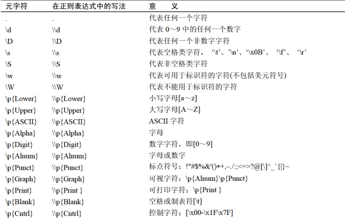

      在正则表达式中可以使用方括号括起若干个字符表示一个元字符，eg：

      [abc] ：代表a、b、c中的任意一个

      [^abc] ：代表除了a、b、c中的任意一个

      [a-d] : 代表从a到d的任意一个

      [a-zA-Z] : 代表所有字母

      并且在括号中可以进行逻辑运算

      [a-d[m-p]] : 代表a到d，或m到p的任意一个  		(并)

      [a-z&&[def]] : 代表d,e,f中任意一个						(交)

      [a-f&&[\^bc]] : 代表a,d,e,f										(差)

      如果想表示 `.` 必须使用 `[.]`  或 `\56` 表示点字符

      正则表达是还可加限定词

      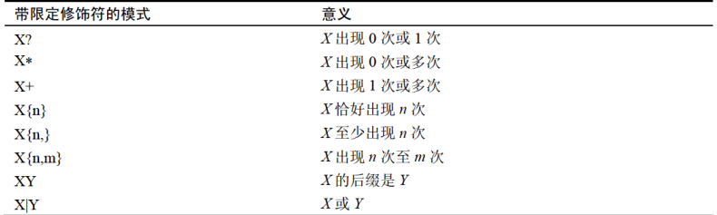

      **字符串的替换与分解**

      ```java
      public String replaceAll(String regex,String replaceMent);
      //返回一个新的字符串对象，把所有与regex匹配的子字符序列用replaceMent替换,eg:
      String str = "12hello567bird".replaceAll("[a-zA-Z]+","你好");
      str == "12你好567你好";
      
      public String[] split(String regex);
      //将regex作为分隔符将字符串裂解，返回字符串数组，eg：
      String str = "1949年10月1日是中华人民共和国成立的日子";
      String [] digitWord = str.split("\\D+"); 	//匹配任何非数字字符序列
      diditWord序列分别为 1949,10，1
      ```

      

### 8.2 StringTokenizer类

当分析一个String对象的字符序列并将字符序列分解成可被独立使用的单词时，可以使用 **java.util** 包中的 **StringTokenizer** 类(不能使用正则表达式)，该类有两种构造该方法

- StringTokenizer(String s) ：为String对象s构造一个分析器。使用默认分隔标记，即空格符、换行符、回车符、Tab符、进纸符作分隔标记
- StringTokenizer(String s,String delim)：参数delim中的字符序列的任意排列作为分隔标记

eg:

```java
StringTokenizer fenxi = new StringTokenizer("you are welcome");
StringTokenizer fenxi = new StringTokenizer("you#*are##*welcome","#*");
```

称一个**StringTokenizer** 对象为一个字符串分析器。

```java
StringTokenizer fenxi = new StringTokenizer("you are welcome");
//使用hasMoreTokens()方法，返回是否还有语言符号，还有返回非0，无返回0
while(fenxi.hasMoreTokens()){
    //使用countTokens()方法，返回当前计数器的值
    System.put.println(fenxi.countTokrns());
    //使用newToken()方法，逐个获取语言符号，每使用一次计数器减一
    System.out.println(fenxi.nextToken());
}
```


### 8.3 Scanner类

与 **StringTokenizer类** 类似 ，**Scanner类** 也用来将字符序列分解

**Scanner类** 可调用**useDelimiter(正则表达式)** 方法，将 **正则表达式** 作为分隔标记，若不指定分隔标记，那么 **Scanner类** 对象默认地使用空白字符（空格、制表符、回行符）作为分隔标记

```java
String NBA = "I Love This Game";
//创建Scanner类对象
Scanner scanner = new Scanner(NBA);
//将正则表达式作为分隔标记
scanner.useDelimiter(正则表达式);

//如果最后一个单词被next(),返回了，hasNext()就返回false，否则返回true
while(scanner.hasNext())
{
    //返回一个单词
    System.out.println(scanner.next());
    //返回一个单词将其转换为int型
    System.out.println(scanner.nextInt());
    //返回一个单词将其转换为double型
    System.out.println(scanner.nextDouble());
    //若单词不是数字型单词，调用nextInt()或nextDouble()方法就会发生					       InputMismantchException异常
}
```


### 8.4 StringBuffer 类

在8.1节学习了 **String** 对象，**String** 对象的字符序列使不可修改的，也就是**String** 对象的的字符序列不能被修改、删除

与 **String** 类不同，**StringBuffer** 类的对象实体空间可以自动地改变大小，便于存放一个可变的字符序列

```java
//StringBuffer对象的创建

//无参数的构造方法，创建一个StringBuffer对象，分配给改对象初始容量可以容纳16个字符
StringBuffer s = new StringBuffer();

//按参数size创建大小相应的StringBuffer对象
StringBuffer s = new StringBuffer(int size);

//分配给StringBuffer对象实体的容量为参数s的字符序列长度加16
StringBuffer s = new StringBuffer(String s);

//第一种与第二种构造方法，若存放的字符序列长度大于size长度，将会自动增加
```


**StringBuffer类的常用方法**

1. **append 方法**

   ```java
   StringBuffer append(String s);
   //追加字符串s，并返回当前StringBuffer对象的引用
   StringBuffer append(int n);
   //将n转换为String对象，将其追加，，并返回当前StringBuffer对象的引用
   StringBuffer append(Object/long/boolean/float/double/char o);
   //将对象o的字符序列表示追加，，并返回当前StringBuffer对象的引用
   ```

2. 

    ```java
    //返回字符串长度
    int StringBuffer length();
    //返回实际容量长度
    int StringBuffer capacity();
    ```

3. ```java
   //返回n位置的字符
   public char charAt(int n);
   //将n位置的字符替换成ch
   public void setCharAt(int n,char ch);
   //n必须非负数，解少于字符序列长度
   ```

4. ```java
   //将str插入找index位置，并返回当前引用
   StringBuffer insert(int index,String str);
   ```

5. ```java
   //将当前对象反转，并返回引用
   public StringBuffer reverse();
   ```

6. ```java
   //删除startIndex到endIndex-1位置的字符
   StringBuffer delete(int startIndex,int endIndex);
   //删除index位置的字符
   StringBuffer deleteCharAt(int index);
   ```

7. ```java
   //替换startIndex到endIndex-1位置的字符，为str
   StringBuffer replace(int startindex,int endIndex,String str)
   ```


### 8.5 Date类与Calendar类

Date类再java.util包中。使用Date类的无参数构造方法创建的对象可以获取本地当前时间

- **无参构造函数**

```java
Date nowtime = new Date();
System.out.println(nowtime);
//获取当前时间
//Wed Oct 20 10:18:14 CST 2021
//星期 月份 日期 时间 时区 年份
```

- **带参数的构造方法**

  计算机系统将自己的时间的“公元”设置在1970年1月1日0时（格林威治时间），参数表示格林威治时间时间加或减参数*毫秒

  ```java
  Date time1 = new Date(1000);
  Thu Jan 01 08:00:01 CST 1970
  
  Date time2 = new Date(-1000); 
  Thu Jan 01 07:59:59 CST 1970
  ```

  


## 第九章 组件及事件处理

### 9.1 概述

**java.awt包** 是Java语言进行GUI程序设计的基础

**javax.swing包 ** Swing组件是Java语言提供的第二代GUI设计工具包

Swing并没有完全替代AWT，而是建立在AWT之上，即使是Swing写的GUI程序，也要使用AWT的事件处理机制。

AWT组件在 java.awt包中，而Swing组件在javax.swing包中。
本质区别：

- java.awt中使用的图形类都是依赖于系统的图形库的。

-  javax.swing包使用到的图形类都是sun自己实现，不需要依赖系统的图形库。

在java中所有的图形类都被称作组件类。组件的类别：容器组件、非容器组件

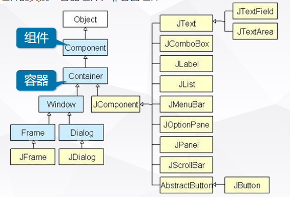

容 器 是 一 种 比 较 特 殊 的 组 件 ， 它 可 以 包 含 其 他 的 组 件 。

Container类中有一个public方法，add()，一个容器可以调用此方法向容器中添加组件。

**底层容器组件：**

- JFrame
- JDialog
- JWindow

**中间组件：**

- JPanel		面板
- JScrollPane	滚动窗格
- JSplitPane		拆分窗格
- JLayeredPane	分层窗格

**轻量级组件：**

- JComponent的子类
- JButton
- JTree
- JMenubar
- JTextField等

### 9.2 窗口（JFrame）

- 底层容器用于直接显示到系统平台上，其它组件被添加到底层容器上

- JFrame(窗口)是一个底层容器

- 不允许将一个窗口添加到另一个容器中

**构造方法**

```java
JFrame();  //创建一个无标题的窗口
JFrame(String title); //创建标题为title的窗口
```

**对于框架外观的操作常用方法**

setIconImage——窗口最小化（在Java中称为图标化）时，把一个Image对象作为图标
setTitle——设置窗口中标题栏的文字
setResizable——设置用户是否可以改变框架大小
setLocation——设置组件的位置
setBounds——重新设置组件的大小和位置
setDefaultCloseOperation——关闭窗口，其参数决定了关闭动作

**创建菜单的步骤**

创建菜单栏、菜单、子菜单、菜单项

- 将菜单项加入到子菜单或菜单中

- 将子菜单加入到菜单中

- 将菜单加入到菜单栏中

```java
//（a）创建菜单栏，并将菜单栏加入到框架中。
JMenuBar menuBar = new JMenuBar();
setJMenuBar(menuBar);

//（b）创建“File”菜单、“Edit”菜单和“View”菜单。
JMenu fileMenu = new JMenu("File");
JMenu editMenu = new JMenu("Edit");
JMenu viewMenu = new JMenu("View");

//（b）创建子菜单。
JMenu optionMenu = new JMenu("Option");

//（c）通过指定菜单项对象新建“Paste”菜单
JMenuItem pasteItem = new JMenuItem("Paste", 'P');

//（d）将菜单项加入到子菜单或菜单中，将子菜单加入到菜单中，
将菜单加入到菜单栏中。
editMenu.add(pasteItem);
viewMenu.add(optionMenu);
menuBar.add(fileMenu);
menuBar.add(editMenu);
menuBar.add(viewMenu);
```

### 9.3 文本组件

1. 文本框组件 JTextField ，单行文本输入

   - JTextField() 创建文本框，文本框的长度为一个机器字符长

   - JTextField(int x) 创建文本框，文本框的长度为x个机器字符长

   - JTextField(String s ) 创建文本框，文本框的初始字符串为s

   - public void setText(String s) 设置文本框中的文本为参数s指定的文本

   - public String getText() 获取文本框中的文本

   - public void setEditable(boolean b) 指定文本框的可编辑性。文本框默认为可编辑的

2. 文本区组件 JTextArea
   - JTextArea(String s) 文本区初始化字符串为s
   - JTextArea(int x,int y) 设置文本区的行列数
   - void setText(String s) 将文本区设置为参数指定的文本
   - void append(String s) 将s写入文本区末尾
   - void copy() 复制到剪贴板
   - void cut() 剪切到剪贴板
   - void paste() 将剪贴板的内容粘贴到文本区

3. 密码框 JPasswordField

   特殊的文本域，在密码域中输入时，用户的输入并不会真正显示出来，而是显示回显符，如“*”，以防止被他人看见用户输入的密码

### 9.4 按钮与标签

**按钮（JButton）**

使用JButton可以生成包含文字或图形（或两者）的按钮，JButton继承自AbstractButoon，常用的构造方法：

- JButton()：生成一个JButton对象。
- JButton(Icon icon)：生成一个以图形表示的JButton对象。
- JButton(String text)：生成一个使用指定文本的JButton对象。
- JButton(String text, Icon icon)：生成一个包含文字和图形的JButton对象。

**标签(JLabel)**
JLabel创建的对象称做标签

- public JLabel () 创建没有名字的标签。
- public JLabel (String s) 创建名字是s的标签，s在标签中靠左对齐。
- public JLabel (String s, int aligment ) 参数aligment 决定标签中的文字在标签中的水平对齐方式。
- public JLabel (Icon icon)  创建具有图标icon的标签，icon在标签中靠左对齐。
- String getText() 获取标签的文本内容。
- void setText(String s) 设置标签的文本为s。
- Icon getIcon() 获取标签的图标。
- void setIcon(Icon icon) 设置标签的图标是icon。

### 9.5 选择性组件

1. JCheckBox类常用方法
   public JCheckBox() 创建没有名字的选择框。
   public JCheckBox(String name) 创建名字是name的选择框。
   public JCheckBox(Icon icon) 创建带有默认图标icon，但没有名字的选择框。
   public JCheckBox(String name, Icon icon) 创建一个带有默认图标和名字name的选择框。
   public void setIcon(Icon defaultIcon) 设置选择框上的默认图标。
   public void setSelectedIcon(Icon selectedIcon) 设置选择框选中状态下的图标。
   public boolean isSelected() 如果选择框处于选中状态该方法返回true，否则返回false。
   public String getText()  选择框调用该方法可以获取选择框的名称。
   public void setText(String name) 选择框调用该方法可以设置选择框的名称。
2. 下拉列表(JComboBox) 
   常用方法：
   public JComboBox() 创建一个没有选项的下拉列表。
   public void addItem(Object anObject) 下拉列表调用该方法增加选项。
   public int getSelectedIndex() 返回当前下拉列表中被选中的选项的索引。
   public Object getSelectedItem() 返回当前下拉列表中被选中的选项。.
   public void removeItemAt(int anIndex) 从下拉列表的选项中删除索引值是anIndex 选项。
   public void removeAllItems() 可以删除全部选项。
   public void addItemListener(ItemListener) 下向下拉列表注册ItemEvent事件的监视器。

3. 设置图标
   JFrame的方法void setIconImage(Image image)设置要作为此窗口图标显示的图像
   Image是一个抽象类，不能实例化对象，可以通过ToolKit对象返回一个Image对象：
   ToolKit是一个抽象类，static ToolKit.getDefaultToolkit()（获取默认工具包）会返回一个ToolKit对象的引用。
   abstract Image ToolKit.getImage(String filename) 返回一幅图像，该图像从指定文件中获取像素数据，图像格式可以是 GIF、JPEG 或 PNG

### 9.6 布局管理器

AWT提供了FlowLayout、BorderLayout、GridLayout、GridBagLayout、CardLayout五个常用布局管理器。
Swing提供了一个BoxLayout布局管理器。

1. **绝对定位(Absolute layout)**
   准确来说这不是一个特定的布局管理器，而是对布局管理器设为null来实现绝对定位，setLayout(null)

2. **流布局管理器(FlowLayout)**
   从左向右排列组件，遇到边界则从下一行开始。如平常使用的文本文档。Panel型容器默认使用FlowLayout布局管理器

   

3. **边界布局管理器(BorderLayout)**
   容器分为东西南北中五个区域。没有指定添加到哪个区域则默认添加到中间区域。后放入的组件会覆盖先放入的组件。Frame、Dialog、ScrollPane默认使用BorderLayout布局管理器

   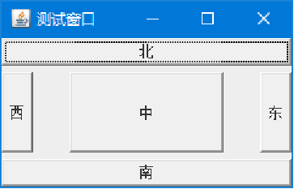

4. 网络布局管理器(GridLayout)
   容器分为纵横线分隔的网络，每个网格所占区域大小相同

   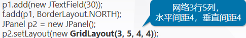

   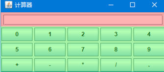

5. **网络袋布局管理器(GridBagLayout)**
   功能强大，使用复杂。与GridLayout不同的是，一个组件可跨越多个网格，设置不同大小。使用GridBagConstraints对象控制组件大小、跨越性。

   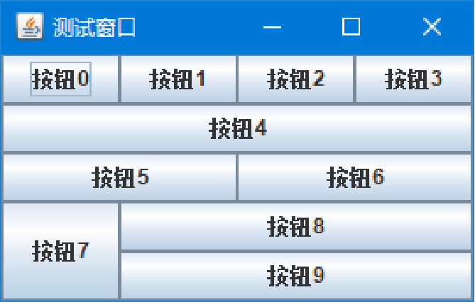

6. 卡片布局管理器(CardLayout)
   以时间而非空间来管理组件，就像一副扑克牌，每次只有最上面的扑克牌才可见。
   卡片布局管理器控制组件可见的5个常用方法：
   first(Container target)		显示容器第一张卡片
   last(Container target)		显示容器最后的卡片
   previous(Container target)		显示容器前一张卡片
   next(Container target)		显示容器后一张卡片
   show(Container target, String name)	显示指定名字的卡片

   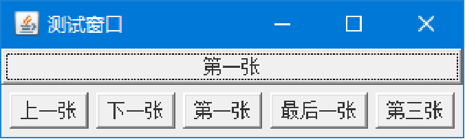

7. 盒式布局管理器(BoxLayout)
   保留了GridBagLayout很多优点但没那么复杂。
   BoxLayout(Container target, int axis)创建基于target容器的盒式布局管理器，按axis方向排列。
   BoxLayout.X_AXIS横向
   BoxLayout.Y_AXIS横向

   


### 9.7 中间容器

底层容器不能互相嵌套，但是底层容器可以添加中间容器，中间容器可以相互嵌套
中间容器中，常用的有：

1. JPanel		面板
2. JScrollPane	滚动窗格
3. JSplitPane		拆分窗格
4. JLayeredPane	分层窗格

**JPanel面板**
JPanel p = new JPanel();
JPanel对象的默认布局是**FlowLayout布局**。

1. 首先将面板和组件添加到JFrame窗体中
2. 然后再将子面板和组件添加到上级面板中，这样就可以向面板中添加无数个组件，并且通过对每个面板采用不同的布局管理器，真正解决众多组件间的布局问题。

### 9.8 事件处理

**Java界面应用程序的开发步骤**

1. **创建界面**，设置布局，添加控件
2. **实现监听器类**
   实现某个监听接口，监听器类提供的信息包括监听的事件类型以及响应动作
3. **为控件注册监视器**
   实现控件对象和监视器对象关联

**事件、事件源和事件监听器**

- 事件是由事件源产生的，**事件的产生者称为事件源**。例如，在JButton组件上点击鼠标会产生以这个JButton为源的一个事件：ActionEvent  e
- **事件监听器**是一个类的实例，这个类实现了一个特殊的接口，称为Listener interface。当事件源产生了一个事件以后，事件源就会发送通知给相应的事件监听器，监听器对象根据事件对象内封装的信息，决定如何响应这个事件

**事件处理模型：**

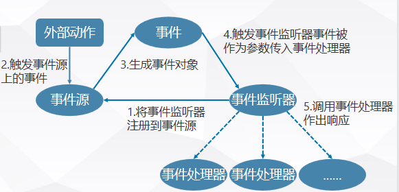


**按钮事件：**

按钮（JButton）发生ActionEvent事件

1. 增加对按钮的事件处理函数（监听器监听ActionEvent事件）
   button.addActionListener(实现ActionListener接口的对象);
2. ActionEvent()类使用的主要两个方法
   - getSourse()方法：用来获得引发事件的对象名,组件对象
   - getActionCommand() 方法：用来获得引发事件动作的命令名，标签名

**窗口事件：**

- void windowOpened(WindowEvent e);已打开窗口时调用。
- void windowClosing(WindowEvent e);正在关闭
- void windowClosed(WindowEvent e);当窗口已被关闭时调用。
- void windowIconified(WindowEvent e);图标化窗口时调用。
- void windowDeiconified(WindowEvent e);取消图标化窗口时调用。
- void windowActivated(WindowEvent e); 激活状态，选中
- void windowDeactivated(WindowEvent e); 非激活状态，未选中

**鼠标事件：**

| mouseClicked(MouseEvent e)  | 鼠标在组件上单击（按下并释放）时调用 |
| :-------------------------- | ------------------------------------ |
| mouseEntered(MouseEvent e)  | 鼠标进入到组件上时调用               |
| mouseExited(MouseEvent e)   | 鼠标离开组件时调用                   |
| mousePressed(MouseEvent e)  | 鼠标在组件上按下时调用               |
| mouseReleased(MouseEvent e) | 鼠标在组件上释放时调用               |
| mouseDragged(MouseEvent e)  | 鼠标拖动                             |
| mouseMoved(MouseEvent e)    | 鼠标移动                             |

**焦点事件FocusEvent：**

如果某个组件能够接收用户按键，那么该组件就拥有焦点。拥有焦点的组件在显示形式上与其他组件有一些差别：**文本域内会显示光标；按钮四周会显示一个由虚线组成的矩形框**

**FocusListener接口**

- focusGained(FocusEvent e) 组件获得焦点时调用
- focusLost(FocusEvent e) 组件失去焦点时调用

**textField.requestFocus(true);//启动时获取焦点**

**键盘事件KeyEvent**

KeyListener接口中有三个方法：

- public void keyPressed(KeyEvent e)
- public void keyReleased(KeyEvent e)
- public void keyTyped(KeyEvent e)

KeyEvent类的常用方法：

- getKeyCode() 返回键码值
- getKeyChar() 返回字符
- getModifiers() 处理复合键情况


## 第十二章 多线程机制

### 线程的基本概念

**程序、进程和多任务**

- 程序（program）是对数据描述与操作的代码的集合，是应用程序执行的脚本。
- 进程（process）是程序的一次执行过程，是操作系统运行程序的基本单位。程序是静态的，进程是动态的。系统运行一个程序就是一个进程从创建、运行到消亡的过程。
- 多任务（Multi Task）是指在一个系统中可以同时运行多个程序，即有多个独立运行的任务，每一个任务对应一个进程。 

**线程概念**

- **线程是比进程更小的运行单位，是程序中单个顺序的流控制**。一个进程中可以包含多个线程。
- 线程是一种特殊的多任务方式。**当一个程序执行多线程时，可以运行两个或更多的由同一个程序启动的任务**。这样，一个程序可以使得多个活动任务同时发生。
- **线程与任何一个程序一样有一个开始、一系列可执行的命令序列、一个结束**。线程本身不能运行，它只能包含在程序中，只能在程序中执行。一个线程在程序运行时，必须争取到为自己分配的系统资源，如执行堆栈、程序计数器等等。

**多线程概念**

- 多线程是相对于单线程而言的，指的是在一个程序中可以定义多个线程并同时运行它们，每个线程可以执行不同的任务。
- 与进程不同的是，同类多线程共享一块内存空间和一组系统资源，所以，系统创建多线程花费单价较小。因此，也称线程为轻负荷进程

**线程的生命周期与Java的多线程周期**

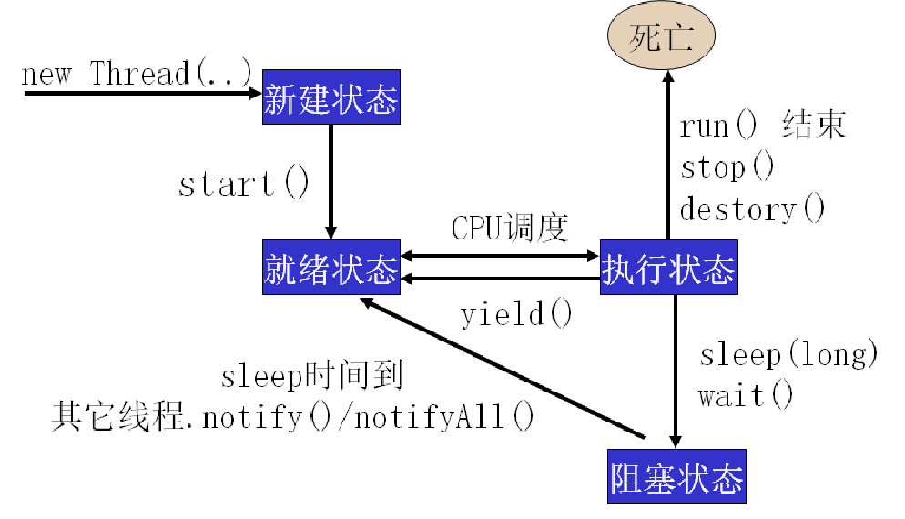

- `destroy()` 用于异常终止进程
- `yiled()` 让当前处于运行状态的线程退回到可运行状态，让出抢占资源的机会

1. **线程的生命周期与状态: 新建-就绪-（阻塞）-运行--死亡** 

- new 创建（新建状态） 
- 调用start()后（就绪状态），获得CPU时间片
- 开始执行run（）方法的线程执行体，该线程处于运行状态
- 如果线程调用了sleep()或者调用了一个阻塞式IO方法等，该线程处于阻塞状态
- 如果线程的run()执行完成或者抛出一个未捕获的异常等原因，该线程处于死亡状态

2. **Java的多线程机制**

- `java.lang`中的线程类`Thread`封装了所有需要的线程操作控制，有很多方法用来控制一个线程的运行、休眠、挂起或停止。这就是Java的多线程机制

  `run()方法`

- Runnable接口：

  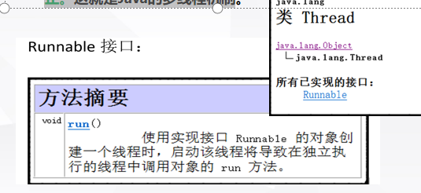

### 创建线程

- 一种方法是通过继承线程类Thread来创建线程类；（简单、然而单继承）
- 另一个方法是建立一个实现Runnable接口的类来创建线程。

1. **通过继承Thread类创建线程**

```java
class 线程的类名 extends Thread
{
    public void run()//覆盖
    {  
        程序语句　  
    }  
}
```

2. **通过Runnable接口创建线程**

- 当一个类是从其他类继承时，此时就不能再继承Thread类来创建线程，这时可以通过接口Runnable直接创建线程对象。
- 常用的构造方法： 
      `Thread(Runnable target)`
- 接口Runnable是一个抽象接口，接口中只声明了一个未实现的run方法。

3. **两种创建线程方法的比较：**

- 由继承Thread类创建线程对象简单方便，可以直接操作线程，但不能再继承其他类。
- 在继承其他类的类中可用Runnable接口创建线程对象。可保持程序风格的一致性。

**总是从主线程开始执行，且主线程与子线程交替执行**

### 线程优先级

- Java为了使有些线程可以提前得到服务，可给线程设置优先级。
- 在单个CPU上运行多线程时采用了线程队列技术，Java虚拟机支持固定优先级队列，一个线程的执行顺序取决于它相对其它Runnable线程的优先级。（**但是并不是完全如此**）

**Thread定义了其中3个常数：**

- MAX_PRIORITY，最大优先级（值为10）。
- MIN_PRIORITY，最小优先级（值为1）。
- NORM_PRIORITY，缺省优先级（值为5）**默认**。

`public void setPriority(int)`设置优先级

### 线程类的方法

**线程的类方法**

- CurrentThread()    返回正在运行的Thread对象名
- sleep(int n)          让当前线程休眠n毫秒
- activeCount()        返回该线程组中当前激活的线程的数目
- checkAccess()       检测当前线程是否可以被修改
- destroy()                终止一个线程，不清除其他相关内容
- getName()            返回线程的名称
- getPriority()         返回线程的优先级
- interrupt()            向一个线程发送一个中断信息
- interrupted()        检查该线程是否被中断
- isAlive()                检查线程是否处于激活状态
- isInterrupted()     检查另一个线程是否被中断

### 线程的同步机制与共享资源

但有时一些同时运行的线程需要共享数据，例如两个线程同时存取一个数据流，其中一个对数据进行了修改，而另一个线程使用的仍是原来的数据，这就带来了数据不一致问题。因此，编程时必须考虑其它线程的状态和行为，以解决资源共享问题。

- Java提供了同步设定功能。
- 目的是为了防止多个线程访问一个数据对象时，对数据造成的破坏。
- Java多线程的同步依靠的是对象锁机制，**synchronized**关键字的背后就是利用了封锁来实现对共享资源的互斥访问。
- 只能同步方法，不能同步变量和类

## 第十五章 泛型与集合框架

- 集合框架：指存储一系列的变量
- Java集合框架：常见数据结构的类
- Java 集合框架提供了一套性能优良，使用方便的接口和类，java集合框架位于java.util包中

**集合框架三大内容**

- **接口**：即表示集合的 **抽象数据类型**。接口提供了让我们对集合中所表示的内容进行单独操作的可能。
- **实现**：也就是集合框架中接口的具体实现。实际它们就是那些可复用的 **数据结构**。
- **算法**：在一个实现了某个集合框架中的接口的对象身上完成某种有用的计算的方法，例如查找、排序等。这些算法通常是 **多态** 的，因为相同的方法可以在同一个接口被多个类实现时有不同的表现。

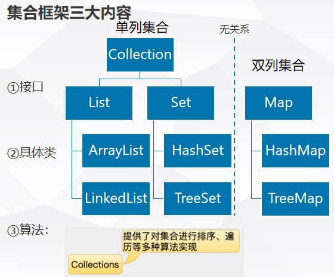

- Collection 接口是一组允许重复的对象。
- Set 接口继承 Collection，但不允许重复 
- List 接口继承 Collection，允许重复，并引入位置下标 
- Map 接口既不继承 Set 也不继承 Collection

**Collection接口具体查询JDK API**


### List接口

**ArrayList**：实现了长度可变的数组，在内存中分配连续的空间。遍历元素和随机访问元素的效率比较高
**LinkedList**：采用链表存储方式。插入、删除元素时效率比较高

**遍历List集合**

1. 通过for循环和get()方法配合实现遍历
2. 通过迭代器Iterator实现遍历
   - 所有集合接口和类都没有提供相应遍历方法，而是由Iterator实现集合遍历
   - Collection 接口的iterator()方法返回一个Iterator，然后通过Iterator接口的两个方法可实现遍历
   - boolean hasNext(): 判断是否存在另一个可访问的元素 
   - Object next(): 返回要访问的下一个元素

**List接口常用方法**

| **方法**                     | **功能**                                                     |
| ---------------------------- | ------------------------------------------------------------ |
| boolean add(Object o)        | 在列表的末尾顺序添加元素，起始索引位置从0开始                |
| void add(int index,Object o) | 在指定的索引位置添加元素。索引位置必须介于0和列表中元素个数之间 |
| int size()                   | 返回列表中的元素个数                                         |
| Object get(int index)        | 返回指定索引位置处的元素。取出的元素是Object类型，使用前需要进行强制类型转换 |
| boolean contains(Object o)   | 判断列表中是否存在指定元素                                   |
| boolean remove(Object o)     | 从列表中删除元素                                             |
| Object remove(int index)     | 从列表中删除指定位置元素，起始索引位置从0开始                |
| boolean add(Object o)        | 在列表的末尾顺序添加元素，起始索引位置从0开始                |

**LinkedList类** 

插入、删除操作频繁时，可使用LinkedList来提高效率，LinkedList还额外提供对头部和尾部元素进行添加和删除操作的方法

**LinkedList类特殊方法**

| **方法**                | **功能**                       |
| ----------------------- | ------------------------------ |
| void addFirst(Object o) | 在列表的首部添加元素           |
| void addLast(Object o)  | 在列表的末尾添加元素           |
| Object getFirst()       | 返回列表中的第一个元素         |
| Object getLast()        | 返回列表中的最后一个元素       |
| Object removeFirst()    | 删除并返回列表中的第一个元素   |
| Object removeLast()     | 删除并返回列表中的最后一个元素 |

eg：

```java
public class LinkedListTest {
	public static void main(String[] args) {
		Dog ououDog = new Dog("欧欧", "雪娜瑞");
		Dog yayaDog = new Dog("亚亚", "拉布拉多");
		Dog meimeiDog = new Dog("美美", "雪娜瑞");
		Dog feifeiDog = new Dog("菲菲", "拉布拉多");
		LinkedList dogs = new LinkedList();
		dogs.add(ououDog);
		dogs.add(yayaDog);
		dogs.addLast(meimeiDog);
		dogs.addFirst(feifeiDog);
		Dog dogFirst = (Dog) dogs.getFirst();
		System.out.println("第一条狗狗昵称是" + dogFirst.getName());
		Dog dogLast = (Dog) dogs.getLast();
		System.out.println("最后一条狗狗昵称是" + dogLast.getName());
		dogs.removeFirst();
		dogs.removeLast();
    }
}
```


### Set接口

- List用于存储
- Set用于快速查找

**HashSet类**

- HashSet是使用一个哈希表存储元素的，是非排序的，不允许有重复元素，可以随机访问，是Set接口的最优性能实现。

- 为了保证HashSet能正常工作，要求当两个对象用equals()方法比较的结果为true时，它们的哈希码也相等

  ​		例如，如果`object1.equals(object2) == true`，那么以下表达式的结果也应为true：
  ​					`object1.hashCode() == object2.hashCode()`

**HashSet元素不充复的原理**

- 如果hash码值不相同，说明是一个新元素，存；
- 如果hash码值相同，且equles判断相等，说明元素已经存在，不存；
- 如果hash码值相同，且equles判断不相等，说明元素不存在，存

**TreeSet类**
TreeSet类实现了`SortedSet`接口，能够对容器中的对象进行排序。当向TreeSet中加入一个对象后，会继续保持对象间的排序的次序

`x.compareTo(y)`：如果返回值为0，则表示x和y相等；如果返回值大于0，则表示x大于y；如果返回值小于0，则表示x小于y。

TreeSet调用对象的`compareTo()`方法比较容器中对象的大小，然后进行升序排列。

### Map接口

Map接口专门处理键值映射数据的存储，可以根据键实现对值的操作
最常用的实现类是HashMap

Map接口常用方法

| **方法**                            | **功能**                                           |
| ----------------------------------- | -------------------------------------------------- |
| Object put(Object key, Object val)  | 以“键-值对”的方式进行存储                          |
| Object get (Object key)             | 根据键返回相关联的值，如果不存在指定的键，返回null |
| Object remove (Object key)          | 删除由指定的键映射的“键-值对”                      |
| int size()                          | 返回元素个数                                       |
| Set keySet ()                       | 返回键的集合                                       |
| Collection values ()                | 返回值的集合                                       |
| boolean	containsKey (Object key) | 如果存在由指定的键映射的“键-值对”，返回true        |


### 泛型

- 把任何类型对象通过add(Object obj) 放入List中，认为只是Object类型
- 通过get(int index) 取出List中元素时必须进行强制类型转换，繁琐而且容易出现异常
- 使用Map的put(Object key, Object value)和get (Object key)存取对象时存在同样问题
- 使用Iterator的next()方法获取元素时存在同样问题
- JDK5.0中通过引入泛型有效的解决了这个问题
- JDK5.0使用泛型改写了集合框架中的所有接口和类
- 泛型：就是允许在定义类、接口、方法时使用类型形参。这个类型形参将在声明变量、创建对象、调用方法时动态指定，即传入实际的类型参数（也叫传入类型实参）

`List<Dog> dogs = new ArrayList<Dog>();`

`Map<String, String> countries = new HashMap<String, String>();`

```java
public class GenericsTest {
	public static void main(String[] args) {
		List<Dog> dogs = new ArrayList<Dog>();
		dogs.add(new Dog("欧欧", "雪娜瑞"));
		dogs.add(new Dog("亚亚", "拉布拉多"));
		dogs.add(new Dog("美美", "雪娜瑞"));
		dogs.add(new Dog("菲菲", "拉布拉多"));
		// dogs.add("hello");
		//无需强制类型转换，即：dog = (Dog) doges.get(2);
		Dog dog = dogs.get(2);
		System.out.println("第三个狗狗的信息如下：");
		System.out.println(dog.getName() + "\t" + dog.getType());
		// 4、使用Iterator遍历dogs对象
		System.out.println("\n所有狗狗的信息如下：");
		Iterator<Dog> it = dogs.iterator();
		while (it.hasNext()) {
			dog = it.next();
			System.out.println(dog.getName() + "\t" + dog.getType());
		}
    }
}
```

**泛型类**

类似C++函数模板

`public class 类名<T>`


## 第十章 输入、输出流

源自 `java.io` 包

- **File类**
- 输入输出流
  - 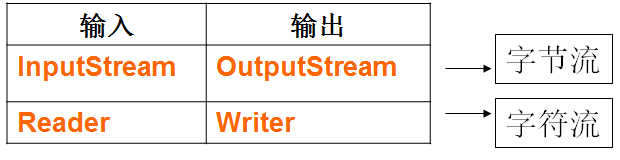
  - 
  - 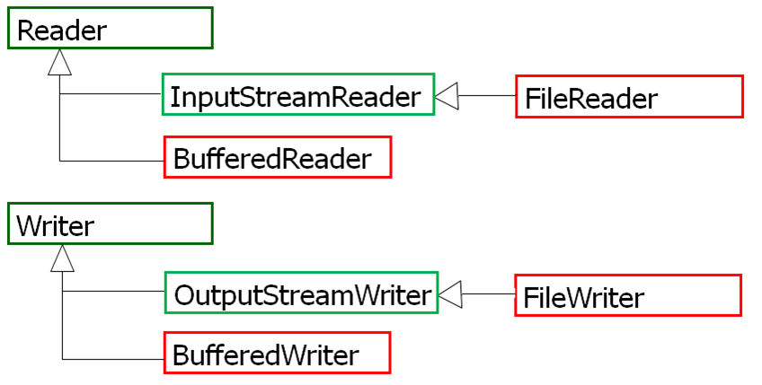

### 10.1 File类

如果要对文件进行操作，需要在内存中创建相应的 `java.io.File`对象

File对象只能获取文件的一些基本信息，如：目录、文件长度或读写权限等，不能读写文件

- 相对路径：`".\\files\\input.txt"`
- 绝对路径：`"C:\\workspace\\files\\input.txt"`
- 其中第一个`\`为转义符

**构造方法**

```java
File(File parent, String child) 
//从父抽象路径名和子路径名字符串创建新的 File实例。  
File(String pathname) 
//通过将给定的路径名字符串转换为抽象路径名来创建新的 File实例。  
File(String parent, String child) 
//从父路径名字符串和子路径名字符串创建新的 File实例。  
```

**常用方法**

```java
//访问文件名、文件检测、文件信息方法：
public String getName() 获取文件的名字
public boolean canRead() 判断文件是否是可读的
public boolean canWrite() 判断文件是否可被写入
public boolean exits() 判断文件是否存在
public long length() 获取文件的长度（单位是字节）
public String getAbsolutePath() 获取文件的绝对路径
public String getParent() 获取文件的父目录
public boolean isFile() 判断文件是否是一个普通文件，而不是目录
public boolean isDirectroy() 判断文件是否是一个目录
public boolean isHidden() 判断文件是否是隐藏文件
public long lastModified() 获取文件最后修改的时间
//目录操作方法：
public boolean mkdir() 创建目录 
public String[] list() 用字符串形式返回目录下的全部文件。
public File [] listFiles() 用File对象形式返回目录下的全部文件。
public String[] list(FilenameFilter obj) 用字符串形式返回目录下的指定类型的所有文件
public File [] listFiles(FilenameFilter obj) 用File对象形式返回目录下的指定类型所有文件
```

上述方法中有一个参数 `FilnameFilter` 是一个接口，该接口有一个方法

```java
public boolean accept(File dir, Strin)
```


### 10.2 文件字节输入流

`java.io.FileInputStream`类

操作对象为 **byte**

构造方法

```java
FileInputStream(File file) 
//通过打开与实际文件的连接创建一个 FileInputStream ，该文件由文件系统中的 File对象 file命名。  
FileInputStream(FileDescriptor fdObj) 
//创建 FileInputStream通过使用文件描述符 fdObj ，其表示在文件系统中的现有连接到一个实际的文件。  
FileInputStream(String name) 
//通过打开与实际文件的连接来创建一个 FileInputStream ，该文件由文件系统中的路径名 name命名。  
```

常用方法

```java
int read() //读取一个字节，返回该字节对应的 int 值
int read(byte b[]) //读取数据至 b,返回读取的字节个数
int read(byte b[],int off,int len) //查看 API
void close() //使用完字节流记得关闭
```


### 10.3 文件字节写入流

`java.io.FileOutpoutStream`

操作对象为 **byte**

构造方法

```java
FileOutputStream(File file) 
//创建文件输出流以写入由指定的 File对象表示的文件。  
FileOutputStream(File file, boolean append) 
//创建文件输出流以写入由指定的 File对象表示的文件。  
FileOutputStream(FileDescriptor fdObj) 
//创建文件输出流以写入指定的文件描述符，表示与文件系统中实际文件的现有连接。  
FileOutputStream(String name) 
//创建文件输出流以指定的名称写入文件。  
FileOutputStream(String name, boolean append) 
//创建文件输出流以指定的名称写入文件。  
```

常用方法

```java
void write(int b) //将指定字节写入文件输出流
void write(byte b[]) //将数组 b 的内容写入
void write(byte b[],int off,int len) //查看 API
void close() //使用完字节流记得关闭
```


### 10.4 文件字符输入、输出流

操作对象为 **char**

**FileReader**

构造方法

```java
FileReader(String name)
FileReader(File file)
```

常用方法

```java
int read() //读取一个字符，返回该字符对应的 int 值
int read(char b[]) //读取数据至 b,返回读取的字符个数
int read(char b[],int off,int len) //查看 API
void close() //使用完字符流记得关闭
```

**FileWriter**

构造方法

```java
FileWriter(String name)
FileWriter(File file)
```

常用方法

```java
void write(int c) //将指定字符写入文件输出流
void write(char b[]) //将数组 b 的内容写入
void write(char b[],int off,int len) //查看 API
void write(String str)
void close() //使用完字符流记得关闭
```


### 10.5 缓冲流

`BufferedReader`和`BufferedWriter`类创建的对象称作缓冲输入、输出流。二者的源和目的地必须是字符输入流和字符输出流

**特点：** 按行读取文件

**构造方法：**

```java
BufferedReader reader = BufferedReader(Reader in); 
BufferedWriter writer = BufferedWriter (Writer out); 
```

**常用方法：**

| 方法                              | 描述                                 |
| --------------------------------- | ------------------------------------ |
| readLine()                        | BufferedReader流读取文本行           |
| newLine();                        | BufferedWriter流向文件写入一个回行符 |
| write(String s, int off, int len) | BufferedWriter流把字符串s写到文件中  |

### 10.6 随机流

`RandomAccessFile` 类

**构造方法：**

```java
RandomAccessFile(String name,String mode); 
RandomAccessFile(File file,String mode);
```

**参数mode可选：“r” 或 “rw”** 

**RandomAccess的含义：应该是任意访问，而不是随机访问，相关方法：**

```java
seek(long a);	定位RandomAccessFile流的读写位置 
getFilePointer();	获取流的当前读写位置 
```


### 10.7 数组流

数组流包括**字节数组流(ByteArrayInputStream)**和**字符数组流(ByteArrayOutputStream)**。用于读写内存，从而提升读写效率

**ByteArrayInputStream构造方法及常用方法:**

```java
ByteArrayInputStream(byte[] buf);	
ByteArrayInputStream(byte[] buf,int offset,int length);	
public int read();						  //顺序地从源中读出一个字节 
public int read(byte[] b,int off,int len);//顺序地从源中读出参数len指定的字节数
```

**ByteArrayOutputStream构造方法及常用方法：**

```java
ByteArrayOutputStream();	
ByteArrayOutputStream(int size);	
public void write(int b); 	    //顺序地向缓冲区写入一个字节
public void write(byte[] b,int off,int len);
//将参数b中指定的len个字节顺序地写入缓冲区
public byte[] toByteArray(); 	//返回输出流写入到缓冲区的全部字节
```

### 10.8 总结

| **分类**   | **字节输入流**       | **字节输出流**        | **字符输入流**    | **字符输出流**     |
| ---------- | -------------------- | --------------------- | ----------------- | ------------------ |
| 抽象基类   | InputStream          | OutputStream          | Reader            | Writer             |
| 访问文件   | FileInputStream      | FileOutputStream      | FileReader        | FireWriter         |
| 访问数组   | ByteArrayInputStream | ByteArrayOutputStream | CharArrayReader   | CharArrayWriter    |
| 访问管道   | PipedInputStream     | PipedOutputStream     | PipedReader       | PipedWriter        |
| 访问字符串 |                      |                       | StringReader      | StringWriter       |
| 缓冲流     | BufferedInputStream  | BufferedOutputStream  | BufferedReader    | BufferedWriter     |
| 转换流     |                      |                       | InputStreamReader | OutputStreamWriter |
| 对象流     | ObjectInputStream    | ObjectOutputStream    |                   |                    |
| 抽象基类   | FilterInputStream    | FilterOutputStream    | FilterReader      | FilterWriter       |
| 打印流     |                      | PrintStream           |                   | PrintWriter        |
| 推回输入流 | PushbackInputStream  |                       | PushbackReader    |                    |
| 数据流     | DataInputStream      | DataOutputStream      |                   |                    |


## 第11章 JDBC与MySQL编程

### 11.1 JDBC

**JDBC**(Java DataBase Connection)是Java数据库连接API(应用程序接口)，不依赖具体数据库

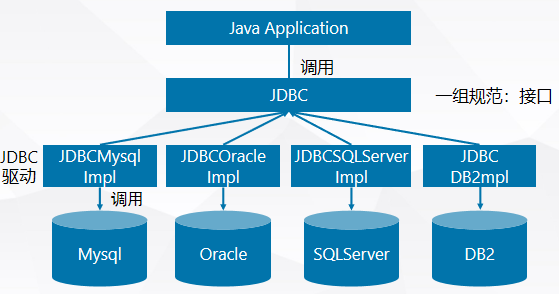

**JDBC常见操作**

常用的数据库建立连接方式

建立JDBC-ODBC连接桥

1. 加载JAVA-ODBC数据库驱动程序** ，eg：mysql-connector-java-8.0.22.jar
2. 向数据库发送SQL语句
3. 处理数据库返回的结果

**JDBC-ODBC模式**

- 建立JDBC-ODBC桥接器
- 建ODBC数据源
- 和ODBC数据源建立连接
- 缺点：计算机平台必须提供ODBC(Open DataBase Connection)，因此影响了程序的移植性
- 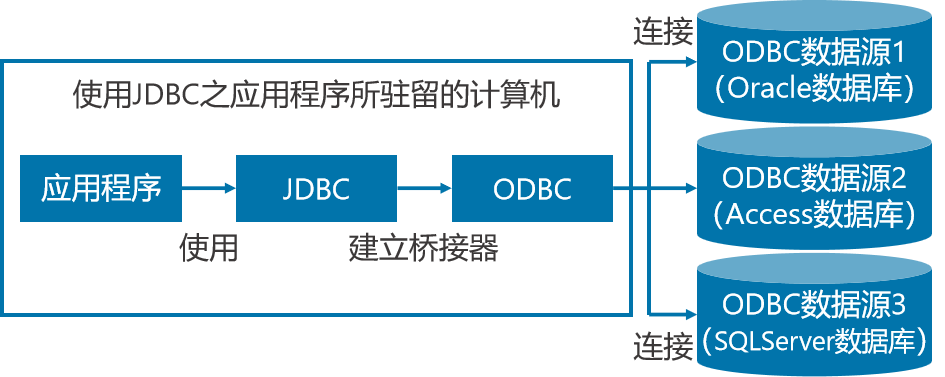

**加载纯Java数据库驱动**

- 这种类型的 JDBC 驱动程序使用 Java 编写，它调用数据库厂商提供的本地 API
- 通过这种类型的 JDBC 驱动程序访问数据库减少了 ODBC 的调用环节，提高了数据库访问的效率
- 在这种方式下需要在客户的机器上加载本地JDBC驱动程序和安装特定数据库厂商的本地 API

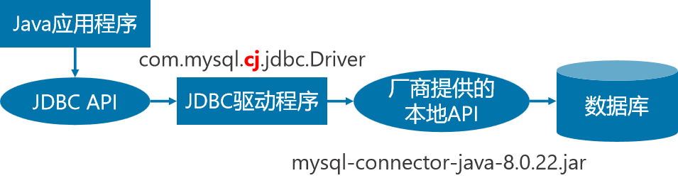

**JDBC API**

- JDBC API是一系列的接口，它使得应用程序能够进行数据库联接，执行SQL语句，并且得到返回结果。
- java.sql.DriverManager装载驱动程序，获取数据库连接
- java.sql.Connection建立指定数据库的连接
- java.sql.Statement在一个给定的连接中作为SQL执行声明的容器

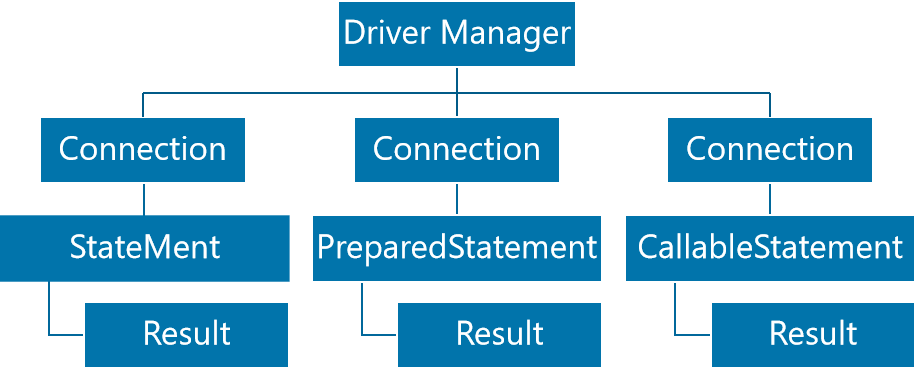

### 11.2 连接数据库

**利安杰MySQL**

```java
Connection conn = DriverManager.getConnection("jdbc:mysql://localhost:3306/test", "root", "123456");
```


**Driver接口**

- Java.sql.Driver接口是所有 JDBC驱动程序需要实现的接口。这个接口是提供给数据库厂商使用的，不同数据库厂商提供不同的实现
- 在程序中不需要直接去访问实现了 Driver 接口的类，而是由驱动程序管理器类(java.sql.DriverManager)去调用这些Driver实现

- **加载JDBC驱动** 

  - 加载JDBC驱动需调用 Class 类的静态方法forName()，向其传递要加载的JDBC驱动的类名
  - `Class.forName("com.mysql.jdbc.Driver");`
  - **MySQL8.0之后** 改为 **"com.mysql.cj.jdbc.Driver“**

- **建立连接**

  - DriverManager 类是驱动程序管理器类，可以调用 DriverManager类的getConnection()方法建立数据库连接     

  - ```java
    Connection con=DriverManager.getConnection("jdbc:mysql://127.0.0.1:3306/test?useSSL=false&serverTimezone=UTC"
    ” , "root" , "123456");
    ```

  - JDBC URL 用于标识一个连接的数据资源。

  - JDBC URL的标准由三部分组成，各部分间用冒号分隔。 

    - jdbc:<子协议>:<子名称>
    - 协议：JDBC URL中的协议总是jdbc 
    - 子协议：子协议用于标识一个数据库驱动程序
    - 子名称：一种标识数据库的方法。子名称可以依不同的子协议而变化，用子名称的目的是为了定位数据库提供足够的信息 

    - 常用JDBC URL

      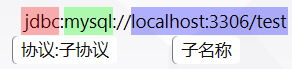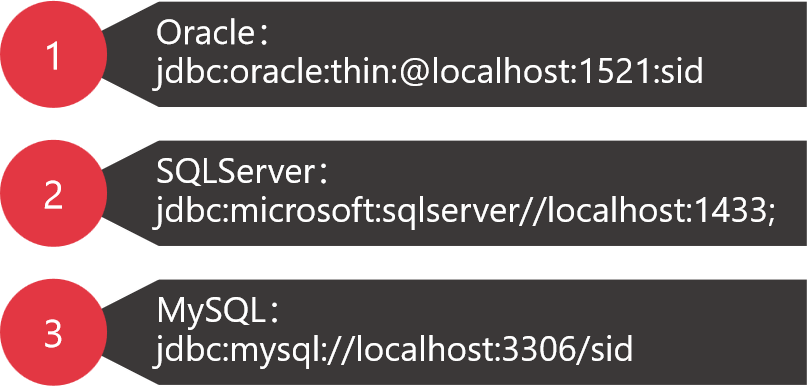


**访问数据库**

3个接口

1. Statement
2. PrepatedStatement
3. CallableStatement

**Statement**

- 通过调用 Connection 对象的 createStatement 方法创建该对象
  `Statement stmt=connection.createStatement();`
- 该对象用于执行静态的 SQL 语句，并且返回执行结果
- Statement 接口中定义一系列方法用于执行 SQL 语句：
  `ResultSet rs=stmt.executeQuery("select * from goods");`

**ResultSet**

- 通过调用 Statement 对象的 `excuteQuery()`方法创建该对象
- ResultSet 对象以逻辑表格的形式封装了执行数据库操作的结果集，ResultSet 接口由数据库厂商实现
- ResultSet 对象维护了一个指向当前数据行的**游标**，初始的时候，游标在第一行之前，可以通过 ResultSet 对象的 **next()** 方法移动到下一行
- ResultSet 接口的常用方法：
  - `boolean next()`
  - `getString()`

**JDBC API 小结**

- 加载数据库驱动，即**`Class.forName(dirver)`**

- java.sql.DriverManager用来装载驱动程序，获取数据库连接；java.sql.Connection完成对某一指定数据库的联接   

  **`Connection con= DriverManager.getConnection(dbURL)`**

- java.sql.Statement在一个给定的连接中作为SQL执行声明的容器，他包含了两个重要的子类型。

  - Java.sql.PreparedSatement 用于执行预编译的sql声明
  - Java.sql.CallableStatement用于执行数据库中存储过程的调用
    **`Statement sql= con.createStatement();`**

- java.sql.ResultSet对于给定声明取得结果的途径
       **`ResultSet rs= statement.execute("sql 语句");`**


### 查询操作

**基本步骤**

- **向数据库发送SQL查询语句**

  ```java
  try {
  	Statement sql = conn.createStatement();
  } catch (SQLException e) {
  	e.printStackTrace();
  }
  ```

  生成SQL语句对象，可以对conn所关联的数据库进行查询操作

- **获取查询结果**

  `ResultSet rs = sql.executeQuery("select * from goods where price>300000");`

  - 将查询结果保存到ResultSet对象中，该对象的内容为满足查询条件的集合
  - next(); getString(int columnIndex or String columnName); getXxx()
  - "select * from goods where price>300000"为SQL语句，可以通过设置得到不同的查询内容：包括ResultSet的列数与查询应该满足的条件
  - 注意：ResultSet 对象和数据库连接对象（Connection 对象）绑定，一旦连接对象被关闭，ResultSet对象中的数据将立刻消失

**顺序查询**

**获取一个表中的字段个数和名称**

- 法一

  DatabaseMetaData //获取连接到的数据库的结构、存储等信息
  (1) DatabaseMetaData实例的获取
  `Connection conn = DriverManager.getConnection(……)；`
  **`DatabaseMetaData dbmd = conn.getMetaData();`**
  (2) 获取某个表的列信息
        dbmd.getColumns()方法返回的结果集中每一列都有23个字段的描述，
        常用到的有：
          3.TABLE_NAME String => table name (表名称)
          4.**COLUMN_NAME String => column name(列名)**
          5.**DATA_TYPE int => SQL type from java.sql.Types**          

  ​        6.**TYPE_NAME String => Data source dependent type name,for a UDT the type name    is fully qualified(列的数据类型)**
  ​        7.COLUMN_SIZE int => column size.

- 法二

  ResultSetMetaData //可用于获取 ResultSet 对象中列的类型和属性信息的对象
  (1) ResultSet对象调用getMetaData()方法建立ResultSetMetaData实例

  ```java
  Connection conn = DriverManager.getConnection(……)；
  Statement sql=con.createStatement();
  ResultSet rs=sql.executeQuery("select * from goods");
  ResultSetMetaData rsmd = rs.getMetaData();
  ```

  (2) 获取某个表的**列信息**
   getColumnCount()，返回此 ResultSet 对象中的列数。
  getColumnLabel(int column) ，获取用于打印输出和显示的指定列的建议标题。
  getColumnType(int column) ， 获取指定列的 SQL 类型
  getColumnTypeName(int column)，获取指定列的 SQL 类型的名称

**随机查询**

滚动查询经常用到ResultSet的下述方法

| **方法**                  | **功能**                         |
| ------------------------- | -------------------------------- |
| boolean previous()        | 将游标向上移动                   |
| void beforeFirst()        | 将游标移动到结果集的初始位置     |
| void afterLast()          | 将游标移到结果集最后一行之后     |
| void first()              | 将游标移到结果集的第一行         |
| void last()               | 将游标移到结果集的最后一行       |
| boolean isAfterLast()     | 判断游标是否在最后一行之后       |
| boolean isBeforeFirst()   | 判断游标是否在第一行之前         |
| boolean ifFirst()         | 判断游标是否指向结果集的第一行   |
| boolean isLast()          | 判断游标是否指向结果集的最后一行 |
| int getRow()              | 得到当前游标所指行的行号         |
| boolean absolute(int row) | 将游标移到参数row指定的行号      |

实现方法：

- 设置con.createStatement(int type, int concurrency)
- 参数type:决定结果集滚动方式，TYPE_FORWORD_ONLY,TYPE_SCROLL_INSENSTIVE,TYPE_SCROLL_SENSTIVE
- concurrency：是否可以通过结果集更新数据库

**其它查询**
通过设置查询条件进行不同要求的查询

- 条件查询
  `String SQL = "SELECT * FROM goods WHERE 条件1 [AND 条件2 [条件3…]]"`
- 排序查询
  **`String SQL = “SELECT * FROM goods ORDER BY price”（测试）`**
- 模糊查询
  可以用SQL语句操作符LIKE进行模式般配：
  用%代替0个或多个字符
  用一个下划线_代替1个字符

### 11.4 增删改查操作

**Statement的主要方法**

- **executeQuery**
  执行查询语句，执行后返回代表查询结果的ResultSet对象
- **executeUpdate**
  执行 INSERT、UPDATE 或 DELETE 语句以及 SQL DDL（数据定义语言）语句，例如 CREATE TABLE 和 DROP TABLE；执行后返回一个整数（int），指更新计数
- **execute**
  执行任何SQL语句，返回一个boolean值，表明执行该SQL语句是否返回了ResultSet

**增删改查**

- 更新操作：

  UPDATE <表名> SET <字段> =新值 WHERE <条件>

- 添加操作：
  INSERT  INTO  表(字段列表)  VALUES (字段值列表)
  INSERT  INTO  表 VALUES (字段值列表)

- 删除操作：
  delete<表名>  WHERE <条件>


### 11.5 预处理与通配符

**预处理**

PreparedStatement类的对象称为预处理对象

使用预处理的原因：

- ```java
  Connection con; // 建立和数据库的连接
  Statement  sql;  
  ResultSet rs; 
  con = DriverManager.getConnection(…);
  sql = con.createStatement();
  rs = sql.executeQuery("SELECT * FROM goods");
  ```

  执行以上语句会，每次更改游标时都会执行SQL语句大大提高SQL解释器的负担

PreparedStatement类的使用

```java
Connection con; // 建立和数据库的连接
PreparedStatement  sql;  
ResultSet rs; 
con = DriverManager.getConnection(…);
sql = con.prepareStatement ("SELECT * FROM goods"); 
rs = sql.executeQuery();
```


## 第13章 Java网络编程

### 13.1 基础知识


- **Internet协议**（IP，Internet Protocol）是网络层协议，是Internet基础网络协议。
- **传输控制协议**（TCP，Transmission Control Protocol）是面向连接的传输层协议，提供的数据源保证按源节点发送的顺序送到目标节点。它与IP协议组合使用，称为TCP/IP。
- **用户数据报协议**（UDP，User Datagram Protocol）是另一个传输层协议，UDP速度更快，但分组不保证送达，更不用说顺序送达，因此UDP更适合小的独立数据分组。

- **IP**: 网络中计算机能够相互通信，必须为每一台计算机制定一个标识号，通过标识号来识别要接收数据的计算机和发送数据的计算机。IP地址只能保证数据送到该计算机，但不能保证把这些数据交给对应的**网络应用程序**。

- **端口**：每个被发送的网络数据包的头部都包含有一个称为“端口”的部分，它是一个整数，表示该数据包交给接收数据的那个应用程序。
  - 一台计算机不能有两个使用同一端口号的网络应用程序运行
  - 端口号的范围0-65535.  1~1023为系统保留端口

- **域名**IP地址不方便记忆，因此将IP地址与一个字符串对应，该字符串为域名，DNS(域名解析器)负责IP与域名的解析  如：www.nwsuaf.edu.cn<->210.27.80.4

### 13.2 RUL类

**URL(Uniform Resoutce Locator)是统一资源定位器，它别是Internet/Intranet上的资源位置**


**URL地址组成：**

| http            | **传输协议**（protocol）     |
| --------------- | ---------------------------- |
| www.xahu.edu.cn | **主机名或主机地址（host）** |
| 80              | **通信端口号（可省略）**     |
| index.html      | **文件名称（file）**         |


**构造方法：**

```java
public URL(String spec)
URL url=new URL(“http://www.nwsuaf.edu.cn/index.html”)
public URL(String protocol,String host,String file)
URL url=new URL(“http”,”www.163.com”,”index.html”)
```

**常用方法：**

```java
public int getPort();
public String getProcotol();
public String getHost();
public String getFile();
public final inputStream openStream();
//返回一个输入流，该输入流指向URL对象所包含的资源，通过该输入流可以将服务器上的资源信息读入到客户端
```


**从URL读取网络资源数据的一般步骤：**

- 创建类URL的实例对象，使其指向给定的网络资源；
- 通过类URL的成员方法openStream建立URL连接，并返回输入流对象的引用，以便读取数据；
- 可选步骤，通过java.io.BufferedInputStream或java.io.BufferedReader封装输入流；
- 读取数据，并进行数据处理；
- 关闭数据流。

### 13.3 InetAddress类

类 java.net.InetAddress用来表示Internet地址，它有两个子类，分别是java.net.Inet4Address和java.net.Inet6Address

**InetAddress类的常用方法：**

| 方 法 名 称              | 方 法 说 明                                              | 返 回 类 型 |
| ------------------------ | -------------------------------------------------------- | ----------- |
| getLocalHost()           | 返回本地主机InetAddress对象                              | InetAddress |
| getByName(String host)   | 获取指定主机名称的IP地址                                 | InetAddress |
| getHostName()            | 获取此主机名                                             | String      |
| getHostAddress()         | 获取主机IP地址                                           | String      |
| isReachable(int timeout) | 在timeout指定的毫秒时间内，测试IP地址是否可达            | boolean     |
| getAddress()             | 返回此 InetAddress 对象的原始 IP 地址                    | byte[]      |
| equals(Object other)     | 判断两个IP地址是否相等                                   | boolean     |
| toString()               | 返回此 InetAddress 对象的字符串表现形式（主机名/IP地址） | String      |


### 13.4 Socket套接字

- 套接字（Socket）是代表计算机之间**网络连接的对象**，用于建立计算机之间的**TCP连接**。
- 一个Socket由**一个IP地址**和**一个端口**号唯一确定。
- 通信的两端都要有Socket，是两台机器间通信的端点
- Socket允许程序把网络连接当成一个流，数据在两个Socket间通过**IO传输**。
- 主动发起通信的应用程序属客户端，等待通信请求的为服务器端。

**三次握手机制：**

1. 客户端向服务器发出连接请求，等待服务器确认；
2. 服务器向客户端回送一个响应，通知客户端接受了请求连接；
3. 客户端在此向服务器发送确认消息，确认连接。

**Socket编程需要用到两个类：**

- ==ServerSocket==（**服务器端使用，用于接收连接请求**）
- ==Socket==（**服务器和客户端均要使用，用于双方通信**）
- 这两个类分别直接继承自Object类

服务器端程序：

- **建立==ServerSocket==对象，指定端口号**
- 等待客户端呼叫
- 客户呼叫之后**生成和客户端交互的==Socket==对象**

客户端程序：

- **建立==Socket==对象**
- 依据**服务器程序的(IP,port)呼叫服务器程序**


**服务器端套接字**

服务器端套接字：**ServerSocke**t类的实例对象，用于实现服务器程序，ServerSocket类将监视指定的端口，并建立客户端到服务器端套接字的连接，也就是客户负责呼叫任务

`ServerSocket(int port)`

当服务器建立ServerSocket套接字对象以后，就可以使用该对象的`accept()`方法接受客户端请求的套接字连接

该方法被调用之后，将==等待客户的连接请求==，在接收到客户端的套接字连接请求以后，该方法将返回Socket对象，这个Socket对象是已经和客户端建立好连接的套接字，可以通过这个Socket对象获取客户端的输入输出流来实现数据发送与接收


**客户端套接字**

- Socket类是实现客户端套接字的基础。它采用TCP建立计算机之间的连接，并包含了Java语言所有对TCP有关的操作方法，例如建立连接、传输数据、断开连接等
- 客户端程序使用Socket类建立负责连接到服务器的套接字对象
- Socket类定义了多个构造方法，它们可以根据InetAddress对象或者字符串指定的IP地址和端口号创建实例
- 构造方法：`Socket(String host, int port)` 使用host参数指定的IP地址字符串和port参数指定的整数类型端口号创建套接字实例对象


**发送和接收数据**

Socket对象创建成功以后，代表和对方的主机已经建立了连接，可以接收和发送数据了。Socket提供了两个方法分别获取套接字的输入流和输出流，可以将要发送的数据写入输出流，实现发送功能，或者从输入流读取对方发送的数据，实现接收功能

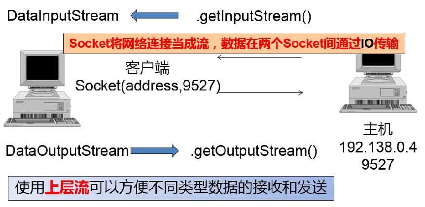

1. 接收数据

   Socket对象从数据输入流中获取数据，该输入流中包含对方发送的数据，这些数据可能是文件、图片、音频或视频。所以，在实现接收数据之前，必须使用getInputStream()方法获取输入流。

   ```java
   InputStream is = socket.getInputStream();
   BufferedReader  in = new BufferedReader(new InputStreamReader(is));
   String line = in.readline();
   ```

2. 发送数据

   Socket对象使用输出流，向对方发送数据，所以，在实现数据发送之前，必须使用getOutputStream()方法获取套接字的输出流。

   ```java
   OutputStream os = socket.getOutputStream();
   BufferedWriter out= new BufferedWriter (new OutputStreamReader(os );
   Out.flush();
   ```

   

**Socket通信总结：**

1. 集安里Socket连接
2. 数据通信
3. 关闭连接


