# **数据结构学习**

[TOC]

## 第1章 数据结构概论

**程序 = 数据结构 + 算法**

- **==数据==：所有能输入到计算机中去的==描述客观事物的符号==**

- **==数据元素==：数据的基本单位也称==结点或记录==**

- **==数据项==：有独立含义的数据==最小单位==，也称为域**

- **数据  >  数据元素   >  数据项**

  **学生表 >  个人记录 >  学号、姓名**

- **数据对象**：相同特性数据元素的集合，是数据的一个子集

### 数据结构（Data Structure）

**数据结构：** 是相互之间存在一种或多种特定**关系的数据元素**的集合

- **逻辑结构**：数据元素间抽象化的相互关系，与数据存储无关，独立于计算机，是从**具体问题抽象出来的数据模型**

  - **线性结构**

    有且仅有一个开始和一个终端结点，并且所**有结点都最多只有一个直接前趋和一个后继**

  - **非线性结构**

    一个结点可能有**多个直接前趋和直接后继**

- **存储结构（物理结构）**：数据元素及其关系在计算机存储器中的存储方式

  - 顺序结构
  - 链式结构

- **操作（数据运算）：**对数据元素的处理


**ADT**


### 算法

**算法的特性**

- **有输入**
- **有输出**
- **有穷性**
- **有效性**
- **确定性**

**算法性能分析**

- **正确性**
- **可读性**
- **健壮性**
- **高效性**
  - **时间复杂度**
  - **空间复杂度**

## 第2章 线性表

### 2.1 线性表(linear list)

 **线性表** 是所有数据结构中最简单的,通常定义为 n个元素的一个 **有限的序列** 。记为
$$
L =(a_1,···,a_i,a_{i+1},···,a_n)
$$
n=0叫做空表，线性表的第一给表项称为表头(head),最后一项称为表尾(tail)

线性表分为 **有序线性表(sorted list)**（元素按照值的递增顺序排列） 与 **无序线性表(unsorted list)** （元素的值与位置之间没有特殊的联系）

线性表的特点：

1. 除第一个元素外，其他每一个元素有一个且仅有一个 **直接前驱**。
2. 除最后一个元素外，其他每一个元素有一个且仅有一个 **直接后继**。
3. 直接前驱和直接后继描述了结点之间的逻辑关系（即邻接关系）。 

```c++
//线性表的抽象基类
template <typename T>
class LinearList {
public:
    LinearList();												//构造函数
   ～LinearList();							   				   //析构函数
    virtual int Size() const = 0;			   					//求表最大体积
    virtual int Length() const = 0;			   					//求表长度
    virtual int Search(T x) const = 0;         					//搜索
    virtual int Locate(int i) const = 0;       					//定位
    virtual bool getData(int i,T& x) const = 0; 				//取值
    virtual void setData(int i, T x) = 0;       				//赋值  
	virtual bool Insert(int i, T x) = 0;            			//插入
    virtual bool Remove(int i, T& x) = 0;	  					//删除
    virtual bool IsEmpty() const = 0;	            			//判表空 
    virtual bool IsFull() const = 0;		  					//判表满
    virtual void Sort() = 0；			  						//排序
    virtual void input() = 0；			  						//输入
    virtual void output() = 0；			  						//输出
    virtual LinearList<T>operator= (LinearList<T>& L) = 0;	  	//复制
};
```

线性表有两种存储方式：顺序存储方式（用其实现的线性表称为 **顺序表**，是用数组作为表达存储结构）和链式存储方式

### 2.2 顺序表(Sequential List)

#### 顺序表的定义：

- 将线性表中的元素相继存放在一个连续的存储空间中
- 可利用一维数组描述存储结构

#### 顺序表的特点：

- 所有元素的逻辑先后顺序与其物理存放顺序一致

**顺序表的优点：**

- 无需位表示结点间的逻辑关系而增加额外的存储空间，存储率高
- 可以方便的随机存取表中的任意结点，存取速度快

#### 顺序表的缺点：

- 在表中插入新元素或删除无用元素时，为了保持其他元素的先对次序不变，平均需要移动一半元素，运行效率低
- 由于要求占用连续的空间，所以需要预先开辟空间，要是替换原数组，时间开销大

#### 顺序表的静态存储和动态存储：

```c++
#define maxSize 100
//顺序表的静态存储表示
typedef int T;
typedef struct {
    T data[maxSize];     
    int n;
} SeqList;
//顺序表的动态存储表示
typedef int T;
typedef struct {
    T *data;                  
    int maxSize, n;
} SeqList;
```

#### 结点点的变体(异质数据)

若想在线性表中存放不同的数据类型可采用等价定义的 **union**:

```c++
typedef union {
	int val;	              //按data.val引用
	char ch;	              //按data.ch引用
	float dir;	              //按data.dir引用
	union data *link;    	  //按data.link引用
}  data;            //整体上是同一类型data     
```

#### 顺序表(SeqList)类的定义

```c++
#include <iostream.h>	       //定义在“seqList.h”中
#include <stdlib.h>
#include "LinearList.h"
const int defaultSize = 100;
template <typename T>
class SeqList: public LinearList<T> {
protected:
	 T *data;		     					//存放数组
	 int maxSize;	     					//最大可容纳表项的项数
     int n;		     						//当前已存表项数
	 void reSize(int newSize);				//改变数组空间大小
public:
	 SeqList(int sz = defaultSize);         //构造函数
	 SeqList(SeqList<T>& L);	           	//复制构造函数
 	～SeqList() {delete[ ] data;}	       //析构函数
     int Size() const {return maxSize;}	    //求表最大容量
     int Length() const {return n;}         //计算表长度
     int Search(T x) const;			 		//搜索x在表中位置，函数返回表项序号
     int Locate(int i) const;				//定位第 i 个表项，函数返回表项序号
     bool Insert(int i, T x);				//插入
  	 bool Remove(int i, T& x);				//删除
     ……
};
```

注：**const成员函数在执行时不能调用非const成员函数**

#### 顺序表的性能分析

- **搜索性能分析**

  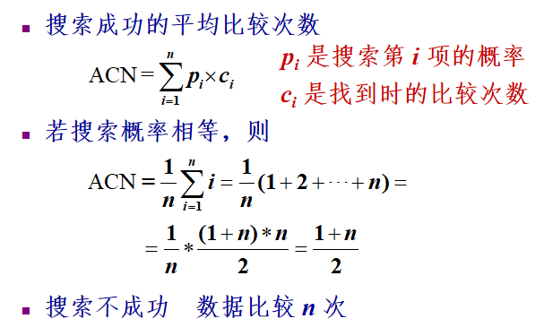

- **插入算法的性能分析**

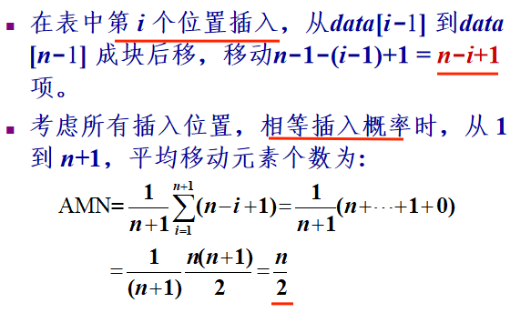

- **删除算法的性能分析**

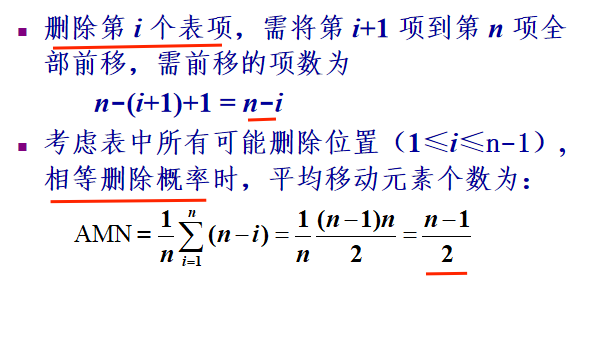

### 2.3 单链表(Singly Linked List)

#### 单链表的特点：

- 每个元素(表项)由结点(Node)构成。
- 线性结构
- 结点之间可以连续，可以不连续存储
- 结点的逻辑顺序与物理顺序可以不一致
- 单链表的特点时长度可以很方便的进行扩充

#### 单链表的类定义

通常使用两个类，即链表的 **结点(linknode)类** 和 **链表类(list)类** 协同表示链表类

1. **复合类**

   利用在LinkNode类中声明友元类的方法，让LinkNode类与List类的成员都能够访问LinkNode类的私有数据成员

```c++
 class List;	            //复合方式

 class ListNode {	        //链表结点类	
 friend class List;	        //链表类为其友元类
 private:
     int data;		        //数据元素域	
     ListNode * link;       //链表指针域		
 };

 class List {	            //链表类		
 private:
     ListNode *first ;      //表头指针
 public:
     //链表公共操作
     ···
 };
```


2. **嵌套类**

   在List类内部对LinkNode类进行定义.由于把LinkNode类定义在List类的private部分，这就保证了List类外部的对象和函数不能直接接触到LinkNode类的对象，若将LinkNode类存放在public部分，List类外部部分也能直接访问它们

   ```c++
   class List {                   //嵌套方式
   private:
       class ListNode {           //嵌套链表结点类
       public:
           int data;			
           ListNode *link;		
       };
       ListNode *first;    	   //表头指针
   public:
       //链表操作
   	···
   };
   ```

   

3. **基类和派生类**

   将LinkNode类声明位基类，List类声明位派生类，建立继承关系，让List类继承LinkNode类的数据成员和某些成员函数，这表示了一种使用关系

   ```c++
   class ListNode {	    	  //链表结点类	
    protected:
        int data;		       
        ListNode * link;          	
    };
   
    class List : public class ListNode {
    //链表类, 继承链表结点类的数据和操作	
    private:
        ListNode *first;         //表头指针
    public:
        //链表操作
        ···
   };
   ```

4. **用struct定义LinkNode类**

   使用这种方法定义LinkNode列，使得LinkNode类失去了封装性，但简化了描述。本书使用这种方式描述链表

   ```c++
   struct ListNode {	       //链表结点类	
        int data;		       
        ListNode * link;          	
    };
   
    class List {
    //链表类, 直接使用链表结点类的数据和操作
    private:
        ListNode *first;          //表头指针
    public:
        //链表操作
        ···
    };    
   ```

#### 链表的插入

```c++
Insert(int i,LinkNode x);
//在第i个位置后插入x
```


- 在链表的最前端

  ```c++
  newNode->link=first;
  first = newNode;
  ```

  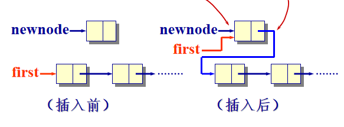

- 在链表中间插入

  ```c++
  newNode->link = currrent->link;		//current为第i个元素的位置的位置
  current->link = newnode;
  ```

  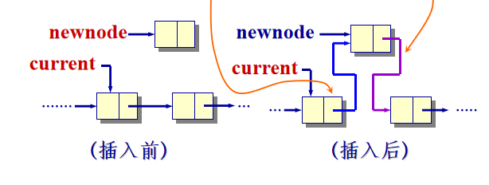

- 在链表最后插入

  ```c++
  newNode->link = current->link;
  current->link = newNode
  ```

  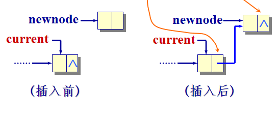

**单链表插入算法的具体实现**

```c++
bool List::Insert(int i, int x) {
//将新元素 x 插入到第 i 个结点之后。i 从1开始，
//i = 0 表示插入到首元结点之前。
    if (first == NULL || i == 0) {	  				  //空表或首元结点前
	    LinkNode *newNode = new LinkNode(x);		  //建立一个新结点
	    newNode->link = first;  
        first = newNode;							  //新结点成为首元结点
   	        
    }			 		
  	else {                    						  //否则，寻找插入位置
        LinkNode *current = first;	  
        int k = 1;     
		while (k < i && current != NULL)      		  //找第i结点
 		{ 
            current = current->link;  
            k++; 
        }
	    if (current == NULL && first != NULL)     	  //链短
		{
            cerr << “无效的插入位置!\n”;  
            return false;
        }
        else {		 								  //插入在链表的中间
		   LinkNode *newNode = new LinkNode(x);
	 	   newNode->link = current->link;
           current->link = newNode;
        }
	}
	return true; 
};
```

#### 链表的删除

- 删除表中的第一个元素

  ```c++
  LinkNode *del;
  del = first;
  first = first->link;
  delete del;
  ```

  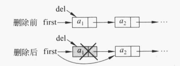

- 删除表中或标为元素

  ```c++
  LinkNode *del;
  del = current->link;			//current为第i-1个元素的位置
  current->link = del->link;
  delete del;
  ```

  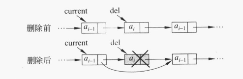

**单链表删除算法具体实现**

```c++
bool Link::Remove(int i,int &x){
//将链表中的第i个元素删去，i从1开始
    LinkNode *del,*current;
    if(i <= i){						//删除第一个结点
        del = first;
        first = first->link;
    }
    else {
        current = first;
        for(int k = 1;k < i-1;k++){		//循环找到第i-1个结点
            if(current == NULL)
                break;
            else
                current = current->link;
        }
        if(current == NULL || current->link == NULL)	//空表或链太短
        {
            cerr<<"无效删除位置!\n";
            return false;
        }
        del = current->link;			//删中间结点或尾结点时拉链
        current->link = del->link;		
    }
    x = del->date;						//去除被删结点中的数据值
    delete del;
    return true; 
}
```

#### 带表头结点的单链表

- 表头结点位于表达最前端，本身不带数据，仅标志表头

- 设置表头结点的目的是 **统一空表与非空表的操作，简化链表操作的实现**

  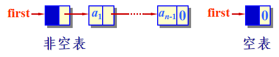

- 删除与插入操作在空表或非空表第一个结点之前的插入可以不作为特殊情况专门处理可以不设立特殊情况，与一般情况一样统一进行处理

**插入**

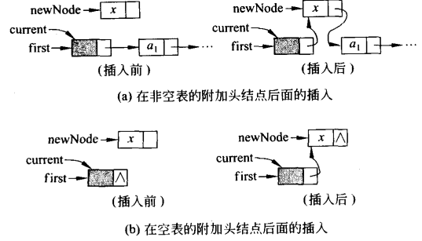

```c++
newNode->link = current->link;
current->link = newNode;
```

**删除**

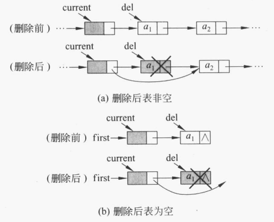

```c++
del = current->link;
current->link = del->link;
delete del;
```


#### 单链表的模板类

- 类模板将类的数据成员和成员函数设计得更加完整、更加灵活

- 类模板更易于复用

- 在单链表的类模板定义中，增加了 **表头结点**

  ```c++
  template <typename T>   //定义在“LinkedList.h”
  struct LinkNode {	 	       	//链表结点类的定义
  	 T data;			       	//数据域
  	 LinkNode<T> *link;     	//链指针域
       LinkNode() 				//构造函数
       { 
           link = NULL; 
       }    
  	 LinkNode(T item, LinkNode<T> *ptr = NULL) //构造函数
       { 
           data = item;  
           link = ptr; 
       }    
       bool operator== (T x) { return data.key == x; }
   	 //重载函数，判相等
       bool operator != (T x) { return data.key != x; }
  };
  template <typename T>
  class List : public LinearList<T> {
  //单链表类定义, 不用继承也可实现
  protected:
  	 LinkNode<T> *first;	 			//表头指针
  public:
  	 List() { 							//构造函数
           first = new LinkNode<T>; 
       }  
  	 List(T x) { 
           first = new LinkNode<T>(x); 
       }
       List( List<T>& L);					//复制构造函数
  	 ~List(){ }							//析构函数
       void makeEmpty();					//将链表置为空表
  	 int Length() const;				//计算链表长度	
       LinkNode<T> *Search(T x);			//搜索含x元素
  	 LinkNode<T> *Locate(int i);		//定位第i个元素
       T *getData(int i);					//取出第i元素值
       void setData(int i, T x);			//更新第i元素值
  	 bool Insert (int i, T x);		    //在第i元素后插入
  	 bool Remove(int i, T& x);	    	//删除第i个元素，x返回该元素的值
       bool IsEmpty() const 		    	//判表空否？空返回true
       { 
           return first->link == NULL ? true : false; 
       }
       LinkNode<T> *getFirst() const { 
           return first; 
       } 
       void setFirst(LinkNode<T> *f ) {
           first = f;
       }
   	 void Sort();			   			//排序
  };
  ```

  详见：文件 [LinkedList.h](数据结构源代码及课件\数据结构类库源代码\ch02_LinerList\LinkedList\LinkedList.h) 

  **注：** 友元函数不是类的成员，不会传给它this指针；静态成员也不能得到传送的this指针

#### 前插法与后插法建立单链表

**前插法**

从一个空表开始，重复读入数据，执行以下两步：

- 生成新结点，将读入的数据存放到新结点的数据域中

- 将该新节点插入到链表的前端，直到读入结束符为止

  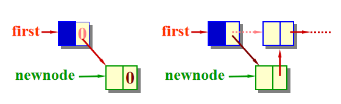

```c++
template <typename T>
void inputFront (T endTag, List<T>& L) {
    LinkNode<T> *newNode, *newF; 
    T val;
    newF = new LinkNode<T>;
 	L.setFirst (newF);      //获取链表L的头结点
    cin >> val;
    while (val != endTag) {
          newNode = new LinkNode<T>(val);
          newNode->link = newF->link;	  //插在表前端
        	newF->link = newNode;
        	cin >> val;
    }
};
```

**后插法**

用后插法建立链表，需要设置一个尾指针last，总是指向新链表中的最后一个结点

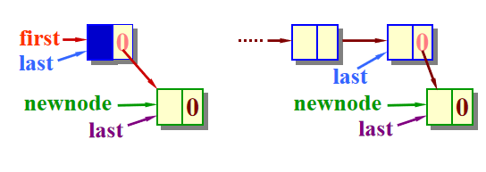

```c++
template <typename T>
void inputRear ( T endTag, List<T>& L ) {
    LinkNode<T> *newNode, *last;  
    T val;
    last = new LinkNode<T>;	  			//建立链表的头结点
    L.setFirst(last);	  	            //为链表L的first赋值 
    cin >> val;
    while ( val != endTag ) {   	 	//last指向当前的表尾
        newNode = new LinkNode<T>(val);
        last->link = newNode;   
        last = newNode;
        cin >> val;						//插入到表末端
    }
    last->link = NULL;              	//表收尾     
}; 
```


### 2.4 线性链表的其他变形

#### 循环链表(Circular Lsit)

- 循环链表是单链表的变形

- 循环链表的最后一个结点的link指针不为NULL，而是指向了表的前端

- 只要知道表中某一结点的地址，就可以搜寻到所有其他结点的地址

  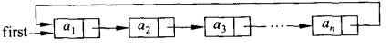

**注：**

- 设current是在循环链表中逐个结点检测的指针，在判断current是否达到链表的链尾是，是判断是否 **current—> link == first**

- 循环链表的运算与单链表类似，但在涉及链头与链尾时的操作稍有不同，若给出放在链尾的rear指针，实现插入或删除运算就会更方便。

  ```c++
  newNode->link = rear->link;
  rear->link = newNode;
  ```

  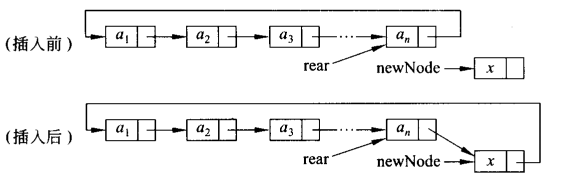

- 循环链表与单链表一样，可以有附加头结点，这样可以简化链表操作，统一空表与非空表的运算

  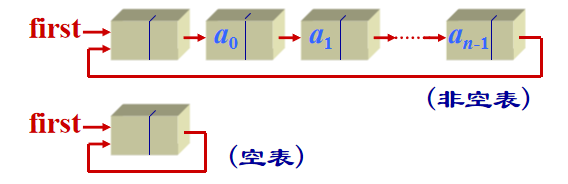

**循环链表的类定义**

```c++
template<class T>
struct CircLinkNode{				//链表结点的注释
    T date;
    cireLinkNode<T> *link;
    CireLinkNode(CireLinkNode<T> *next = NULL) : link(next) {}
    CireLinkNode(T d,CireLinkNode<T>,CireLinkNode<T> *next = N) : date(d),link(next) {}
};

template<class T>
class CireList : public LinearList<T> {		//链表类定义
public:
	CireList(const T& x);					//构造函数
    CireList(CireList<T>& L);				//复制构造函数
    ~CireList();							//析构函数
    int Length()const;						//计算循环链表的长度
    bool IsEmpty();							//链表判空
    CireLinkNode<T> *getHead()const;		//返回附加头结点的地址
    void setHead(CireLinkNode<T> *p);		//设置附加头结点的地址
    CireLinkNode<T> *Search(T x);			//搜索按数据x的元素
    CireLinkNode<T> *Locate(int i);			//搜索第i个元素的地址
    T *getDate(int i);						//取出第i个元素的值
    void setDate(int i,T& x);				//用x修改第i给元素的值
    bool Insert(int i,T& x);				//在第i给元素之后插入x
    bool Remove(int i,T& x);				//删除第i给元素，x返回该元素的值
private:
    CireLinkNode<T> *first,*last;			//定义头指针与尾指针
};
```

**注：**具体实现详见 [CircList.h](数据结构源代码及课件\数据结构类库源代码\ch02_LinerList\CircList\CircList.h) 


#### 双向链表(double linked list)

- 双向链表是指在前驱he后继方向都能游历（遍历）的线性链表

- 双线链表的每个结点结构

  

- 双向链表通常采用带表头结点的循环表形式

  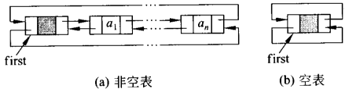

- 结点指向

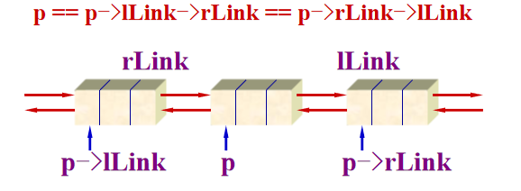

**双向循环链表类的定义**

```c++
template<class T>
struct DblNode{
    T date;
    DblNode ( DblNode<T> *l = NULL, DblNode<T> *r = NULL )         //构造函数
	DblNode ( T value, DblNode<T> *l = NULL, DblNode<T> *r = NULL) //构造函数
};

template<class T>
class DblList : public LinearList<T>{		//链表类定义
public:
    DblList(T uniqueVal);					//构造函数：添加附加头结点
    ~DblList();								//析构函数
    int Length()const;						//计算双链表的长度
    bool IsEmpty();							//判空函数
    DblNode<T> *getHead()const;				//取附加头结点地址
    void setHead(DblNode<T> *ptr);			//设置附加头结点地址
    DblNode<T> *Search(const T& x);			//搜索函数
    DblNode<T> *Locate(int i,int d);		//定位函数，d=0按前驱，d！=0按后驱
    bool Insert(int i,const T& x,int d);	//插入函数，d=0按前驱，d！=0按后驱
    bool Remove(int i,T& x,int d);			//删除函数，d=0按前驱，d！=0按后驱
private:
    DblNode<T> *first;						//定义头结点
}
```

**注：** 具体实现详见 [DblList.h](数据结构源代码及课件\数据结构类库源代码\ch02_LinerList\DblList\DblList.h) 

**双向链表的搜索/插入和删除算法**

- **双向链表的搜索算法**

  ```c++
  template <typename T>
  DblNode<T> *DblList<T>::Search (T x, int d) {
  //在双向循环链表中寻找其值等于x的结点。
      DblNode<T> *current = (d == 0)?						//按d确定搜索方向
            first->lLink : first->rLink;   
  	while ( current != first && current->data != x )	//按d确定搜索方向
          current = (d == 0) ? current->lLink : current->rLink;
  	if ( current != first ) return current;	   			//搜索成功
  	else return NULL;			   						//搜索失败
  };
  ```

- **双向链表的插入算法**

  - 非空表

    ```c++
    newNode->rLink = current->rLink;
    current->rLink = newNode;
    newNode->rLink->lLink = newNode;
    newNode->lLink = current;
    ```

  - 空表

    ```c++
    newNode->rLink = current->rLink;
    current->rLink = newNode;
    newNode->rLink->lLink = newNode;
    newNode->lLink = current;
    ```

  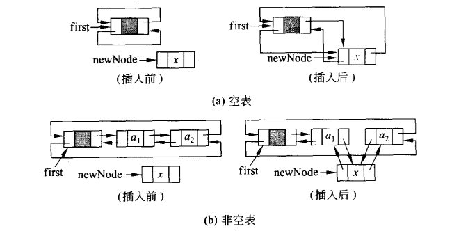

- **双向链表的删除算法**

  ```c++
  current->rLink->lLink = current->lLink;
  current->lLink->rLink = current->rLink;
  ```

  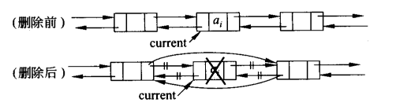

### 2.6 静态链表

- 为数组中每一个元素附加一个链接指针，就形成静态链表结构
- 处理时可以 **不改变各元素的物理位置** ，只要重新链接，就能改变这些元素的逻辑顺序
- 他是利用数组定义的，在整个运算过程中存储空间的大小不会变化

- 静态链表每个结点有两个数据成员构成：**date**域存储数据，**link**域存放链接指针
- 所有结点形成一个结点数组

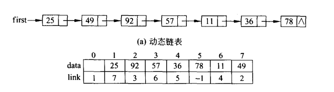

**注：**具体实现详见 [StaticList.h](数据结构源代码及课件\数据结构类库源代码\ch02_LinerList\StaticList\StaticList.h) 

### 2.7 C++STL中链表的使用

C++的STL库中自带链表类型，命名为Lists，下面简述Lists的使用

```c++
#include<iostream>
#include<list>					//引入头文件
#define typename int;
using namespace std;

//1.list的构造函数
list<int>a{1,2,3}
list<int>a(n)     //声明一个n个元素的列表，每个元素都是0
list<int>a(n, m)  //声明一个n个元素的列表，每个元素都是m
list<int>a(first, last)  //声明一个列表，其元素的初始值来源于由区间所指定的序列中的元素，first和last是迭代器

int main()
{
    //2.begin()与end()
    //begin()返回一个指向容器起始位置的迭代器(类似于指针)，end()返回指向最后一个元素的下一位置的迭代器，通过两者可以遍历链表
    for(auto i = a.first();a != a.end();a++)
    {
        ···
    }
    
    //3.push_back()和push_front()
    //push_back从末端插入一个元素
    a.push_back(1);
    //push_front从头部插入一个元素
    a.push_front(3);
    
    //4.empty()判空函数
    if(a.empty()){
        ···
    }
    
    //5.resize()
    //调用resize(n)将list的长度改为只容纳n个元素，超出的元素将被删除。如果n比list原来的长度长，那么默认超出的部分元素置为0。也可以用resize(n, m)的方式将超出的部分赋值为m。
    list<int>b{1, 2, 3, 4};
	b.resize(2);
	//list中输出元素：1,2
	list<int>b{1, 2, 3, 4};
	b.resize(6);
	//list中输出元素：1,2,3,4,0,0
	list<int>b{1, 2, 3, 4};
	b.resize(6,9);
	//list中输出元素：1,2,3,4,9,9
    
    //6.clear()清空函数
    a.clear();
    
    //7.front()和back()
    //front()可以获得list容器中的头部元素，通过back()可以获得list容器的最后一个元素,返回的是引用可以直接更改
    typename i = a.front();
    typename j = a.back();
    
    //8.pop_back()与pop_front()
    //使用pop_back()可以删掉尾部第一个元素，pop_front()可以删掉头部第一个元素
    a.pop_back();
    a.pop_front();
    
    //9.assign()
    //法一：使用assign(n,val):将a中的所有元素替换成n个val元素
    list<int>b{1,2,3,4,5};
	b.assign(5,10);
    //b中存放的为10,10,10,10,10
    //法二：a.assign(b.begin(), b.end())替换为两个迭代器中间存放的信息
    list<int>a{6,7,8,9};
	list<int>b{1,2,3,4,5};
	b.assign(a.begin(),a.end());
    //b中存放的信息为6，7，8，9
    
    //10.swap()交换两个链表
    list<int>a{6,7,8,9};
	list<int>b{1,2,3,4,5};
	swap(a, b);  //或a.swap(b)
    //a=1,2,3,4,5
    //b=6,7,8,9
    
    //11.reverse()逆置链表
    list<int>b{1,2,3,4,5};
    b.reverse();
    //b=5，4，3，2，1
    
    //12.merge()合并函数
    //法一：merge(list b)将a,b合并清空b
    list<int>a{6,7,8,9};
	list<int>b{2, 1, 3, 6, 5};
	a.merge(b);
    //a=6，7，8，9，2，1，3，6，5
    //法二： merge( list &lst, Comp compfunction )指定compfunction，则将指定函数作为比较的依据
    
    //13.insert()插入函数
    iterator insert( iterator pos, const typename &val );
  	void insert( iterator pos, size_type num, const typename &val );
  	void insert( iterator pos, input_iterator start, input_iterator end );
    a.insert(a.begin(),100);  //在a的开始位置（即头部）插入100
	a.insert(a.begin(),2, 100);   //在a的开始位置插入2个100
	a.insert(a.begin(),b.begin(), b.end());//在a的开始位置插入b从开始到结束的所有位置的元素
    
    //14.erase()删除函数
    iterator erase( iterator pos );
  	iterator erase( iterator start, iterator end );
	a.erase(a.begin());  //将a的第一个元素删除
	a.erase(a.begin(),a.end());  //将a的从begin()到end()之间的元素删除。
	//返回最后一个删除元素的下一个位置的迭代器
    
    //15.remove()删除元素
    list<int>a{6,7,8,9,7,10};
	a.remove(7);
    //a=6,8,9,10
}
```


## 第 3 章 栈和队列

### 3.1 栈(stack)

#### 栈的定义

- **通常栈可以定义为只允许在表的末端进行插入和删除的线性表**

- 又称为 **后进先出(LIFO，Last In First Out)** 的线性表

  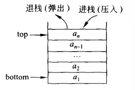

c++类定义的如下

```c++
template<class T>
class Stack{					//栈的类定义
public:
    Stack(){};					//构造函数
    void Push(const T& x);		//新元素x进栈
    bool Pop(T& x);				//栈顶元素出栈，由x返回
    bool getTop(T& x)const;		//读取栈顶元素，由x返回
    bool IsEmpty()const;		//判栈空
    bool isFull()const;			//判栈满
    int getSize()const;			//返回栈中元素个数
}
```

见文件： [stack.h](数据结构源代码及课件\数据结构类库源代码\ch03_Stack_Queue\Stack\stack.h) 

#### 顺序栈(SeqStack)

基于数组存储表示的栈

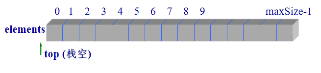

```c++
template <class E>
class SeqStack {   //顺序栈类定义
private:     
 	 E *elements;				//栈元素存放数组
     int top;					//栈顶指针，存放栈顶位置
     int maxSize;               //栈最大容量
     void overflowProcess();	//栈的溢出处理
public:
     SeqStack(int sz =50);		//构造函数
     ～SeqStack() { delete []elements; }   //析构函数
     void Push(E x);	          		//进栈
     bool Pop(E& x);		//出栈
     bool getTop(E& x);		//取栈顶内容
     bool IsEmpty() const { return top == -1; }
     bool IsFull() const { return top == maxSize-1; }
};
```

具体实现见文件： [SeqStack.h](数据结构源代码及课件\数据结构类库源代码\ch03_Stack_Queue\Stack\SeqStack\SeqStack.h) 

进栈出栈图画

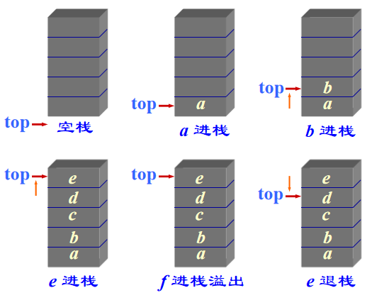

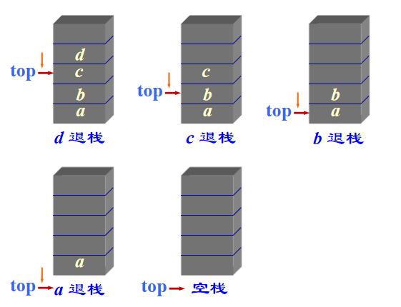

#### 链式栈(LinkedStack)

- 链式栈无栈满问题，空间可扩充
- 插入和删除金带栈顶处执行
- 链式栈的栈顶在链头
- 适合于多栈操作

链式栈的类定义:本栈使用 **头删与头插法**

```c++
struct StackNode {                  //栈结点类定义
private: 
    E data;			          		//栈结点数据
    StackNode<E> *link;            	//结点链指针
public:
    StackNode(E d = 0, StackNode<E> *next = NULL)
         : data(d), link(next) { }
};

template <class E>
class LinkedStack : public Stack<E> { //链式栈类定义   
private:
	 StackNode<E> *top;		            //栈顶指针
	 void output(ostream& os, StackNode <E> *ptr, int& i);
				           //递归输出栈的所有元素
public:
     LinkedStack() : top(NULL) {}	   //构造函数
	 ～LinkedStack() { makeEmpty(); }   //析构函数
	 void Push(E x);		             	   //进栈
	 bool Pop(E& x);			   //退栈
	 bool getTop(E& x) const;		//取栈顶  	
     bool IsEmpty() const { return top == NULL; }
     void makeEmpty();			//清空栈的内容
     int k = 1;
     friend ostream& operator << (ostream& os, 
  		LinkedStack<E>& s) { output(os, s.top, k); }				//输出栈元素的重载操作 <<
};
```

具体实现详见： [LinkedStack.h](数据结构源代码及课件\数据结构类库源代码\ch03_Stack_Queue\Stack\LinkedStack\LinkedStack.h) 

**清空栈操作**

```c++
template <class E>
LinkedStack<E>::makeEmpty() {	
//逐次删去链式栈中的元素直至栈顶指针为空。
    StackNode<E> *p;
	while (top != NULL)		//逐个结点释放
    { 
        //头删法
        p = top;  
        top = top->link;  
        delete p; 
    }
};
```

**插入栈操作**

```c++
template <class E>
void LinkedStack<E>::Push(E x) {
//将元素值x插入到链式栈的栈顶,即链头
     top = new StackNode<E> (x, top);	//创建新结点，新节点存放x指向top
     assert (top != NULL);				//创建失败退出
};

```

**删除栈顶操作**

```c++
template <class E>
bool LinkedStack<E>::Pop(E& x) {
//删除栈顶结点, 返回被删栈顶元素的值。
     if (IsEmpty() == true) 
         return false;   		//栈空返回
  	 StackNode<E> *p = top;		//暂存栈顶元素
	 top = top->link;			//退栈顶指针
	 x = p->data;   
     delete p;					//释放结点
   	 return true;	
};
```

**递归输出栈中所有元素**

```c++
template <class E>
void LinkedStack<E>::output(ostream& os, StackNode<E> *ptr, int& i) {
//递归输出栈中所有元素（沿链逆向输出）
	if (ptr != NULL) {
  		if (ptr->link != NULL) 
              output(os, ptr->link, i++);
         os << i << “ : ” << p->data << endl;	
                  //逐个输出栈中元素的值
	  }
};


```

当进栈元素的编号为1, 2, …, n时，可能的出栈序列有多少种？

推导结果为

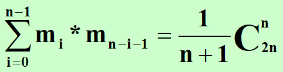

#### C++STL中栈的使用

```c++
#include<iostream>
#include<stack>
using namespace std;

//创建栈
//默认使用deque为底层容器来创建空栈
stack<int> s;
stack<int> a(s);
//使用双向链表为容器创建一个空栈对象
stack<int,list<int>> s;

//前堆栈为空，empty() 函数 返回 true 否则返回false.
bool empty();

//pop() 函数移除堆栈中最顶层元素
void pop();

//push() 函数将 val 值压栈，使其成为栈顶的第一个元素
void push(const type& val);

//size() 函数返当前堆栈中的元素数目
size_type size();

//top() 函数返回对栈顶元素的引用
type& top();
```


#### 栈的应用

**符号匹配**

具体思路：

建立字符栈，存放括号，遇见 **左括号入（<,{,(,[）栈**，遇见 **右括号（>,},),]）出栈** 判断右括号与栈顶左括号是否匹配

可见[符号配对 (pintia.cn)](https://pintia.cn/problem-sets/1379438661491073024/problems/1379441117797130241)


**表达式计算**

算数表达式的三种表达形式

1. **中缀(infix)表示**：<操作数><操作符><操作数> 例如A+B
2. **前缀(prefix)表示**：<操作符><操作数><操作数> 例如 +AB
3. **后缀(postfix)表示**：<操作数><操作数><操作符> 例如 AB+

**编译程序一般用后缀表达式**

**求后缀表达式的值的具体思路**：

建立int栈，存放数字，遇见数字入栈，遇见操作符出栈两个数字，先出栈的作为被数，将结果再次入栈，直到结束

**求前缀表达式的值的具体思路**：

建立int栈，存放操作数，从右向左，进行与后缀表达式相同的操作

可见[求前缀表达式的值(pintia.cn)](https://pintia.cn/problem-sets/1379438661491073024/problems/1379441452448096256)


### 3.2 栈与递归

以下三种情况常常用到递归的方法

- 定义是递归的

  1. 对于一个较为复杂的问题，如果能够分解乘几个相对简单的且解法相同或类似的子问题时。只要解决了这些子问题，那么原问题解迎刃而解了
  2. 当分解后的子问题可以直接解决时，就停止分解
  3. 递归定义的函数可以用递归过程来编程求解，递归过程直接反应了定义的结构

  例如：求阶乘函数，幂函数，斐波那契数列

- 数据结构是递归的

  例如：使用递归寻找链表最后一个结点，并打印其数值

  ```c++
  template <class E> 
  void Print(ListNode<E> *f) {
      if (f ->link == NULL)
           cout << f ->data << endl;
      else Print(f ->link);
  }
  ```

- 问题的解法是递归的

  有些问题只能用递归方法来解决

  例如：**汉诺塔(Tower of Hannoi)问题**

  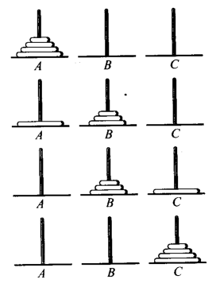

  **具体思路：**

  1. 用C柱做过渡，将A柱上的(n-1)个盘子移到B柱上
  2. 将 A 柱上最后一个盘子直接移到 C 柱上
  3. 用 A 柱做过渡，将 B 柱上的 (n-1) 个盘子移到 C 柱上

  **具体实现：**

  ```c++
  //A为起始柱，B为过渡柱，C为目标柱
  void Hanoi (int n, char A, char B, char C) {
  //解决汉诺塔问题的算法
      //如果A柱上只剩一个将A->C
      if (n == 1) 
          cout << " move " << A << " to  "<< C << endl;	   
      else {  
          //分解问题，如何让A只剩一个？将A上的n-1个移到B上，将B看作C
          //A为起始柱，C为过渡柱，B为目标柱
      	Hanoi(n-1, A, C, B);
             cout << " move " << A << " to " << C<< endl;	
          //现在，B上有n-1个，A上有一个，将n-1个放到C上，将B看作A
          //B为起始柱，A为过渡柱，C为目标柱
          Hanoi(n-1, B, A, C);
     }
  }
  ```

共移动 $2^n-1$ 次

递归问题的应用：

- n皇后问题
- 迷宫问题


## 第四章 数组、串与广义表

### 4.1 一维数组与多维数组

**二维数据存放：**

行优先存放：
   	 设数组开始存放位置 LOC(0, 0) = a,  每个元素占用 l 个存储单元
         LOC ( j, k ) = a + ( j * m + k ) * l

列优先存放：
    设数组开始存放位置 LOC(0, 0) = a,  每个元素占用 l 个存储单元
     LOC ( j, k ) = a + ( k * n + j ) * l

**三维数组的存放：**

各维元素个数为  m1, m2, m3
下标为 i1, i2, i3的数组元素的存储地址：

​			LOC ( i1, i2, i3 ) = a +  ( i1* m2 * m3 + i2* m3 + i3 ) * l 

### 4.2 特殊矩阵

- 对称矩阵
- 三对角矩阵

**对称矩阵：**

- **对称矩阵的压缩存储**

  对称矩阵中的元素关于主对角线对称，`aij = aji， 0≤i, j≤n-1`

  为节约存储，只存对角线及对角线以上的元素，或者只存对角线或对角线以下的元素。前者称为上三角矩阵，后者称为下三角矩阵。

  将其存储到一个一维数组B中，称之为对称矩阵A的压缩存储方式

  ​		B共有 **n*(n+1)/2个** 元素

  - **下三角矩阵的压缩存储：**

    **`i>=j`** , 数组元素`A[i][j]`在数组B中的存放位置：

    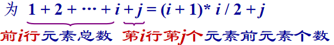

    若 `i<j` ,数组元素为上上三角部分，`A[j][i]=j*(j+1)/2+i`

    `i(i+1)/2 <= k <(i+1)*(i+2)/2`
    	的 i, 此即为该元素的行号。
    `j = k - i * (i + 1) / 2`

  - **上三角矩阵的压缩存储：**

    `i<=j` `A[i][j]` 位置为

    

    即 `(2*n-i-1)*i/2+j` 

- **三对角矩阵的压缩存储：**

  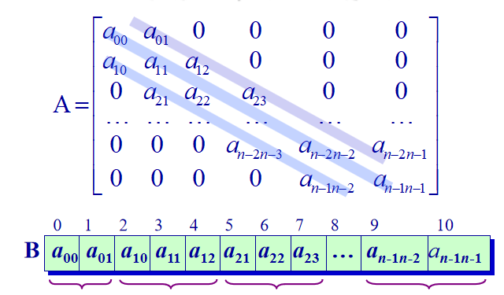

  n阶矩阵共有 **3n-2** 个非零元素

  $a_{ij}$ 满足

  ​	`0<=i<=n-1, i-1<=j<=i+1` 注：不得过界

  `A[i][j] = B[2*i+j]`

  `A[(k+1)/3][k-2*i] = B[k]`

### 4.3 稀疏矩阵

当A中矩阵元素的非零元素远远小于矩阵元素的总数，则称A为稀疏矩阵

eg：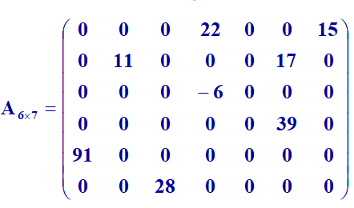

- 设矩阵 A 中有 s 个非零元素。令 e = s/(m*n),称 e 为矩阵的稀疏因子
- e≤0.05 时称之为稀疏矩阵
- 每一个三元组 (i, j, aij) 唯一确定了矩阵A的一个非零元素。因此，稀疏矩阵可由表示非零元的一系列三元组及其行列数唯一确定


### 4.4 广义表（General Lists）

- 广义表是 n ( ≥0 ) 个表元素组成的有限序列，记作
      LS (a1, a2, a3, …, an)
- LS 是表名，ai 是表元素，可以是表（称为子表），可以是数据元素（称为原子）。
- n为表的长度。n = 0 的广义表为空表。
- n > 0时，表的第一个表元素称为广义表 的表头（head），除此之外，其它表元素组成的表称为广义表的表尾（tail）

eg：

A( )                              A长度为0，深度为1
B( 6, 2 )                       B长度为2，深度为1
C( ‘a’, ( 5,  3,  ‘x’ ) )   C长度为2，深度为2
D( B,  C, A )                D长度为3，深度为3
E( B, D )                      E长度为？  深度为？
F( 4, F )                       F长度为？ 深度为？

A( )                  head(A) 和 tail(A) 不存在
B( 6, 2 )           head(B) = 6, tail(B) = (2)
C( ‘a’, ( 5,  3,  ‘x’ ) )      head(C) =‘a’
D( B,  C, A )      tail(C) = ((5,3,’x’))
E( B, D )          head( ((5,3,’x’)) ) = (5,3,’x’)
F( 4, F )           tail( ((5,3,’x’)) ) = ( )  

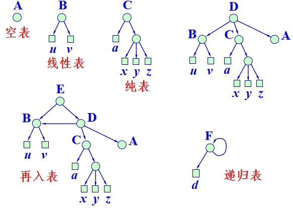

**广义表结点定义：**


- 结点类型 utype：= 0, 表头；= 1, 原子数据； = 2, 子表白
- 信息info：utype = 0时, 存放引用计数(ref)；utype = 1时, 存放数据值(value)；utype = 2时, 存放指向子表表头的指针(hlink)
- 尾指针tlink：utype = 0时, 指向该表第一个结点；utype != 0时, 指向同一层下一个结点


## 第五章 树与二叉树

### 5.1 基本术语

- 自由树

  二元组定义一个自由数 $T_f$
  $$
  T_f =(V,E)
  $$
  其中$V = {v1, ..., vn} $是由 n (n＞0) 个元素组成的有限非空集合，称为顶点集合。$E = {(vi, vj) | vi, vj V, 1≤i, j≤n} $是n-1个序对的集合，称为边集合，E 中的元素 (vi, vj）称为边或分支。

  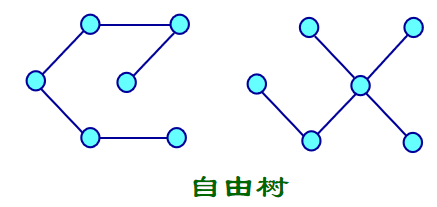

- 有根树

  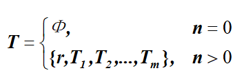

  - r 是一个特定的称为根(root)的结点，它只有直接后继，但没有直接前驱；
  - 根以外的其他结点划分为 m (m  0) 个互不相交的有限集合T1, T2, …, Tm，每个集合又是一棵树，并且称之为根的子树。
  - 每棵子树的根结点有且仅有一个直接前驱，但可以有0个或多个直接后

- 子女：若结点的子树非空，结点子树的根即为该结点的子女

- 双亲：若结点有子女，该结点是子女双亲

- 兄弟：同一结点的子女互称为兄弟

- 度：结点的子女个数即为该结点的度；树中各个结点的度的最大值称为树的度

- 分支结点：度不为0的结点即为分支结点，亦称为非终端结点

- 叶结点：度为0的结点即为叶结点，亦称为终端结点

- 祖先：某结点到根结点的路径上的各个结点都是该结点的祖先

- 子孙：某结点的所有下属结点，都是该结点的子孙

- 结点的层次：规定根结点在第一层，其子女结点的层次等于它的层次加一。以下类推

- 深度：结点的深度即为结点的层次；离根最远结点的层次即为树的深度

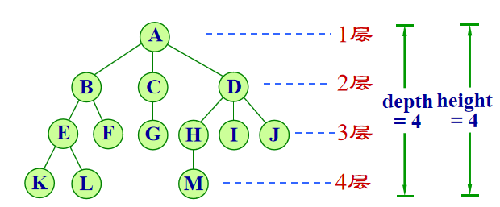

- 高度：规定叶结点的高度为1，其双亲结点的高度等于它的高度加一。
- 树的高度：等于根结点的高度，即根结点所有子女高度的最大值加一。
- 有序树：树中结点的各棵子树 T0, T1, …是有次序的，即为有序树。
- 无序树：树中结点的各棵子树之间的次序是不重要的，可以互相交换位置。
- 森林：森林是m（m≥0）棵树的集合。 

### 5.2 二叉树

一个根节点加上两颗分别称为左子树和右子树、互不相交的二叉树组成

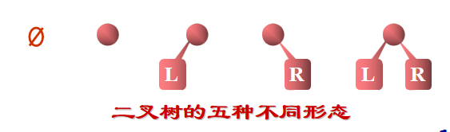

**二叉树的性质：**

- 性质1   若二叉树结点的层次从 1 开始, 则在二叉树的第 i 层最多有 $2^{i-1} $个结点。( i≥1)
- 性质2   深度为 k 的二叉树最少有 k 个结点，最多有 $2^k-1$个结点。( k≥1 )
- 性质3    对任何一棵二叉树，如果其叶结点有 $n_0 $个, 度为 2 的非叶结点有 $n_2$ 个,   则有
      $n_0＝n_2+1$
- 性质4    具有 n (n≥0) 个结点的完全二叉树的深度为 $log_2(n+1)$

**二叉树的定义：**

- 定义1  满二叉树 (Full Binary Tree) 

  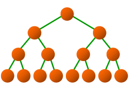

- 定义2  完全二叉树 (Complete Binary Tree)
  ─ 若设二叉树的深度为 k，则共有 k 层。除第 k 层外，其它各层 (1～k-1) 的结点数都达到最大个数，第k层从右向左连续缺若干结点，这就是完全二叉树

  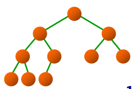

- 性质5  如将一棵有n个结点的完全二叉树自顶向下，同一层自左向右连续给结点编号1, 2, …, n，则有以下关系： 

  - 若**i = 1**, 则 i 无双亲
  - 若**i > 1**, 则 i 的双亲为**i／2**
  - 若**2\*i <= n**, 则 i 的左子女为 **2\*i**，
  - 若**2*i+1 <= n**, 则 i 的右子女为**2*i+1**
  - 若 i 为奇数, 且**i != 1**, 则其左兄弟为**i-1,**
  - 若 i 为偶数, 且**i != n**, 则其右兄弟为**i+1**

  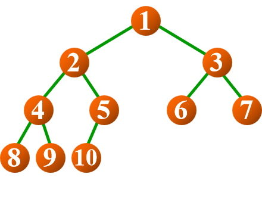

### 5.4 二叉树的遍历

设访问根结点记作 V
遍历根的左子树记作 L
遍历根的右子树记作 R

三种遍历：

-  前序   VLR     镜像     VRL
-  中序   LVR     镜像     RVL
-  后序   LRV     镜像     RLV

**中序遍历(Inorder Traversal)：**

- 若二叉树为空，则空操作
- 否则
  - 中序遍历左子树 (L)
  - 访问根结点 (V)
  - 中序遍历右子树 (R)

关键代码：

**递归：**

```c++
if (subTree != NULL) {
      InOrder (subTree->leftChild, visit);	//遍历左子树
      visit (subTree);						//访问根结点
      InOrder (subTree->rightChild, visit);	//遍历右子树
}
```

**非递归（利用栈）：**


关键代码：

```c++
void BinaryTree<T>::InOrder (void (*visit) (BinTreeNode<T> *t)) {
    stack<BinTreeNode<T>*> S;    
	BinTreeNode<T> *p = root; 
    do {
      	while (p != NULL) {			//遍历指针向左下移动
        	S.Push (p); 				//该子树沿途结点进栈
       		p = p->leftChild;
      	}
      	if (!S.IsEmpty()) {			//栈不空时退栈
           	p = S.top();			//退栈, 访问
            S.pop();
            visit (p);	
           	p = p->rightChild;		//遍历指针进到右子女
      	}
 	} while (p != NULL || !S.IsEmpty ());
};
```


**前序遍历(Preorder Traversal)：**

- 若二叉树为空，则空操作
- 否则
  - 访问根结点 (V)
  - 前序遍历左子树 (L)
  - 前序遍历右子树 (R)

关键代码：

**递归：**

```c++
if (subTree != NULL) {
    visit (subTree);						//访问根结点
    PreOrder (subTree->leftChild, visit);	//遍历左子树
    PreOrder (subTree->rightChild, visit);	//遍历右子树
}
```

**非递归（利用栈）：**

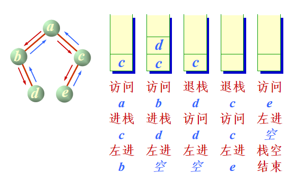

```c++
void BinaryTree<T>::PreOrder (void (*visit) (BinTreeNode<T> *t) ) {
    stack<BinTreeNode<T>*> S;
    BinTreeNode<T> *p = root; 
    S.Push (NULL);
 	while (p != NULL) {
    	visit(p);			   			//访问结点
    	if (p->rightChild != NULL)
			S.Push (p->rightChild);  	//预留右指针在栈中
        if (p->leftChild != NULL) 
           	p = p->leftChild;			//进左子树
        else {							//左子树为空
    		p = S.top();
            S.pop();
        }
    }
};
```

应用：

利用二叉树前序遍历建立二叉树

以递归方式建立二叉树。
输入结点值的顺序必须对应二叉树结点前序遍历的顺序。并约定以输入序列中不可能出现的值作为空结点的值以结束递归, 此值在RefValue中。例如用“@”或用“-1”表示字符序列或正整数序列空结点。

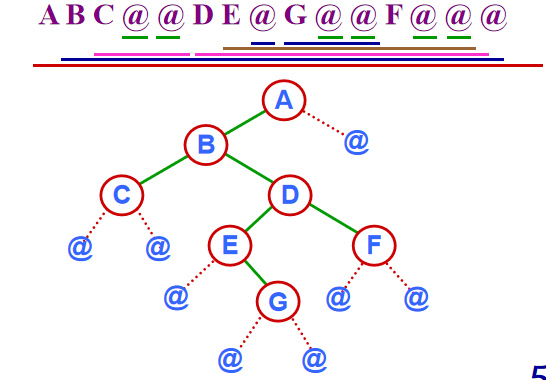

关键代码：

`void BinaryTree<T>::CreateBinTree (ifstream& in, BinTreeNode<T> *& subTree) `

```c++
T item;
if ( !in.eof () ) {	    	//未读完, 读入并建树	
     in >> item;  		//读入根结点的值
     if (item != RefValue) {
         subTree = new BinTreeNode<T>(item); 	               //建立根结点
         if (subTree == NULL) {
             cerr << “存储分配错!” << endl;  exit (1);
         }
		 CreateBinTree (in, subTree->leftChild);	//递归建立左子树
         CreateBinTree (in, subTree->rightChild); //递归建立右子树
    }
    else subTree = NULL;						    //封闭指向空子树的指针
}

```


**后序遍历 (Postorder Traversal)**

- 若二叉树为空，则空操作
- 否则
  - 后序遍历左子树 (L)
  - 后序遍历右子树 (R)
  - 访问根结点 (V)

关键代码：

**递归：**

```c++
if (subTree != NULL ) {
  	PostOrder (subTree->leftChild, visit);			//遍历左子树
	PostOrder (subTree->rightChild, visit);		    //遍历右子树
    visit (subTree);	         					//访问根结点
}
```

**非递归（利用栈）：**

在后序遍历过程中所用栈的结点定义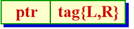

tag = L：表示从左子树退回还要遍历右子树

tag = R：表示从右子树退回要访问根结点

关键代码：

```c++
template <class T>
struct stkNode {
	BinTreeNode<T> *ptr;      //树结点指针	        
    enum tag {L, R};               //退栈标记
    stkNode (BinTreeNode<T> *N = NULL) :ptr(N), tag(L) { }      //构造函数
};

template <class T>
void BinaryTree<T>::
PostOrder (void (*visit) (BinTreeNode<T> *t) {
    Stack<stkNode<T>> S;   
    stkNode<T> w; 
    BinTreeNode<T> * p = root;     //p是遍历指针
	do {
		while (p != NULL) {	
		    w.ptr = p;  
            w.tag = L;  
            S.Push (w);   
		    p = p->leftChild;					
        }
	 	int continue1 = 1;	    //继续循环标记, 用于R
		while (continue1 && !S.IsEmpty ()) {
		    w = S.top();
            S.pop();
            p = w.ptr;
        	switch (w.tag) {   	//判断栈顶的tag标记
            	case L:  
                	w.tag = R;
                    S.Push (w); 
                    continue1 = 0;  
                    p = p->rightChild;  
                    break;
                case R:  
                    visit (p);   
                    break;	
           }
	 	}
     } while (!S.IsEmpty ());	//继续遍历其他结点
     cout << endl;
};

```


**应用：**

利用二叉树后序遍历算法计算二叉树的结点个数

关键代码：

```c++
if (subTree == NULL) return 0;	       //空树
else return 1+Size (subTree->leftChild) + Size (subTree->rightChild);
```

利用二叉树后序遍历算法计算二叉树的高度或深度

关键代码：

```c++
if (subTree == NULL) return 0;	//空树高度为0
else {
      int i = Height (subTree->leftChild);
      int j = Height (subTree->rightChild);
      return (i < j) ? j+1 : i+1; 
}

```


**层序遍历 (Level Traversal)**

层次序遍历二叉树就是从根结点开始，按层次逐层遍历

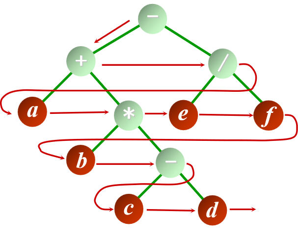

- 这种遍历需要使用一个先进先出的队列，在处理上一层时，将其下一层的结点直接进到队列（的队尾）。在上一层结点遍历完后，下一层结点正好处于队列的队头，可以继续访问它们
- 算法是非递归的

具体实现：

```c++
void BinaryTree<T>::levelOrder (void (*visit) (BinTreeNode<T> *t)) {
    if (root == NULL) return;
    Queue<BinTreeNode<T> * > Q;
    BinTreeNode<T> *p = root;   
    visit (p);   
    Q.EnQueue (p); 	
    while (!Q.IsEmpty ()) {
  		p = Q.front();
        Q.DeQueue ();
        if (p->leftChild != NULL) {      
       		visit (p->leftChild);
            Q.EnQueue (p->leftChild);
        }
        if (p->rightChild != NULL) {
       		visit (p->rightChild);
           	Q.EnQueue (p->rightChild);
      	}
	}
};
```


**二叉树的计数**

**计算具有n个结点的不同二叉树的棵树**

**n==1 || n ==0** $b_n=1$

**n>1时**
$$
\left\{\begin{matrix} 
&b_0 =1，  & n=0   
\\&b_n=\sum_{i=0}^{n-1}b_i*b_{n-i-1}, & n>=1 
\end{matrix}\right.
$$

$$
\begin{align}
&化简得：\\
&bn  = \frac{1}{n+1} C_{2n}^{n}  = \frac{1}{n+1}\frac{(2n)!}{n!*n!}  
\end{align}
$$

### 5.5 线索二叉树(Threaded Binary Tree)

- 又称为穿线树
- 通过二叉树的遍历，可将二叉树中所有结点的数据排列在一个线性序列中，可以找到某数据在这种排列下它的前驱和后继
- 希望不必每次都通过遍历找出这样的线性序列。只要事先做预处理，将某种遍历顺序下的前驱、后继关系记在树的存储结构中，以后就可以高效地找出某结点的前驱、后继

**线索 (Thread)**


 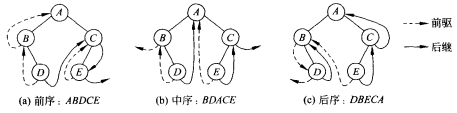

- 增加前驱Pred指针和后继Succ指针的二叉树

- 这种设计的缺点是每个结点增加两个指针，当结点数很大时存储消耗较大

- 改造树结点，将 pred 指针和 succ 指针压缩到 leftChild 和 rightChild 的空闲指针中，并增设两个标志 ltag 和 rtag，指明指针是指示子女还是前驱／后继。后者称为线索

  

- ltag (或rtag) = 0，表示相应指针指示左子女（或右子女结点）；当ltag (或rtag) = 1, 表示相应指针为前驱（或后继）线索

**通过中序遍历建立中序线索化二叉树**

```c++
template <class T> 
void ThreadTree<T>::createInThread () {
    ThreadNode<T> *pre = NULL;    //前驱结点指针
	if (root != NULL) {   	         //非空二叉树, 线索化
    	createInThread (root, pre);				    //中序遍历线索化二叉树
	    pre->rightChild = NULL;  pre->rtag = 1;		   //后处理中序最后一个结点
	}
};

```

### 3.6 树与森林

**数的存储表示**

1. **广义表表示**

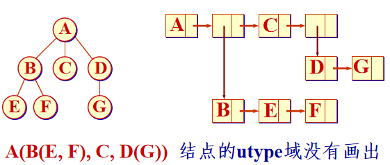

2. **双亲表示**

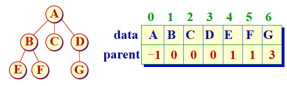

3. **子女链表表示**

   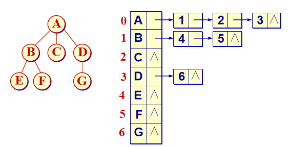

4. **子女指针表示**

- 一个合理的想法是在结点中存放指向每一个子女结点的指针。但由于各个结点的子女数不同，每个结点设置数目不等的指针，将很难管理。
- 为此，设置等长的结点，每个结点包含的指针个数相等，等于树的度（degree）。
- 这保证结点有足够的指针指向它的所有子女结点。但可能产生很多空闲指针，造成存储浪费。

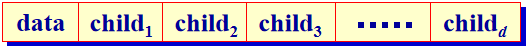

5. **子女-兄弟表示**


- `firstChild` 指向该结点的第一个子女结点。无序树时，可任意指定一个结点为第一个子女。
- `nextSibling`指向该结点的下一个兄弟。任一结点在存储时总是有顺序的。
- 若想找某结点的所有子女，可先找`firstChild`,再反复用 `nextSibling` 沿链扫描。

### 5.7 树与森林的遍历及其应用

- 深度优先遍历
  - 先根次序遍历
  - 后根次序遍历
- 广度优先遍历

**树的先根次遍历**

- 当树非空时

  - 访问根结点

  - 依次先根遍历根的各棵
        子树

- 树先根遍历 ABEFCDG

- 对应二叉树前序遍历 ABEFCDG

- 树的先根遍历结果与其对应二叉树表示的前序遍历结果相同

- 树的先根遍历可以借助对应二叉树的前序遍历算法实现

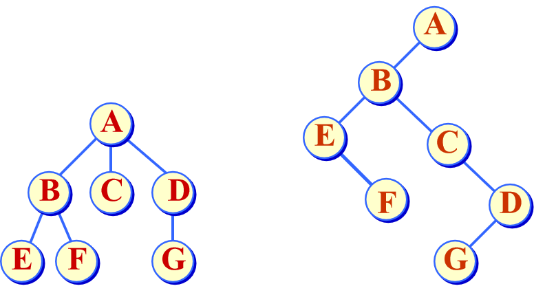

**树的后根次序遍历**

- 当树非空时
  - 依次后根遍历根的各棵
    子树
  - 访问根结点
- 树后根遍历 EFBCGDA
- 对应二叉树中序遍历 EFBCGDA
- 树的后根遍历结果与其对应二叉树   表示的中序遍历结果相同
- 树的后根遍历可以借助对应二叉树的中序遍历算法实现

**广度优先（层次次序）遍历**

- 按广度优先次序遍历树的结果
      ABCDEFG
- 遍历算法用到一个队列。


**森林与二叉树的转换**

- 将一般树化为二叉树表示就是用树的子女-兄弟表示来存储树的结构。
- 森林与二叉树表示的转换可以借助树的二叉树表示来实现。

- **林转化成二叉树的规则**
  1. 若 F 为空，即 n = 0，则对应的二叉树 B 为空树。
     若 F 不空，则
  2. 二叉树 B 的根是 F 第一棵树 T1 的根；
     - 其左子树为B (T11, T12, …, T1m)，其中，T11, T12, …, T1m 是 T1 的根的子树；
     - 其右子树为 B (T2, T3, …, Tn)，其中，T2, T3, …, Tn 是除 T1 外其它树构成的森林。

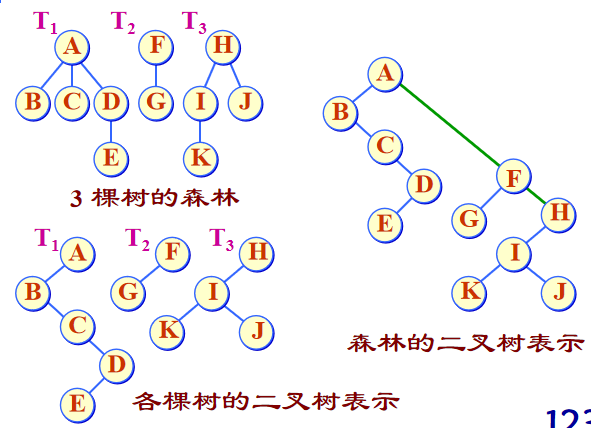

- 二叉树转换为森林的规则
  1. 如果 B 为空，则对应的森林 F 也为空。
  2. 如果 B 非空，则
     - F 中第一棵树 T1 的根为 B 的根；
     - T1 的根的子树森林 { T11, T12, …, T1m } 是由 B 的根的左子树 LB 转换而来；
     - F 中除了 T1 之外其余的树组成的森林 { T2, T3, …, Tn } 是由 B 的根的右子树 RB 转换而成的森林。


**森林的先根次序遍历**

- 若森林F = Ø，返回；
- 否则
  1. 访问森林的根（也是第一棵树的根）r1；
  2. 先根遍历森林第一棵树的根的子树森林{T11, …, T1k}；
  3. 先根遍历森林中除第一棵树外其他树组成的森林{T2, ...,Tm}。 

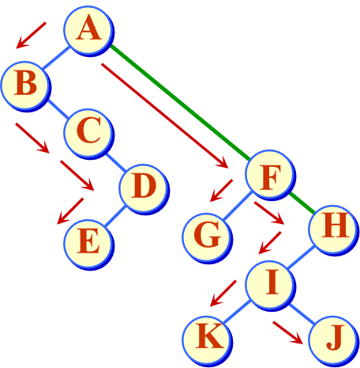

**森林的后根次序遍历**

- 若森林 F = Ø，返回；
- 否则
  1. 后根遍历森林 F 第一棵树的根结点的子树森林{T11, …, T1k}；
  2. 访问森林的根结点 r1；
  3. 后根遍历森林中除第一棵树外其他树组成的森林{T2, ..., Tm}。

BCEDA GF KIJH

**广度优先遍历（层次序遍历）**

- 若森林 F 为空，返回；
- 否则
  - 依次遍历各棵树的
    	根结点；
  - 依次遍历各棵树根
    	结点的所有子女；
  - 依次遍历这些子女
    	结点的子女结点；

### 5.8 堆（Heap）

**优先级队列**

- 每次出队列的是优先权最高的元素。
- 用堆实现其存储表示，能够高效运作

**用完全二叉树的顺序存储方式存储在一维数组中**


**即子节点均大于（小于）父节点**


**堆的元素下标计算**

- 由于堆存储在下标从 0 开始计数的一维数组中，因此在堆中给定下标为 i 的结点时 
- 如果 $i = 0$，结点 i 是根结点，无双亲；否则结点 i 的父结点为结点 $(i-1)/2)$； 
- 如果 $2i+1＞n-1$，则结点 i 无左子女；否则结点 i 的左子女为结点 $2i+1$； 
- 如果 $2i+2＞n-1$，则结点 i 无右子女；否则结点 i 的右子女为结点 $2i+2$。

创建堆

```c++
template <class T, class E>
MinHeap<T>::MinHeap (E arr[], int n) {
    maxHeapSize = (DefaultSize < n) ? n : DefaultSize;
    heap = new E[maxHeapSize]; 
    if (heap == NULL) {
       cerr << “堆存储分配失败！” << endl;  exit(1);
    }
    for (int i = 0; i < n; i++) 
        heap[i] = arr[i];
    currentSize = n;	       //复制堆数组, 建立当前大小
	int currentPos = (currentSize-2)/2;	
                              //找最初调整位置:最后分支结点
	while (currentPos >= 0) {	    //逐步向上扩大堆
           siftDown (currentPos, currentSize-1);
           	//局部自上向下下滑调整
           currentPos--;
    }					
};
```

自下向上逐步调整为最小堆


**最小堆的下滑调整算法**

```c++
//下滑调整算法
template <class T, class E>
void MinHeap<T>::siftDown (int start, int m ) {
//私有函数: 从结点start开始到m为止, 自上向下比较, 
//如果子女的值小于父结点的值,  则关键码小的上浮, 
//继续向下层比较, 将一个集合局部调整为最小堆。
	int i = start, j = 2*i+1;  	//j是i的左子女位置
	E temp = heap[i]; 				
	while (j <= m) {			//检查是否到最后位置
        if ( j < m && heap[j] > heap[j+1] ) 
             j++;			 //让j指向两子女中的小者
		if ( temp <= heap[j] ) 
            break;	//小则不做调整
		else { 
            heap[i] = heap[j];  
            i = j; 
            j = 2*j+1; 
        }//否则小者上移, i, j下降
	 }
	 heap[i] = temp;	      	//回放temp中暂存的元素
};
```


**最小堆的插入**

每次插入都加在堆的最后，再自下向上执行调整，使之重新形成堆，时间复杂性O(log2n)。

```c++
template <class T, class E>
bool MinHeap<T>::Insert (const E& x )  {
//公共函数: 将x插入到最小堆中
    if ( currentSize == maxHeapSize ) 	//堆满
    { 
        cerr << "Heap Full" << endl;  
        return false; 
    }
	heap[currentSize] = x;  		//插入
	siftUp (currentSize);			//向上调整
	currentSize++;				//堆计数加1
	return true;
};
```

**最小堆的向上调整**


```c++
template <class T, class E>
void MinHeap<T>::FilterUp (int start) {
//私有函数: 从结点start开始到结点0为止, 自下向上
//比较, 如果子女的值小于父结点的值, 则相互交换, 
//这样将集合重新调整为最小堆。关键码比较符<=
//在E中定义。
	int j = start,  i = (j-1)/2;   E temp = heap[j];
	while (j > 0) {		//沿父结点路径向上直达根
    	if (heap[i] <= temp) break;				//父结点值小, 不调整
		else { 
            heap[j] = heap[i];  
            j = i;  
            i = (i-1)/2; 
        }			//父结点结点值大, 调整
	}	
	heap[j] = temp;				//回送
};
```

**最小堆删除**

每次都删除根节点，在自上向下调整

```c++
template <class T, class E>
bool MinHeap<T>::Remove (E& x) {
	if ( !currentSize ) {		//堆空, 返回false
	     cout << "Heap empty" << endl;  return false;
    }
	x = heap[0];  
	heap[0] = heap[currentSize-1];
	currentSize--;
	siftDown(0, currentSize-1);    	//自上向下调整为堆
	return true;			//返回最小元素
}
```


### 5.8 Huffman树

**路径长度 (Path Length)** 

- 两个结点之间的路径长度 PL 是连接两结点的路径上的分支数。
- 树的外部路径长度是各叶结点（外结点）到根结点的路径长度之和 EPL。
- 树的内部路径长度是各非叶结点（内结点）到根结点的路径长度之和 IPL。
- 树的路径长度 PL = EPL + IPL。
- 第i个结点路径为$log_2i$

**带权路径长度 (Weighted Path Length, WPL)**

- 在很多应用问题中为树的叶结点赋予一个权值，用于表示出现频度、概率值等。因此，在问题处理中把叶结点定义得不同于非叶结点，把叶结点看成“外结点”，非叶结点看成“内结点”。这样的二叉树称为扩充二叉树。

- 扩充二叉树中只有度为 2 的内结点和度为 0的外结点。根据二叉树的性质，有 n 个外结点就有 n-1 个内结点，总结点数为2n-1。

- 若一棵扩充二叉树有 n 个外结点，第 i 个外结点的权值为wi，它到根的路径长度为li，则该外结点到根的带权路径长度为wi*li。

- 扩充二叉树的带权路径长度定义为树的各外结点到根的带权路径长度之和。
  $$
  WPL = \sum_{i=1}^{n} w_i *l_i
  $$

- 对于同样一组权值，如果放在外结点上，组织方式不同，带权路径长度也不同。


**Huffman树**

- 带权路径长度达到最小的扩充二叉树即为Huffman树。
- 在Huffman树中，权值大的结点离根最近。

**Huffman树的构造算法**

1. 由给定 n 个权值 ${w0, w1, w2, …, wn-1}$，构造 具有 n 棵扩充二叉树的森林 $F = { T0, T1, T2, 
   	…, Tn-1 }$，其中每棵扩充二叉树 Ti 只有一个带权值 wi 的根结点, 其左、右子树均为空。

2. 重复以下步骤, 直到 F 中仅剩一棵树为止：
   - 在 F 中选取两棵根结点的权值最小的扩充二叉树,    做为左、右子树构造一棵新的二叉树。置新的二叉树的根结点的权值为其左、右子树上根结点的权值之和。
   - 在 F 中删去这两棵二叉树。
   - 把新的二叉树加入 F。

## 第六章 


### 散列表（Hash Table）

- 理想的搜索方法是可以不经过比较，一次直接从字典中得到要搜索的元素

- 如果在元素存储位置与其关键码之间建立一个确定的对应函数关系Hash()， 使得每个关键码与结构中一个唯一的存储位置相对应：
  $$
  Address ＝ Hash(key)
  $$

- 在插入时依此函数计算存储位置并按此位置存放。在搜索时对元素的关键码进行同样的计算，把求得的函数值当做元素存储位置， 在结构中按此位置搜索。这就是散列方法

- 在散列方法中所用转换函数叫做**散列函数**。按此方法构造出来的表叫做**散列表**

- 使用散列方法进行搜索不必进行多次关键码的比较, 搜索速度比较快, 可以直接到达或逼近具有此关键码的表项的实际存放地址

- 散列函数是一个压缩映象函数。关键码集合比散列表地址集合大得多。因此有可能经过散列函数的计算，把不同的关键码映射到同一个散列地址上，这就产生了冲突

**散列函数**

- 构造散列函数时的几点要求：
  - 散列函数应是简单的，能在较短的时间内  计算出结果
  - 散列函数的定义域必须包括需要存储的全部关键码，如果散列表允许有 m 个地址时，其值域必须在 0 到 m-1 之间
  - 散列函数计算出来的地址应能均匀分布在整个地址空间中 : 若 key 是从关键码集合中随机抽取的一个关键码,  散列函数应能以同等概率取0 到 m-1 中的每一个值

1. **直接定址法**

   此类函数取关键码的某个线性函数值作为散列地址：

   

   这类散列函数是一对一的映射，一般不会产生冲突。但它要求散列地址空间的大小与关键码  集合的大小相同。

2. **数字分析法**

   设有 n 个 d 位数,   每一位可能有 r 种不同的符号。这 r 种不同符号在各位上出现的频率不一定相同。根据散列表的大小,  选取其中各种符号分布均匀的若干位作为散列地址。
   计算各位数字中符号分布均匀度k的公式：


   其中，    表示第 i 个符号在第 k 位上出现的次数，n/r 表示各种符号在 n 个数中均匀出现的期望值。

## 第七章 搜索结构

- **静态搜索表**
- **二叉搜索树**
- **最优二叉搜索树**
- **AVL树**
- **伸展树**
- **红黑树**

**静态环境**，搜索结构在插入和删除等操作的前后不发生改变—— **静态搜索表** 

**动态环境**，为保持较高的搜索效率, 搜索结构在执行插入和删除等操作的前后将自动进行调整，结构可能发生变化—— **动态搜索表**

## 顺序搜索（Sequential Search）

- 顺序搜索主要用于在线性表中搜索
- 设若表中有 CurrentSize 个元素，则顺序搜索从表的先端开始，顺序用各元素的关键码与给定值 x 进行比较
- 若找到与其值相等的元素，则搜索成功，给出该元素在表中的位置
- 若整个表都已检测完仍未找到关键码与 x 相等的元素，则搜索失败。给出失败信息

**时间复杂度：$O(n)$**

## 二叉搜索树 ( Binary Search Tree )

二叉搜索树或者是一棵空树，或者是具有下列性质的二叉树：

- 每个结点都有一个作为搜索依据的关键码(key)，所有结点的关键码互不相同。
- 左子树（如果非空）上所有结点的关键码都小于根结点的关键码。
- 右子树（如果非空）上所有结点的关键码都大于根结点的关键码。
- 左子树和右子树也是二叉搜索树。
- 结点左子树上所有关键码小于结点关键码
- 右子树上所有关键码大于结点关键码
- 如果对一棵二叉搜索树进行**中序遍历**，可以按从小到大的顺序，将各结点关键码排列起来，所以也称二叉搜索树为二叉排序树
- **注：**若从根结点到某个叶结点有一条路径，路径左边的结点的关键码不一定小于路径上的结点的关键码


**二叉搜索树的搜索算法**

- 在二叉搜索树上进行搜索，是一个**从根结点开始，沿某一个分支逐层向下**进行比较判等的过程。它可以是一个递归的过程
- 假设想要在二叉搜索树中搜索关键码为 x 的元素，搜索过程从根结点开始
- 如果**根指针为NULL，则搜索不成功**；否则用给定值 x 与根结点的关键码进行比较：
  - 若**给定值等于根结点关键码，则搜索成功**，返回搜索成功信息并报告搜索到结点地址
  - 若给定值小于根结点的关键码，则继续递归搜索根结点的左子树、
  - 否则。递归搜索根结点的右子树

递归：

```c++
Search (const K x, BSTNode<E, K> *ptr) {
//私有递归函数：在以ptr为根的二叉搜索树中搜索含x的结点。
//若找到，则函数返回该结点的地址，否则函数返回NULL值。
    if (ptr == NULL) 
        return NULL; 
    else if (x < ptr->data) 
        return Search(x, ptr->left);
    else if (x > ptr->data) 
        return Search(x, ptr->right);
    else return ptr;				//搜索成功
};
```

非递归：

```c++
Search (const K x, BSTNode<E, K> *ptr) {
//非递归函数：作为对比，在当前以ptr为根的二叉搜索树中搜索含x的结点。
//若找到，则函数返回该结点的地址，否则函数返回NULL值。
    if (ptr == NULL) return NULL; 
    BSTNode<E, K>* temp = ptr;
    while (temp != NULL) {
        if (x == temp->data) 
            return temp;
        if (x < temp->data) 
            temp = temp->left;
        else 
            temp = temp->right;
    }
    return NULL;
};
```

**二叉搜索树的插入算法**

- 为了向二叉搜索树中插入一个新元素，必须**先检查这个元素是否在树中已经存在**
  - 如果搜索成功，说明树中已经有这个元素，不再插入；
  - 如果搜索不成功，说明树中原来没有关键码等于给定值的结点，把新元素加到搜索操作停止的地方

```c++
Insert (const E& e1, BSTNode<E, K> *& ptr) {	   
//私有函数：在以ptr为根的二叉搜索树中插入值为e1的结点。若在树中已有含e1的结点则不插入
    if (ptr == NULL) {	   //新结点作为叶结点插入
        ptr = new BstNode<E, K>(e1);	  //创建新结点
        if (ptr == NULL){ 
            cerr << "Out of space" << endl;  
            exit(1); 
        }
	    return true;
    }
    else if(e1 < ptr->data) 
        Insert (e1, ptr->left);	 		//左子树插入
	else if(e1 > ptr->data) 
        Insert (e1, ptr->right);		//右子树插入
	else 
        return false;	      //x已在树中,不再插入
};
```


**二叉搜索树的删除算法**

- 在二叉搜索树中删除一个结点时，必须将因删除结点而断开的二叉链表重新链接起来，同时确保二叉搜索树的性质不会失去。
- 为保证在删除后树的搜索性能不至于降低，还需要防止重新链接后树的高度增加。
  - **删除叶结点**，只需将其双亲结点指向它的指针清零，再释放它即可
  - **被删结点右子树为空**，可以拿它的左子女结点顶替它的位置，再释放它
  - **被删结点左子树为空**，可以拿它的右子女结点顶替它的位置，再释放它
  - **被删结点左、右子树都不为空**，可以在它的右子树中寻找中序下的第一个结点(关键码最小),用它的值填补到被删结点中，再来处理这个结点的删除问题

```c++
Remove(const K x, BstNode<E, K> *& ptr) {
//在以 ptr 为根的二叉搜索树中删除含 x 的结点
    BstNode<E, K> *temp;
    if (ptr != NULL) {
         if(x < ptr->data) 
             Remove (x, ptr->left);		//在左子树中执行删除
	     else if(x > ptr->data) 
             Remove (x, ptr->right);	//在右子树中执行删除
  		 else if (ptr->left != NULL && ptr->right != NULL)
        {       //ptr指示关键码为x的结点，它有两个子女
             temp = ptr->right;  //到右子树搜寻中序下第一个结点
             while (temp->left != NULL) 
                 temp = temp->left;
             ptr->data = temp->data;//用该结点数据代替根结点数据
		     Remove (ptr->data, ptr->right);
        }
	    else {	//ptr指示关键码为x的结点有一个子女
            temp = ptr;
		    if (ptr->left == NULL) 
                ptr = ptr->right;
            else 
                ptr = ptr->left;
            delete temp;
            return true;
        }
	}
	return false;
}; 
```


## AVL树  高度平衡的二叉搜索树

**AVL 树的定义：**  一棵 AVL 树或者是空树，或者是具有下列性质的二叉搜索树：它的左子树和右子树都是 AVL 树，且左子树和右子树的高度之差的绝对值不超过1。


## 第九章 排序

- **排序：**将一组杂乱无章的数据按一定规律顺次排列起来
- **数据表(datalist)：**它是待排序数据元素的有限集合
- **排序码(key)：**通常数据元素有多个属性域，即多个数据成员组成，其中有一个属性域可用来区分元素，作为排序依据。该域即为排序码。每个数据表用哪个属性域作为排序码，要视具体应用需要而定
- **排序算法的稳定性**：若在元素序列中有两个元素r[i]和r[j]，它们的排序码 k[i] == k[j]，且在排序之前， 元素r[i]排在r[j]前面。若在排序之后，元素r[i]仍在元素r[j]的前面，则称这个排序方法是稳定的，否则是不稳定的
- **内排序**与**外排序**：内排序是指在排序期间数据元素全部存放在内存的排序；外排序是指在排序期间全部元素个数太多，不能同时存放在内存，必须根据排序过程的要求，不断在内、外存之间移动的排序
- **排序的时间开销**（**时间复杂度**）：是衡量算法好坏的最重要标志。排序时间开销可用算法执行中的数据比较次数与数据移动次数来衡量
- 算法执行时所需的**附加存储**（**空间复杂度**）：评价算法好坏的另一标准

### 插入排序（InsertSorting）

**基本方法：**每步将一个待排序的元素，按其排序码大小，插入到前面已排好序的一组元素的适当位置上, 直到元素全部插入为止

#### 直接插入排序

**基本思想是：**当插入第i (i≥1) 个元素时，前面的V[0], V[1],  …, V[i-1]已经排好序。这时，用V[i]的排序码与V[i-1], V[i-2], …的排序码顺序进行比较，找到插入位置即将V[i]插入，原来位置上的元素向后顺移

```c++
template <class T>
void InsertSort(T *array, const int left, const int right)
{
    T temp;
    int i, j;
    for (i = left + 1; i <= right; i++) //遍历所有元素
    {
        if (array[i] < array[i - 1]) //当前元素小于已排序序列的最后一个元素
        {
            temp = array[i];
            j = i - 1;
            while (j >= left && temp < array[j])
            { //循环找到应在的位置，并将j与其后元素后移一位
                array[j + 1] = array[j];
                j--;
            }
            array[j + 1] = temp;
        }
    }
}
```

**算法分析：**

- 设待排序元素个数为currentSize = n, 则该算法的主程序执行n-1趟

- 排序码比较次数和元素移动次数与排序码的初始排列有关

- 最好情况下，排序前元素已按排序码从小到大有序，每趟只需与前面有序元素序列的最后一个元素比较1次，总的排序码比较次数为 **n-1**, 元素移动次数为0

- 最坏情况下, 第 i 趟时第 i 个元素必须与前面 i 个元素都做排序码比较, 并且每做1次比较就要做1次数据移动。则总排序码比较次数KCN和元素移动次数RMN分别为

  

- 平均情况下排序的时间复杂度为 $O(n^2)$
- 直接插入排序是一种稳定的排序方法。

#### **折半插入排序(Binary Insertsort)**

**基本思想：**设在顺序表中有一 个元素序列 V[0], V[1], …, V[n-1]。其中, V[0], V[1], …, V[i-1] 是已经排好序的元素。在插入V[i] 时, 利用折半搜索法寻找V[i] 的插入位置

```c++
template <class T>
void BinaryInsertSort(T *array, const int left, const int right)
{
    T temp;
    int i, low, high, middle, k;
    for (i = left + 1; i <= right; i++) //遍历所有元素
    {
        temp = array[i];
        low = left;
        high = i - 1;
        while (low <= high) //二分查找找到相应位置
        {
            middle = (low + high) / 2;
            if (temp < array[middle])
                high = middle - 1;
            else
                low = middle + 1;
        }
        for (k = i - 1; k >= low; k--) //后移元素
            array[k + 1] = array[k];
        array[low] = temp;
    }
}
```

**算法分析**

- 折半搜索比顺序搜索快, 所以折半插入排序就平均性能来说比直接插入排序要快。

- 它所需的排序码比较次数与待排序元素序列的初始排列无关，仅依赖于元素个数。在插入第 i 个元素时，需要经过 **$[\log_{2}{i}]+1$** 次排序码比较, 才能确定它应插入的位置。因此，将 n 个元素(为推导方便, 设为 n=2k ) 用折半插入排序所进行的排序码比较次数为：

  

- 折半插入排序是一个稳定的排序方法

- 当 n 较大时，总排序码比较次数比直接插入排序的最坏情况要好得多，但比其最好情况要差

- 在元素的初始排列已经按排序码排好序或接近有序时，直接插入排序比折半插入排序执行的排序码比较次数要少。折半插入排序的元素移动次数与直接插入排序相同，依赖于元素的初始排列

### 希尔排序（ShellSort）

- 又称缩小增量排序。基本思想：设待排序列有 n 个元素, 首先取一个整数 gap < n 作为间隔，将全部元素分为 gap 个子序列，所有距离为 gap 的元素放在同一个子序列中，在每一个子序列中分别施行直接插入排序。然后缩小 gap, 如取 gap = [gap/2]，重复上述子序列划分和排序工作。直到最后取 gap == 1，将所有元素放在同一个序列中排序为止
- 开始时 gap 的值较大，子序列中的元素较少，排序速度较快;  随着排序进展，gap 值逐渐变小, 子序列中元素个数逐渐变多，由于前面工作的基础，大多数元素已基本有序，所以排序速度仍然很快

```c++
template <class T>
void ShellSort(T *array, const int left, const int right)
{
    T temp;
    int i, j;
    int grap = right - left + 1;            //设置间隔
    while (grap > 1)
    {
        grap = grap / 3 + 1;                //更新间隔
        for (i = left + grap; i <= right; i++)      //以grap为步长对元素进行排序（插入排序的方法）
        {
            if (array[i] < array[i - grap])
            {
                temp = array[i];
                j = i - grap;
                do
                {
                    array[j + grap] = array[j];
                    j -= grap;
                } while (j >= left && temp < array[j]);
                array[j + grap] = temp;
            }
        }
    }
}
```

**算法分析：**

- Gap的取法有多种。最初 shell 提出取 gap = [n/2]，gap = [gap/2]，直到gap = 1。Knuth提出取 gap = [gap/3] +1。还有人提出都取奇数为好，也有人提出各 gap 互质为好。
- 对特定的待排序元素序列，可以准确地估算排序码的比较次数和元素移动次数
- 难以给出排序码比较次数和元素移动次数与增量选择之间的依赖关系，并给出完整的数学分析。 
- Knuth利用大量实验统计资料得出 : 当 n 很大时，排序码平均比较次数和元素平均移动次数大在 $n^{1.25}$ 到 $1.6n^{1.25}$ 的范围内。这是在利用直接插入排序作为子序列排序方法的情况下得到的
- 希尔排序是一种不稳定的排序方法

### 冒泡排序（BubbleSort）

**基本方法：**设待排序元素序列中元素个数为 n。最多作 n-1 趟，i = 1, 2, , n-1。在第 i 趟中从后向前，j = n-1, n-2, ,  i，顺次两两比较V[j-1].key和V[j].key。如果发生逆序，则交换V[j-1]和V[j]

```c++
template <class T>
void BubbleSort(T *array, const int left, const int right)
{
    int pass = left + 1;
    int exchange = 1;
   while(pass <= right && exchange)
    {
       exchange = 0;	//标志为0假定未交换
        for(int j = right;j >= pass;j--)
        {
            if(array[j-1] > array[j])
            {
                T temp = array[j-1];
                array[j-1] = array[j];
                array[j] = temp;
                exchange = 1;
            }
        }
       pass++;
    }
}

```

### 快速排序（QuickSort）

- 基本思想：任取待排序列中的某个元素 (例如取第一个元素) 作为基准，按照该元素的排序码大小，将整个元素序列划分为左右两个子序列：
  - 左侧子序列中所有元素排序码 <= 基准元素排序码 
  - 右侧子序列中所有元素排序码 > 基准元素排序码
- 基准元素则排在这两个子序列中间(这也是该元素最终应安放的位置)
- 然后分别对这两个子序列重复施行上述方法，直到所有的元素都排在相应位置上为止

```c++
template <class T>
void QuickSort(T *array, const int left, const int right)
{
    if (left < right)   //判断是否需要排序
    {
        int pivotpos = left;        //基准位置
        T pivot = array[left];      //基准元素
        for (int i = left + 1; i <= right; i++)         //遍历所有元素
        {
            if (array[i] < pivot)                       //当前元素小于基准元素
            {
                pivotpos++;                             //基准位置前进1
                if (pivotpos != i)                      //当前位置不是基准位置（即基准位置的元素大于基准元素，i位置的元素小于基准元素），交换元素
                {
                    T temp = array[pivotpos];
                    array[pivotpos] = array[i];
                    array[i] = temp;
                }
            }
        }
        array[left] = array[pivotpos];                  //最左边元素=基准位置元素
        array[pivotpos] = pivot;                        //基准位置赋值基准元素
        //至此left-pivotpos-1全小于pivot，pivotpos+1-right全大于pivot
        QuickSort(array, left, pivotpos - 1);
        QuickSort(array, pivotpos + 1, right);
    }
}
```

**算法分析**

- 算法quicksort是一个递归的算法, 其递归树如图所示

  

- 算法partition利用序列第一个元素作为基准，将整个序列划分为左右两个子序列。算法中执行了一个循环，只要是排序码小于基准元素排序码的元素都移到序列左侧，最后将基准元素安放到位, 函数返回其位置

- 从快速排序算法的递归树可知，快速排序的趟数取决于递归树的高度

- 如果每次划分对一个元素定位后，该元素的左侧子序列与右侧子序列的长度相同，则下一步将是对两个长度减半的子序列进行排序，这是最理想的情况。

- 在 n个元素的序列中，对一个元素定位所需时间为 $O(n)$。若设 $t (n)$ 是对 n 个元素的序列进行排序所需的时间，且每次对一个元素正确定位后，正好把序列分为长度相等的两个子序列,此时时间复杂度为$O(n\log_{2}{n})$

- 可以证明，函数quicksort的平均计算时间也是O(nlog2n)。实验结果表明: 就平均计算时间而言，快速排序是内排序方法中最好的一个

- 快速排序是递归的，需要有一个栈存放每层递归调用时的指针和参数

- 最大递归调用层次数与递归树高度一致，理想情况为$log2(n+1)$,存储开销为 O(log2n)。

- 在最坏的情况，即待排序元素序列已经按其排序码**从小到大排好序的情况**下，其递归树成为单支树，每次划分只得到一个比上一次少一个元素的子序列。必须经过n-1 趟才能把所有元素定位，而且第 i 趟需要经过 n-i 次排序码比较才能找到第 i 个元素的安放位置，总的排序码比较次数将达到

  

- 快速排序是不稳定的

### 选择排序（SelectSort）

**基本思想：**每一趟 (例如第 i 趟, i = 0, 1, …, n-2) 在后面 n-i 个待排序元素中选出排序码最小的元素，作为有序元素序列的第 i 个元素。待到第 n-2 趟作完，待排序元素只剩下1个,  就不用再选了

```c++
template<class T>
void SelectSort(T *array, const int left, const int right)
{
    for (int i = left; i <= right; i++)
    {
        for (int j = i + 1; j <= right; j++)
        {
            if (array[j] < array[i])
            {
                T temp = array[i];
                array[i] = array[j];
                array[j] = temp;
            }
        }
    }
}
```

**算法分析：**

- 直接选择排序的排序码比较次数 KCN 与元素的初始排列无关。设整个待排序元素序列有 n 个元素，则第 i 趟选择具有最小排序码元素所需的比较次数总是 n-i-1 次。总的排序码比较次数为

  

- 元素移动次数与元素序列初始排列有关。当这组元素初始状态是按其排序码从小到大有序的时候,  元素的移动次数达到最少RMN = 0

### 堆排序（HeapSort）

- 利用堆及其运算, 可以很容易地实现选择排序的思路。
- 堆排序分为两个步骤
  - 根据初始输入数据，利用堆的调整算法 siftDown( ) 形成初始堆;
  - 通过一系列的元素交换和重新调整堆进行排序。
- 为了实现元素按排序码从**小到大**排序，要求建立**最大堆**

```c++
template<class T>
void siftDown(T *array, const int start, const int m)
{
    //最大堆的向下调整算法
    //从结点start开始到m自上向下比较，如果子女的值大于双亲的值，则相互交换
    int i = start;          //i为起始的根
    int j = 2*i + 1;        //j为i的左子树
    T temp = array[i];
    while(j <= m){
        if(j < m && array[j] < array[j+1])  //j指向最大树
            j++;
        if(temp >= array[j])          //若左子树、右子树都小于根退出不用调整
            break;
        else{
            array[i] = array[j];      //子女上移
            i = j;                    //i下降到子女位置
            j = 2*j + 1;
        }
    }
    array[i] = temp;           //temp放到合适位置
}

template<class T>
void HeapSort(T *array, const int left, const int right)
{
    int i;
    int n = right - left;
    for(i = (n-1)/2;i >= 0;i--)     //将表转换为堆，从第一个有子树的结点开始到堆顶
        siftDown(array, i, right);
    for(i = right;i >= left;i--){  //对表排序
        T temp = array[left];      //将堆顶（也就是最大值）与最后一个元素交换
        array[left] = array[i];
        array[i] = temp;
        siftDown(array, left, i-1); //调整堆
    }
}
```

 **算法分析：**

- 设堆中有 n 个结点,  且 $2^{k-1} ≤ n < 2^k$,  则对应的完全二叉树有 k 层。在第 i 层上的结点数≤2i-1  (i = 1, …, k)。在第一个形成初始堆的 for 循环中对每一个非叶结点调用了一次堆调整算法siftDown(),   该循环所用的计算时间为：
  
- 其中,  i 是层次编号, 2i-1 是第 i 层的最大结点数, (k-i)是第 i 层结点能够移动的最大距离
- 第二个 for 循环中调用了n-1次siftDown()算法, 该循环的计算时间为O(nlog2n)。因此, 堆排序的时间复杂性为$O(n\log_2n)$。
- 该算法的附加存储主要是在第二个 for 循环中用来执行元素交换时所用的一个临时元素。因此该算法的空间复杂性为O(1)。
- 堆排序是一个不稳定的排序方法。

### 归并排序(Merge sort)

- **归并**：将两个或两个以上的有序表合并成一个新有序表。
- 序列L1中有两个有序表Vector[left..mid]和Vector[mid+1..right]。它们可归并置一个有序表L2的Vector[left..right] 中。
- 这种方法称为**两路归并 (2-way merging)**。
- 变量 i 和 j 分别是表Vector[left..mid]和Vector [mid+1..right]的检测指针。k 是存放指针
- 迭代的归并排序算法基于两路归并操作实现。假设初始序列有 n 个元素，其基本排序过程如下：
  - 首先把初始序列看成 n 个长度为 1 的有序子序列（归并项），做两两归并，得到 n/2 个长度为 2 的归并项（最后一个归并项的长度为1）；
  - 再做两两归并，得到 [n/4] 个长度为 4 的归并项（最后一个归并项长度可以短些）；
  - 如此重复，最后得到一个长度为 n 的有序序列

```c++
template<class T>
void merge(T *array_1, T *array_2, const int left, const int mid, const int right)
{
    //两路归并算法
    //将有序序列array_1[left:mid],与有序序列array_1[mid+1,right]
    //归并为一个数组，存放到array_1[left:right]中,array_2为辅助数组
    for(int k = left; k <= right;k++)    //先将array_1中所有元素复制到array_2中
        array_2[k] = array_1[k];
    
    int s1 = left, s2 = mid+1, t = left;    //s1,s2为检测指针，t是存放比较指针
    
    while(s1 <= mid && s2 <= right)         //两个表都未检测完，两两比较
        if(array_2[s1] <= array_2[s2])      //在array_1中存放两序列中最小的，并将t指针与最小元素所在的指针后移一位
            array_1[t++] = array_2[s1++];
        else
            array_1[t++] = array_2[s2++];
    
    while(s1 <= mid)                        //若第一个表未检测完，复制
        array_1[t++] = array_2[s1++];
    
    while(s2 <= right)                      //若第二个表未检测完，复制
        array_1[t++] = array_2[s2++];
    
}

template<class T>
void MergeSort(T *array_1, T *array_2, const int left, const int right)
{
    //归并排序
    //拍array_1,array_2为辅助数组
    if(left >= right)
        return;
    int mid = (left + right)/2;
    MergeSort(array_1, array_2, left, mid);
    MergeSort(array_1, array_2, mid+1, right);
    merge(array_1, array_2, left, mid, right);
}
```

