# 机器学习（Machine Learning)

[TOC]

## 第一章绪论

### 1.2 基本术语

1. **模型**（**model**）/ **学习算法**（**learning** **algorithm**）：机器学习所研究的主要内容，时关于在计算机上从数据中产生模的算法，即学习算法
2. **数据集(date set)**：关于一个事件或对象的描述的记录的总和,eg：((色泽=青绿；根蒂=蜷缩；敲声=沉闷 )，········）
3. **示例(instance)/样本(sample)**：**数据集**中的一组
4. **属性(attribute)/特征(feature)**：反映书屋或对象在某方面的表现或性质的事项，eg:"色泽"、”根蒂“····
5. **属性值(attribute value)**：**属性**上的取值，eg:”青绿“，”蜷缩“，······
6. **属性空间(attribute space)/样本空间(sample space)/输入空间**：**属性**张成的空间，eg:由”色泽“、”根蒂“和”敲声“三个属性作坐标轴建立的坐标空间
7. **特征向量(feature vector)**：由一个**实例**的**属性值**在样本空间中对应的一个坐标向量，所以我们把一个**实例**称为一个**特征向量**
8. 一般地令$D=\left \{ x_{1},x_{2},\dots ,x_{m}  \right \} $ 表示包含m个示例的数据集,每个示例$x_{i}=\left \{ x_{i1};x_{i2};\dots ;x_{id}  \right \} $ 是D维空间的一个向量，$x_{ij}$是$x_{i}$在第$j$个属性上取值
9. **维数(dimensionality)**：**属性空间**的维数，即属性的个数，d的大小
10. **学习(learning)/训练(training)**：从**数据**中学得**模型**的过程，这个过程通过执行某个**学习算法**来完成。
11. 训练过程中使用的**数据**称为**训练数据(training date)**,其中每个样本称为一个**训练样本(training sample)**,训练样本组成的集合称为**训练集(training set)**
12.  **假设(hypothesis)**：学得模型对应了关于数据的某种潜在的规律
13. **真相/真实(ground-truth)**：潜在规律自身称为真实
14. **标记(label)**：关于实例结果的信息，eg:好瓜，称为标记
15. **样例(example)：**拥有了标记信息的示例，一般地用$\left ( x_{i} ，y_{i}  \right ) $表示第i个样例，其中$y_i$是$x_i$的标记，其中$y_i\subset \gamma $,$\gamma $是所有标记的集合，亦称**标记空间(label space)/输出空间**
16. **分类(classification)：**若我们预测值是离散值，例如“好瓜”，“坏瓜”，此类学习任务称为 **分类**。只涉及两个类别的称为 **二分类(binary classification)**，通常称其中一个类为 **正类(positive class)**，另一个类为 **反类(negative class)**；涉及多个类别时，则称为 **多分类(multi-class classification)**
17. **回归(regression)：**若欲预测的是连续值，该类学习任务则称为回归
18. 学得模型后，十七进行预测的过程称为 **测试(testing)**，被测样本称为 **测试样本(testing sample)**
19. **聚类(clustering)：**即将训练集中的膝盖分成若干组，每组称为一个 **簇(cluster)**，这些自动形成的簇可能对应一些潜在的概念划分（事先不知道）
20. 根据训练数据是否拥有标记，学习任务大致划分为两大类：**监督学习(supervised learning)**和 **无监督学习(unsupervised learning)**

### 1.3 假设空间

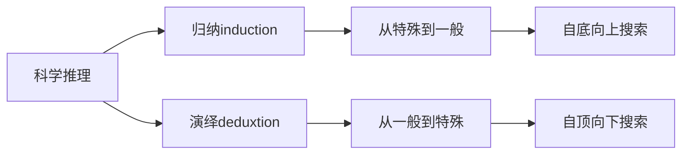

西瓜的**假设空间**如下：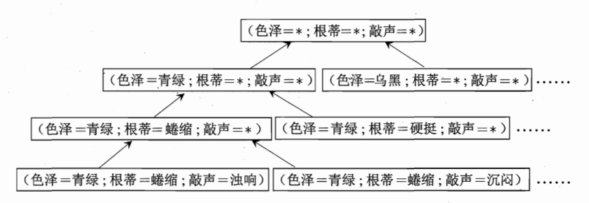

在学习过程中，可能有多个假设与训练集一致，即存在一个与训练集一致的 **假设集合**，我们称之为 **版本空间(version space)**，例如，在西瓜问题中，与训练集对应的 **版本空间**如图：

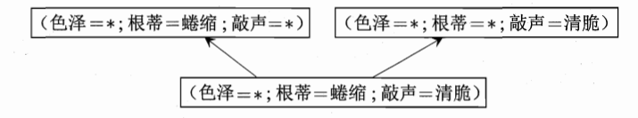

### 1.4 归纳偏好

 判断好瓜的假设，由于模型的不同而有不同假设。机器学习算法在学习过程中对某种类型假设的偏好，称为 **假设偏好(inductive bias)**

如何判断哪个偏好是“正确的偏好”？

1. **奥卡姆剃刀(Occam's razor)**原则：若有多个假设与观察一致，择选最简单的一个
2. **没有免费的午餐定理(NO Free Lunch Theorem)**：要谈论算法的优劣必须针对具体学习问题具体分析

## 第2章 模型评估与选择

### 2.1 经验误差与过拟合

1. **错误率(error rate)**：分类错误占样本数的比例，eg:m个样本有a个样本分类错误，则错误率 **E=a/m**
2. **精度(accuracy)：** **1-a/m**,即”精度=1-错误率“
3. **误差(error)：**将学习器的实际预测输出与样本的真实输出之间的差异称为**误差(error)**,学习器在训练集上的误差称为 **训练误差(training error)** 或 **经验误差(empirical error)** ,在新样本上的误差称为 **泛化误差(generalization error)**
4. **过拟合(overfitting)：**学习器把训练样本学习得 ”太好了“ 了的时候，很可能已经把训练样本自身的一些特点当作了所有潜在样本都会具有的一般性质，这样就会导致泛化性能下降
5. **欠拟合(underfitting)：**与 **过拟合** 相对，是指对训练样本的一般性质尚未学好

**下列是一个过拟合与欠拟合的例子**

### 2.2 评估方法

通常，测试机应该尽可能与训练集互斥，即车市样本尽量不在训练集中出现、未在训练过程中使用过

若只有一个包含m个样例的数据集 ==$D=\left \{ \left (  x_{1},y_{1} \right ) , \left (  x_{2},y_{2} \right ),\dots  ,\left (  x_{m},y_{m} \right ) \right \} $​​​​​​== ，如何从中产生训练集  ==$S$== 和测试集 ==$T$​​== :

1. **留出法（hold-out）**

   直接将 **数据集$D$​** 划分为两个互斥的集合，其中一个作训练集 **$S$​**，另一个作测试集 $T$ ，即​

    $D=S\bigcup   T ,S\bigcap T=\oslash $,在$S$上训练出模型后，用$T$​来评估其测试误差，作为对泛化误差的估计​

2. **交叉验证法（cross validation）/k折交叉验证（ $k$ -flold crossvalidation）**

   先将数据集 $D$ 划分为k个大小相似的互斥子集，即 $D=D_{1} \bigcup D_{2}\bigcup\cdots \bigcup D_{k},D_{i}\bigcap  D_{j}=\oslash (i\ne j) $ .每个子集 $D_{i}$ 都尽可能保持数据分布的一致性，即从 $D$ 中通过分层采样得到。然后每次用 $k-1$ 个子集的并集作为训练集，余下的那个子集作为测试集。于是可以进行 $k$ 次训练和测试，结果的稳定性与包真性与 $k$ 有关，所以又称 **k折交叉验证（ $k$​ -flold crossvalidation）**

   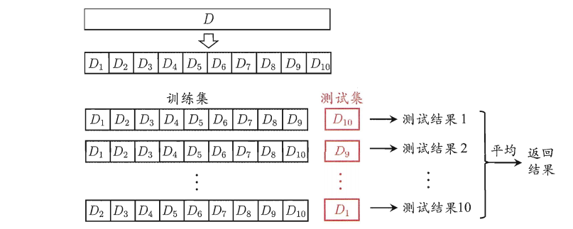

3.**自助法（bootstrapping）**

​	以 **自助采样法（bootstrap sampling）** 为基础。给定包含 $m$ 个样本的数据集 $D$ ，我们对它进	行采样产生数据集 $D'$ ：每次随机从 $D$ 中挑选一个样本，将其拷贝放入 $D'$ ，然后将该样本放回	初始数据集 $D$ 中，然后再将该样本放回初始数据集 $D$ 中,使得该样本在 下次釆样时仍有可能被釆	到；这个过程重复执行 $m$ 次后，我们就得到了包含 $m$ 个样本的数据集 $D'$ 这就是自助釆样的结	果.显然，$D$ 中有一部分样本会在 $D'$ 中多次出现，而另一部分样本不出现.可以做一个简单的估  计，样本在 $m$ 次釆样中始终不被釆到的概率是 $\left (  1-\frac{1}{m} \right )^{m}$ ，取极限得到
$$
\lim_{m \to \infty} \left (  1-\frac{1}{m} \right )^{m} \to \frac{1}{e}\approx 0.368\qquad(2.1)
$$
​	于是将 $D'$ 做i为训练集，$D\setminus D'$​ 作测试集 

**一般来说，在初始数据量足够时，留出法和交叉验证法更常用一些**

**调参与最终模型：**

- 大多数学习算法都有些 **参数（parameter）** 需要设定，参数配置不同，学得模型的性能往往有显著差别。因此,在进行模型评估与选择时，除了要对适用学习 算法进行选择，还需对算法参数进行设定，这就是通常所说的 **参数调节** 或 简称 **调参(parameter tuning)**.
- 假定算法有 **3** 个参数，每个参数有 **5** 个候选值，这样每一组 **训练/测试集** 就有 $5^{3}=125$ 个模型
- 通常把学得模型在实际使用中遇到的数据称为 **测试数据**，为了加以区分，模型评估与选择中用于评估测试的数据集常称为 **验证集(validation set)**.
- 一般我们在选用算法模型，调参后训练，再在验证集上运行得出一个结果，泛化能力不强则再重复这一过程，最后再通过测试集测试

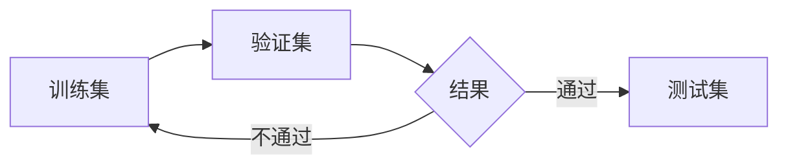

### 2.3 性能量度

**性能量度(performance measure)：**衡量模型泛化能力的评价标准

​	**性能度量** 反映了任务需求，在对比不同模型的能力时，使用不同的 **性能度量** 往往会导致不同的评判结果；这意味着模型的“好坏”是相对的，什么样的模型 是好的，不仅取决于算法和数据，还决定于任务需求.

​	假设给定样例集 $D=\left \{ \left (  x_{1},y_{1} \right ) , \left (  x_{2},y_{2} \right ),\dots  ,\left (  x_{m},y_{m} \right ) \right \} $ ，其中 $y_{i}$ 是示例 $x_{i}$ 的真实标记。要评估学习器 $f$ 的性能，就要把学习器预测结果 $f(x)$ 与真实标记 $y$ 进行比较

- 回归任务最常用的 **性能量度** 是 **均方误差（mean squared error）**

$$
E(f;D)=\frac{1}{m}\sum_{i=1}^{m}\left ( f\left ( x_{i} \right ) -y_{i} \right ) ^{2} \qquad(2.2)
$$

- 对于数据分布 $\mathcal{D}$ 和概率分布密度函数 $p(x)$ ,均方误差可描述为
  $$
  E(f;\mathcal{D})=\int_{x\sim \mathcal{D}}^{} \left ( f(x)-y \right )^{2}p(x)dx\qquad(2.3)
  $$

1. **错误率与精度**

   **错误率与精度** 是分类任务中最常用的两种性能量度.错误率是分类错误的样本数占样本总数的比例，精度则是门类正确的样本数占样本总数的比例，最样本例集 $D_{i}$ 分类的 **错误率**定义为：
   $$
   E(f ; D)=\frac{1}{m} \sum_{i=1}^{m} \mathbb{I}\left(f\left(\boldsymbol{x}_{i}\right) \neq y_{i}\right)\qquad(2.4)
   $$
    **精度**定义为：
   $$
   \begin{aligned}
   \operatorname{acc}(f ; D) &=\frac{1}{m} \sum_{i=1}^{m} \mathbb{I}\left(f\left(\boldsymbol{x}_{i}\right)=y_{i}\right) \\
   &=1-E(f ; D)
   \end{aligned}\qquad(2.5)
   $$
   对于数据分布 $\mathcal{D}$ 和概率分布函数 $p(x)$ ,**错误率** 与 **精度** 分别描述为
   $$
   E(f ; \mathcal{D})=\int_{\boldsymbol{x} \sim \mathcal{D}} \mathbb{I}(f(\boldsymbol{x}) \neq y) p(\boldsymbol{x}) \mathrm{d} \boldsymbol{x}\qquad(2.6)
   $$

   $$
   \begin{aligned}
   \operatorname{acc}(f ; \mathcal{D}) &=\int_{\boldsymbol{x} \sim \mathcal{D}} \mathbb{I}(f(\boldsymbol{x})=y) p(\boldsymbol{x}) \mathrm{d} \boldsymbol{x} \\
   &=1-E(f ; \mathcal{D})
   \end{aligned}\qquad(2.7)
   $$

2. **查准率、查全率与 $F1$**

   - **查准率（precision）：**在信息检索中，检索出的信息中有多少比例是用户感兴趣的

   - **查全率（recall）：**在信息检索中，用户感兴趣的信息中有多少被检索出来了

   对于二分问题，可将样例根据其真实类别与学习器预测类别的组合划分为**真正例(true positive)**、**假正例(false positive)**、**真反例(true negative)**、**假反例(false negative)**四种情形，令$TP、FP、TN、EN$分别表示其对应的 样例数，则显然有$TP + FP + TN + FN =样例总数$.分类结果的**混淆矩阵(confusion matrix)**如下所示：

   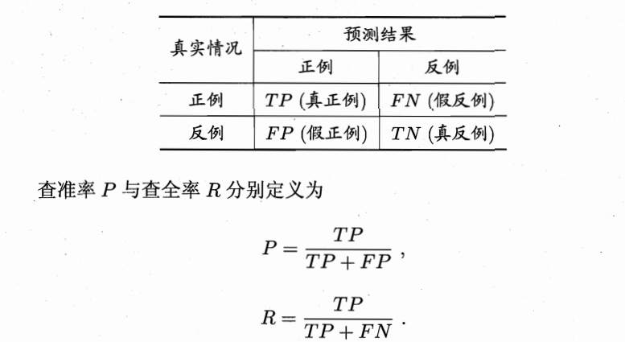

    **查准率** 和 **查全率** 是一对矛盾的量度。一般来说，查准率高时，查全率往往偏低；二查全率搞事，查准率往往偏低。以 **查准率** 为纵轴、**查全率** 为横轴作图，就得到 了 **查准率-查全率曲线**，简称 **P-R曲线**，显示该曲线的图称为 **P-R图**

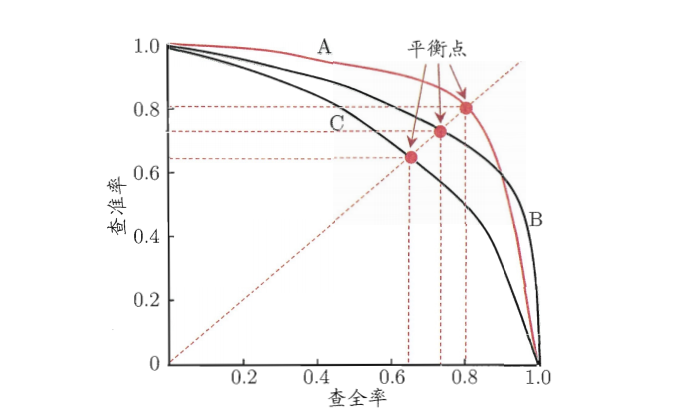

​		**P-R图** 直观地显示出学习器在样本总体上的查全率、查准率。若一个学习器的 **P-R图** 完全被另一		个学习器完全 **包住**，则可以断言后者性能强于前者，如上图，**A的性能强于B**。但是，如果二者 		**P-R图有交叉** 则难以分辨。因此人们设计了一些综合考虑 **查准率、查全率** 的性能量度;

​		1. **平衡点（Break-Event Point，简称BEP）**

​		即 **查全率=查准率的取值**，例如上图，C的 **BEP** =0.64.若基于 **BEP** 比较A优于B。但 **BEP** 还是过		于简化，更常用的时 **F1量度**

  2. **F1量度**
     $$
     F1=\frac{2\times P\times R}{P+R}=\frac{2\times TP}{样例总数+TP-TN} \qquad(2.10)
     $$
     在一些应用中 **查准率、查全率** 的重视程度不同。所以引入了 $\beta$ 值，产生了 $F 1$ 量度的一般形式 $F _{\beta }$ ，能让我们表达出对查准率/查全率的不同偏好，它定义为
     $$
     F1=\frac{(1+\beta^2)\times P\times R}{(\beta^2 \times P)+R}\qquad (2.11)
     $$
      其中 $\beta >0$ 度量了査全率对査准率的相对重要性[VanRijsbergen, 1979]. $\beta =1$ 时退化为标准的$F1$; $\beta >1$ 时查全率有更大影响；$\beta <1$​ 时查准率有更大影响.

     很多时候我们有多个二分类混淆矩阵，这是希望在 $n$ 个二分类混淆矩阵上综合考察 **查准率** 和 **查全率** ：

     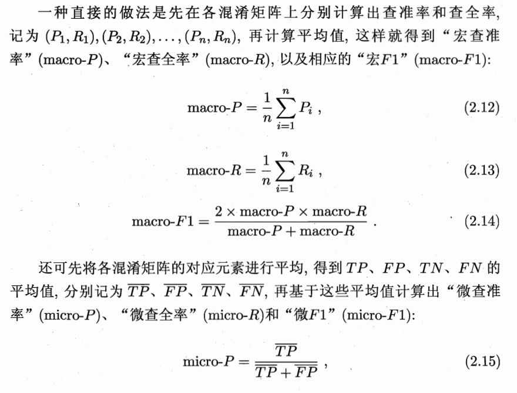

     ​	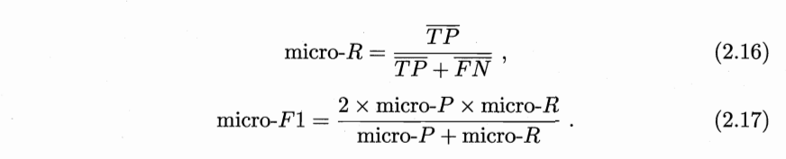

3. **ROC与AUC**

   很多学习器是为测试样本产生一个实值或概率预测，然后将这个预测值与一个 **分类阈值（threshold）** 进行比较，若大于阈值则分为正类，否则分为反类。这个实值预测或概率的好坏，直接决定了学习器的泛化能力。**分类** 过程就相当于在这个排序中以某个 **截断点（cut point）** 将样本分为两部分，前一部分作正例后一部分作反例。因此，排序本身的质量好坏，体现了"一般情况下"泛化性能的好坏。**ROC曲线** 则是从这个角度出发来研究学习器泛化性能的有力工具。

   **ROC** 全程 **受试者工作特征（Receiver Operating Characteristic）曲线**。 **ROC曲线**分别以 **真正例率（True Positive Rate，简称TPR）**为纵轴，以 **假正例率（False Positive Rate，简称FPR）**为横轴建立图表，二者定义为：
   $$
   TPR=\frac{TP}{TP+FN}\qquad (2.18)
   $$

   
   $$
   TPR=\frac{TP}{TP+FN}\qquad (2.19)
   $$

   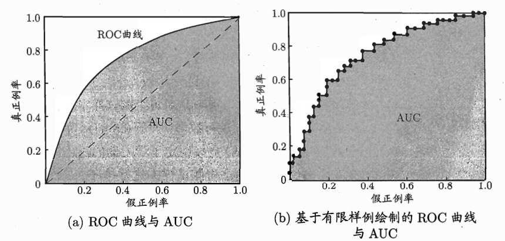

   (a)图为所有正例排在所有反例之前的 ”理想模型“ ，现实中通常是利用有限个测试样例来绘制 **ROC图** ，此时无法产生类似(a)的平滑图像，只能产生(b)这样的曲线。

   若一个学习器的 **ROC曲线** 被另一 个学习器的曲线完全“包住”，则可断言后者的性能优于前者；若两个学习器的 **ROC曲线** 发生交叉，则难以一般性地断言两者孰优孰劣.此时如果一定要进 行比较，则较为合理的判据是比较 **ROC曲线** 下的面积，即 **AUC（Area Under ROC Curve）**，假定**ROC曲线** 是由坐标为 $\left \{ \left (  x_{1},y_{1} \right ) , \left (  x_{2},y_{2} \right ),\dots  ,\left (  x_{m},y_{m} \right ) \right \} $ 的点按序连接而形成 $(x_{1}=0,x_{m}=1)$ ,则 **AUC** 可估算为：
   $$
   AUC=\frac{1}{2} \sum_{m-1}^{i=1} (x_{i+1}-x_{i})\bullet (y_{i}+y_{i+1})\qquad (2.20)
   $$
   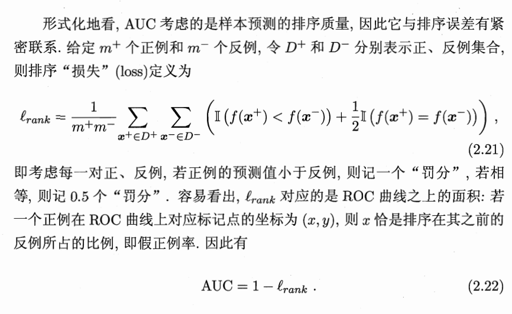

4. **代价敏感错误率与代价曲线**

   为权衡不同类型错误所造成的不同损失，可以错误的赋予 **非均等代价（unequal cost）**

   以二分任务举例，设定一个 **代价矩阵（cost martrix）**，对 $cost_{01}$ 与 $cost_{10}$​​​ 分别赋值代表损失的代价,取值为$[0,1]$

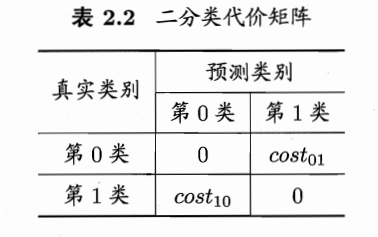

​		例如上式，若将第0类作为正类，第1类作为反类，令 $D^+$ 与 $D^-$ 分别代表样例 $D$​ 的正例子集		与反例子集，则 **代价敏感（cost-sensitive）错误率** 为：
$$
\begin{aligned}
E(f ; D ; \text { cost })=& \frac{1}{m}\left(\sum_{\boldsymbol{x}_{i} \in D^{+}} \mathbb{I}\left(f\left(\boldsymbol{x}_{i}\right) \neq y_{i}\right) \times \operatorname{cost}_{01}\right.\\
&\left.+\sum_{\boldsymbol{x}_{i} \in D^{-}} \mathbb{I}\left(f\left(\boldsymbol{x}_{i}\right) \neq y_{i}\right) \times \operatorname{cost}_{10}\right)
\end{aligned}
$$
​		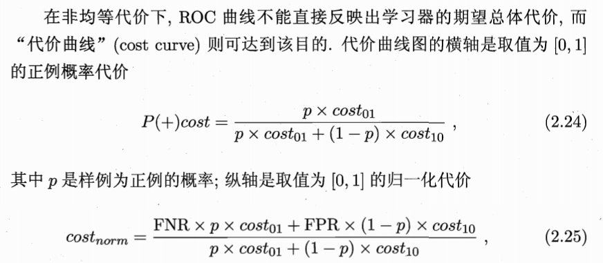

其中 $FPR$​ 是式 $(2.19)$ 定义的假正例率，$FNR=1-TPR$ 为假反例率。代价曲线的绘制很简单：**ROC曲线** 上的每一点对应了代价平面上的一条线段，将**ROC曲线** 上的每一点转化为代价平面上的一条线段，然后取所有线段的下界，围成的面积就是期望总体代价：

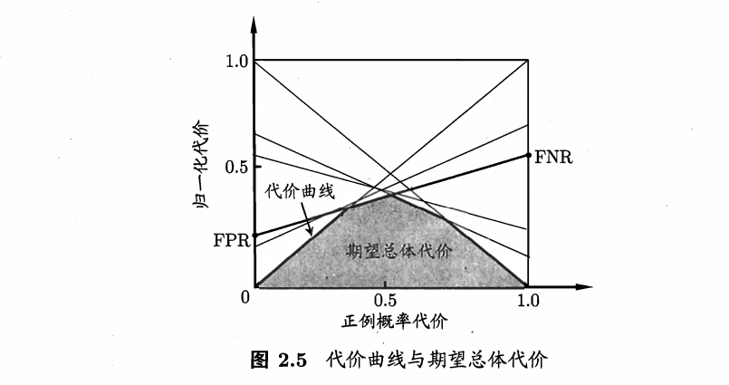

### 2.4 比较检验

本节讲述如何对学习器的性能进行比较

**统计假设检验（hypothesis test）** 为我们进行学习器性能的比较提供了重要依据。本节默认错误率为性能量度，用 $\epsilon $ 表示

1. 方法一

   **泛化错误率** 与 **测试错误率** 未必相同，但直观上，二者接近的可能性应该比较大。因此可以根据测试错误率估推出泛化错误率的分布
   
   泛化错误率 $\epsilon $ ：学习器在一个样本上犯错的概率
   
   测试错误率 $\hat{\epsilon } $ ：学习器在 m 个测试样本中恰有 $\hat{\epsilon }\times  m$ 个被误分类
   
   泛化错误率为 $\epsilon $  的学习器被测定测试错误率为 $\hat{\epsilon } $​ 的概率为：
   
   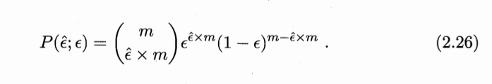
   
   该概率分布符合 **二项分布(binomial)** ，

## 第3章 线性模型

### 3.1 基本形式

​	给定有 $d$ 个属性描述的示例 $x=(x_1;x_2;...;x_d)$ 其中 $x_i$ 是 $x$ 在第 $i$ 个属性上的取值，**线性模型（linear model）** 试图学得一个通过属性的线性组合来进行预测的函数，即

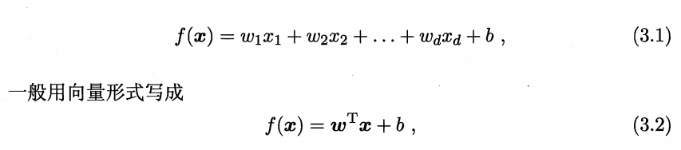

其中 $w=(w_1;w_2;...;w_d)$ .$w$ 与 $d$​ 学得后，模型就得以确认​。

线性模型形式简单，易于建模，$w$ 直观表达了各属性在预测性在预测中的重要性，因此线性模型有很好的 **可解释性（comprehensibility）** 。eg：在西瓜问题中学得 $f_{好瓜}(x)=0.2*x_{色泽}+0.5*x_{根蒂}+0.3*x_{敲声}+1$ ，意味着三种属性之间的权重

### 3.2 线性回归

给定数据集 $D=\left \{ \left (  x_{1},y_{1} \right ) , \left (  x_{2},y_{2} \right ),\dots  ,\left (  x_{m},y_{m} \right ) \right \} $ ，其中$x_{i}=\left \{ x_{i1};x_{i2};\dots ;x_{id}  \right \} $ ，$y_{i}\in \mathbb{R}$ 。**线性回归（liner regression）** 试图学得一个线性模型以尽可能准确地预测实值输出标记。

#### d=1(一元线性回归)

**线性回归试图学得：**  

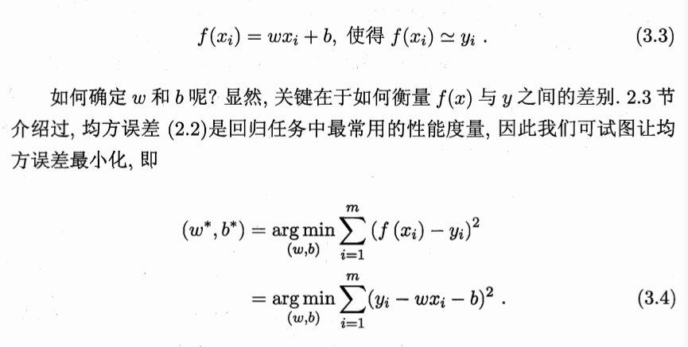

​	基于均方误差最小化来进行模型求解的方法称为 **最小二乘法（least square method）** 

​	经过计算我们可以得到 $w$ 和 $b$ 最优解的 **闭式（closed-form）** 解

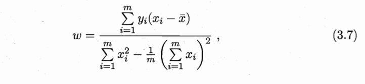

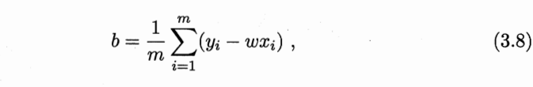

其中 $\bar{x} $ 是 $x$ 的均值

#### d>1(多元线性回归)

此时我们试图学得
$$
f(x_i)=w^Tx_i+b,使得f(xi)\simeq y_i,
$$
这称为 **多元线性回归（multivariate linear regression）**

由于 $x_i$ 有 d 个维度，所以我们的 $w^T$ 就有d个，所以就有：
$$
w^Tx_i=w_1*x_{i1}+w_2*x_{i2}+···+w_d*x_{id}
$$
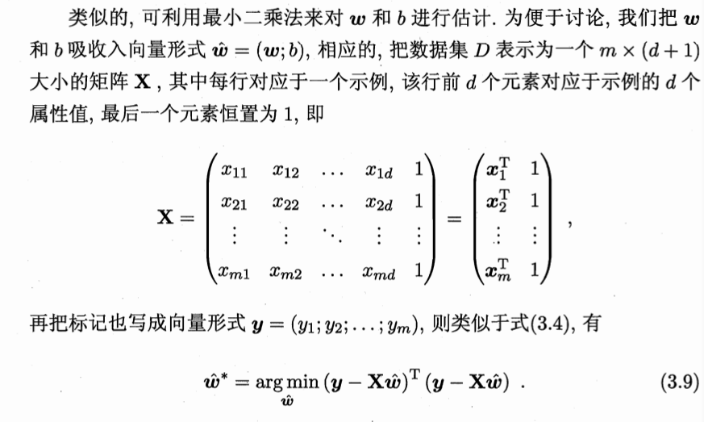

相当于将 $x$ 和 $y$ 都变成向量形式，向量 $x_i$ 与向量 $y$ 都有 $d$ 个维度

1. 当 $X^TX$ 为 **满秩矩阵（full-rank matrix）** 或 **正定矩阵（positive definite matrix）** 时可得：

$$
\hat{w} ^*=(X^TX)^{-1}X^Ty
$$

最终学得的多元线性回归模型为

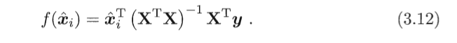

2. 显示任务中$X^TX$ 往往不是 **满秩矩形** ，这时可能会产生多个 $\hat{w}$ 使得均方误差最小，这时一般引入 **正则化（regularization）** ，令：
   $$
   \ln_{}{}y=w^Tx+b
   $$
   这就是 **对数线性回归（log-linear regression）** 

   更一般的，考虑单调可微函数 $g(·)$ ,令：
   $$
   y=g^{-1}(w^Tx+b)
   $$
   这样得到的，模型被称为 **广义线性模型（generalized inear model）** 其中 $g(·)$ 被称为 **联系函数（link function）**.显然，对数线性回归时广义线性回归在 $g(·)=\ln (·)$ 时的特例

### 3.3 对数几率回归

**问题描述**

1. 分类问题，无论x的取值y的输出只有几种

2. 考虑广义的线性模型，找一个单调可微函数将分类问题的真实标记 $y$ 与线性回归模型的预测值联系起来就行

**二分类问题**

线性回归模型产生的预测值 $z=w^Tx+b$ ,于是，我们就需要将 $z$ 转化为 0/1 值

1. **单位阶跃函数（unit-step function）**

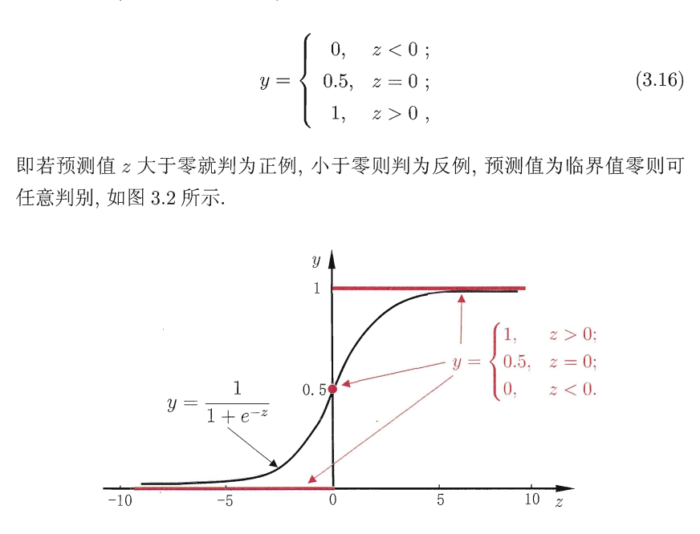

​										         	**图 3.2** 单位阶跃函数与对数几率函数	

​	红线所示为 **单位阶跃函数**

2. **对数几率函数（logisticfunction）**

   **单位阶跃函数** 并不连续，不能直接用。所以这时，需要找到能在一定程度上近似 **单位阶跃函数** 的 **替代函数（surrogate function）** 。**对数几率函数** 就是一个常用的 **替代函数**：

   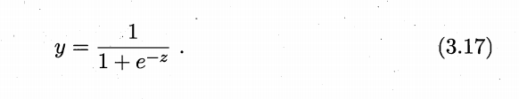

   如 **图 3.2** 的黑线所示

   将 $z=w^Tx+b$ 带入上式得：

   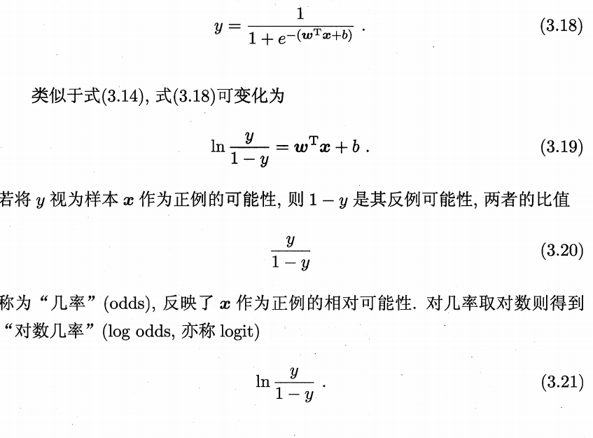

   从此可以看出， **式（3.18）** 实际上是在用 **线性回归模型** 的预测结果去笔记真实标记的对数几率，一次，对应的模型称为 **对数几率回归（logistic regression）**。虽然称为回归，但还是一种分类学习方法。其优点为：

   1.  可以直接对分类可能性进行建模，无需事先假设数据分布
   2. 不仅预测出类别，而是可得到近似概率预测
   3. 对数函数时任意阶可导的凸函数，有很好的数学性质

### 3.4 线性判别分析（Linear Discriminant Analy，简称LDA）

**思想方法：**

1. 给定训练样例集，设法将样例投影到一条直线上，使得同类样例的投影点尽可能的接近、异类样例投影点尽可能远离
2. 对新样本进行分类时，将其投影到同样的这条直线上，再根据投影点的位置来确定新样本的类别

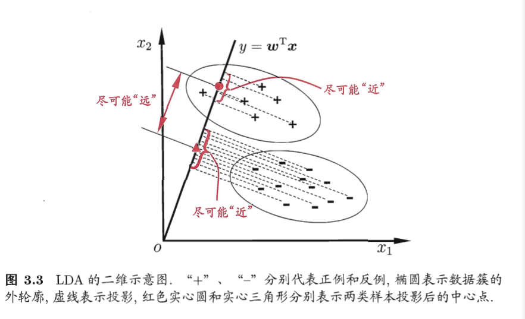

