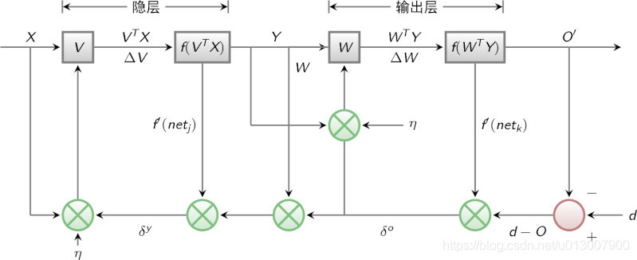

# 概述

**BP（Back Propagation）**神经网络是1986年由Rumelhart和McCelland为首的科研小组提出，参见他们发表在Nature上的论文 Learning representations by back-propagating errors 。

BP神经网络是一种按误差逆传播算法训练的多层前馈网络，是目前应用最广泛的神经网络模型之一。BP网络能学习和存贮大量的 输入-输出模式映射关系，而无需事前揭示描述这种映射关系的数学方程。它的学习规则是使用最速下降法，通过反向传播来不断 调整网络的权值和阈值，使网络的误差平方和最小。

# BP算法的基本思想

上一次我们说到，多层感知器在如何获取隐层的权值的问题上遇到了瓶颈。既然我们无法直接得到隐层的权值，能否先通过输出层得到输出结果和期望输出的误差来间接调整隐层的权值呢？BP算法就是采用这样的思想设计出来的算法，它的基本思想是,学习过程由信号的正向传播与误差的反向传播两个过程组成。

- 正向传播时，输入样本从输入层传入,经各隐层逐层处理后,传向输出层。若输出层的实际输出与期望的输出(教师信号)不符,则转入误差的反向传播阶段。

- 反向传播时，将输出以某种形式通过隐层向输入层逐层反传,并将误差分摊给各层的所有单元,从而获得各层单元的误差信号,此误差信号即作为修正各单元权值的依据。
  这两个过程的具体流程会在后文介绍。

## BP算法的信号流向图如下图所示

# BP网络模型的特性分析——BP三要素

我们分析一个ANN时，通常都是从它的三要素入手，即
1)网络拓扑结构；
2)传递函数；
3)学习算法。

每一个要素的特性加起来就决定了这个ANN的功能特性。所以，我们也从这三要素入手对BP网络的研究。

## BP网络的拓扑结构

上一次已经说了，BP网络实际上就是多层感知器，因此它的拓扑结构和多层感知器的拓扑结构相同。由于单隐层（三层）感知器已经能够解决简单的非线性问题，因此应用最为普遍。三层感知器的拓扑结构如下图所示。
一个最简单的三层BP：

## BP网络的传递函数

BP网络采用的传递函数是非线性变换函数——Sigmoid函数（又称S函数）。其特点是函数本身及其导数都是连续的，因而在处理上十分方便。为什么要选择这个函数，等下在介绍BP网络的学习算法的时候会进行进一步的介绍。
**单极性S型函数曲线**如下图所示。
$$
f ( x ) ={1\over 1+e^{-x}}
$$

**双极性S型函数曲线** 如下图所示:
$$
f ( x )={1-e^{-x}\over 1+e^{-x}}
$$

## BP网络的学习算法

BP网络的学习算法就是BP算法，又叫 δ 算法（在ANN的学习过程中我们会发现不少具有多个名称的术语）， 以三层感知器为例，当网络输出与期望输出不等时，存在输出误差 E ，定义如下
$$
E ={1\over 2}(d−O)^2={1\over 2}∑_{κ=1}^ℓ(d_k−o_k)^2
$$
将以上误差定义式展开至隐层，有
$$
E={1\over 2}∑_{κ=1}^ℓ[d_κ−f(net_κ)]^2={1\over 2}∑_{κ=1}^ℓ[d_κ−f(∑_{j=0}^mω_{jκ}y_j)]^2
$$

进一步展开至输入层，有
$$
E{1\over 2}∑_{κ=1}^ℓ{d_κ−f[∑_{j=0}^mω_{jκ}f(net_j)]}^2={1\over 2}∑_{κ=1}^ℓ{d_κ−f[∑_{j=0}^mω_{jκ}f(∑_{j=0}^nυ_{ij}χ_i)]}^2
$$

由上式可以看出，网络输入误差是各层权值$w_{jk},v_{ij}$ 的函数，因此调整权值可改变误差$E$。 显然，调整权值的原则是使误差不断减小，因此应使权值与误差的梯度下降成正比，即
$$
Δω_{jκ}=−η{∂E\over ∂ω_{jκ}}j=0,1,2,…,m;κ=1,2,…,ℓ
$$

$$
Δυ_{ij}=−η{∂E∂\over υ_{ij}}i=0,1,2,…,n;j=1,2,…,m
$$

对于一般多层感知器，设共有 $h$ 个隐层，按前向顺序各隐层节点数分别记为 

$m 1 , m 2 , … , m_h$，各隐层输出分别记为 $y_1 , y_2 , … , y_h$ ，各层权值矩阵分别记为 $W_1 , W_2 , … , W_h , W_{h+1}$  ，则各层权值调整公式为

输出层

$$
Δω^{h+1}_{jκ}=ηδ_{h+1}^κy^h_j=η(d_κ−o_κ)o_κ(1−o_κ)y^κ_j\tag{j=0,1,2,…,mh;κ=1,2,…,ℓ}
$$

第$h$隐层

$$
Δω^h_{ij}=ηδ^h_jy^h_i−1=η(∑^l_{κ=1}δ^o_κω^{h+1}_{jκ}y^κ_j(1−y^k_jappa)y^h_i−1\tag{i=0,1,2,…,m(h−1);j=1,2,…,$m_h$}
$$

按以上规律逐层类推，则第一隐层权值调整公式

$$
Δω^1_{pq}=ηδ^1_qχ_p=η(∑^{m_2}_{r=1}δ^2_rω^2_{qr})y^1_q(1−y^1_q)χ_p\tag{p=0,1,2,…,n;j=1,2,…,$m_1$}
$$

容易看出，BP学习算法中，各层权值调整公式形式上都是一样的，均由3个因素决定，即：

1. 学习率$η$

2. 本层输出的误差信号 $δ$

3. 本层输入信号 $Y$（或$X$）

其中输入层误差信号与网络的期望输出与实际输出之差有关，直接反应了输出误差，而各隐层的误差信号与前面各层的误差信号有关，是从输出层开始逐层反传过来的。

可以看出BP算法属于δ学习规则类，这类算法常被称为误差的梯度下降算法。δ学习规则可以看成是Widrow-Hoff(LMS)学习规则的一般化(generalize)情况。LMS学习规则与神经元采用的变换函数无关，因而不需要对变换函数求导，δ学习规则则没有这个性质，要求变换函数可导。这就是为什么我们前面采用Sigmoid函数的原因。

综上所述，BP三要素如下图所示。

下面我们会介绍BP网络的学习训练的具体过程。

BP网络的训练分解
训练一个BP神经网络，实际上就是调整网络的权重和偏置这两个参数，BP神经网络的训练过程分两部分：

前向传输，逐层波浪式的传递输出值；
逆向反馈，反向逐层调整权重和偏置；
我们先来看前向传输。
前向传输（Feed-Forward前向反馈）
在训练网络之前，我们需要随机初始化权重和偏置，对每一个权重取[ − 1 , 1 ] [-1,1][−1,1]的一个随机实数，每一个偏置取[ 0 , 1 ] [0,1][0,1]的一个随机实数，之后就开始进行前向传输。

神经网络的训练是由多趟迭代完成的，每一趟迭代都使用训练集的所有记录，而每一次训练网络只使用一条记录，抽象的描述如下：

while 终止条件未满足：
    for record:dataset:
        trainModel(record)
1
2
3
首先设置输入层的输出值，假设属性的个数为100，那我们就设置输入层的神经单元个数为100，输入层的结点N i N_iN 
i

 为记录第i ii维上的属性值x i x_ix 
i

 。对输入层的操作就这么简单，之后的每层就要复杂一些了，除输入层外，其他各层的输入值是上一层输入值按权重累加的结果值加上偏置，每个结点的输出值等该结点的输入值作变换

前向传输的输出层的计算过程公式如下：
I j = ∑ i = 1 ω i j o i + θ j I_j=\sum_{i=1}\omega_{ij}o_i+\theta_j
I 
j

 = 
i=1
∑

 ω 
ij

 o 
i

 +θ 
j

 

o j = f ( I j ) = 1 1 + e I j o_j=f(I_j)={1\over 1+e^{I_j}}
o 
j

 =f(I 
j

 )= 
1+e 
I 
j

 

1

 

对隐藏层和输出层的每一个结点都按照如上图的方式计算输出值，就完成前向传播的过程，紧接着是进行逆向反馈。

逆向反馈（Backpropagation）
逆向反馈从最后一层即输出层开始，我们训练神经网络作分类的目的往往是希望最后一层的输出能够描述数据记录的类别，比如对于一个二分类的问题，我们常常用两个神经单元作为输出层，如果输出层的第一个神经单元的输出值比第二个神经单元大，我们认为这个数据记录属于第一类，否则属于第二类。

还记得我们第一次前向反馈时，整个网络的权重和偏置都是我们随机取，因此网络的输出肯定还不能描述记录的类别，因此需要调整网络的参数，即权重值和偏置值，而调整的依据就是网络的输出层的输出值与类别之间的差异，通过调整参数来缩小这个差异，这就是神经网络的优化目标。对于输出层：
E j = O j ( 1 − O j ) ( T j − O j ) E_j=O_j(1-O_j)(T_j-O_j)
E 
j

 =O 
j

 (1−O 
j

 )(T 
j

 −O 
j

 )

其中E j E_jE 
j

 表示第j jj个结点的误差值，O j O_jO 
j

 表示第j jj个结点的输出值，T j T_jT 
j

 记录输出值，比如对于2分类问题，我们用01表示类标1,10表示类别2，如果一个记录属于类别1，那么其T 1 = 0 T_1=0T 
1

 =0，T 2 = 1 T_2=1T 
2

 =1。

中间的隐藏层并不直接与数据记录的类别打交道，而是通过下一层的所有结点误差按权重累加，计算公式如下：
E j = O j ( 1 − O j ) ∑ k E k W j k E_j=O_j(1-O_j)\sum_kE_kW_{jk}
E 
j

 =O 
j

 (1−O 
j

 ) 
k
∑

 E 
k

 W 
jk

 

其中W j k W_{jk}W 
jk

 表示当前层的结点j jj到下一层的结点k kk的权重值，E k E_kE 
k

 下一层的结点k kk的误差率。

计算完误差率后，就可以利用误差率对权重和偏置进行更新，首先看权重的更新：

其中λ λλ表示表示学习速率，取值为0到1，学习速率设置得大，训练收敛更快，但容易陷入局部最优解，学习速率设置得比较小的话，收敛速度较慢，但能一步步逼近全局最优解。

更新完权重后，还有最后一项参数需要更新，即偏置：

至此，我们完成了一次神经网络的训练过程，通过不断的使用所有数据记录进行训练，从而得到一个分类模型。不断地迭代，不可能无休止的下去，总归有个终止条件。

训练终止条件
每一轮训练都使用数据集的所有记录，但什么时候停止，停止条件有下面两种：

设置最大迭代次数，比如使用数据集迭代100次后停止训练
计算训练集在网络上的预测准确率，达到一定门限值后停止训练
BP网络运行的具体流程
网络结构
输入层有n nn个神经元，隐含层有p pp个神经元，输出层有q qq个神经元。

变量定义
输入变量：
x = ( x 1 , x 2 , … , x n ) x=(x_1,x_2,\dots,x_n)
x=(x 
1

 ,x 
2

 ,…,x 
n

 )

隐含层输入变量：
h i = ( h i 1 , h i 2 , … , h i p ) hi=(hi_1,hi_2,\dots,hi_p)
hi=(hi 
1

 ,hi 
2

 ,…,hi 
p

 )

隐含层输出变量：
h o = ( h o 1 , h o 2 , … , h o p ) ho=(ho_1,ho_2,\dots,ho_p)
ho=(ho 
1

 ,ho 
2

 ,…,ho 
p

 )

输出层输入变量：
y i = ( y i 1 , y i 2 , … , y i q ) yi=(yi_1,yi_2,\dots,yi_q)
yi=(yi 
1

 ,yi 
2

 ,…,yi 
q

 )

输出层输出变量：
y o = ( y o 1 , y o 2 , … , y o q ) yo=(yo_1,yo_2,\dots,yo_q)
yo=(yo 
1

 ,yo 
2

 ,…,yo 
q

 )

期望输出向量：
d o = ( d 1 , d 2 , … , d q ) d_o=(d_1,d_2,\dots,d_q)
d 
o

 =(d 
1

 ,d 
2

 ,…,d 
q

 )

输入层与中间层的连接权值：
w i h w_{ih}
w 
ih

 

隐含层与输出层的连接权值：
w h o w_{ho}
w 
ho

 

隐含层各神经元的阈值：
b h b_h
b 
h

 

输出层各神经元的阈值：
b o b_o
b 
o

 

样本数据个数：
k = 1 , 2 , … , m k=1,2,\dots,m
k=1,2,…,m

激活函数：
f ( ⋅ ) f(\cdot)
f(⋅)

误差函数：
e = 1 2 ∑ o = 1 q ( d o ( k ) − y o o ( k ) ) 2 e={1\over 2}\sum_{o=1}^{q}(d_o(k)-yo_o(k))^2
e= 
2
1

o=1
∑
q

 (d 
o

 (k)−yo 
o

 (k)) 
2

###第一步：网络初始化
给各连接权值分别赋一个区间( − 1 , 1 ) (-1,1)(−1,1)内的随机数，设定误差函数e ee，给定计算精度值ε \varepsilonε和最大学习次数M MM。
###第二步：随机选取
随机选取第k kk个输入样本以及对应的期望输出
x ( k ) = ( x 1 ( k ) , x 2 ( k ) , … , x n ( k ) ) d o ( k ) = ( d 1 ( k ) , d 2 ( k ) , … , d q ( k ) ) x(k)=(x_1(k),x_2(k),\dots,x_n(k))\\ d_o(k)=(d_1(k),d_2(k),\dots,d_q(k))
x(k)=(x 
1

 (k),x 
2

 (k),…,x 
n

 (k))
d 
o

 (k)=(d 
1

 (k),d 
2

 (k),…,d 
q

 (k))

###第三部：隐含层计算
计算隐含层各神经元的输入和输出
h i h ( k ) = ∑ i = 1 n w i h x i ( k ) − b h ( h = 1 , 2 , … , p ) hi_h(k)=\sum_{i=1}^nw_{ih}x_i(k)-b_h \tag{$h=1,2,\dots,p$}
hi 
h

 (k)= 
i=1
∑
n

 w 
ih

 x 
i

 (k)−b 
h

 (h=1,2,…,p)

h i h ( k ) = f ( h i h ( k ) ) ( h = 1 , 2 , … , p ) hi_h(k)=f(hi_h(k)) \tag{$h=1,2,\dots,p$}
hi 
h

 (k)=f(hi 
h

 (k))(h=1,2,…,p)

y i o ( k ) = ∑ h = 1 p w h o h o h ( k ) − b o ( o=1,2, …   ,q ) yi_o(k)=\sum_{h=1}^pw_{ho}ho_h(k)-b_o \tag{o=1,2,$\dots$,q}
yi 
o

 (k)= 
h=1
∑
p

 w 
ho

 ho 
h

 (k)−b 
o

 (o=1,2,…,q)

y o o ( k ) = f ( y i o ( k ) ) ( o=1,2, …   ,q ) yo_o(k)=f(yi_o(k))\tag{o=1,2,$\dots$,q}
yo 
o

 (k)=f(yi 
o

 (k))(o=1,2,…,q)

第四步：求偏导数
利用网络期望输出和实际输出，计算误差函数对输出层的各神经元的偏导数δ o ( k ) \delta_o(k)δ 
o

 (k)

第六步：修正权值
利用输出层各神经元的δ o ( k ) \delta_o(k)δ 
o

 (k)和隐含层各神经元的输出来修正连接权值w h o ( k ) w_{ho}(k)w 
ho

 (k)。

第七部：修正权值
利用隐含层各神经元的δ h ( k ) \delta_h(k)δ 
h

 (k)和输入层各神经元的输入修正连接权值。

第八步：计算全局误差
E = 1 2 m ∑ k = 1 m ∑ o = 1 q ( d o ( k ) − y o ( k ) ) 2 E={1\over 2m}\sum_{k=1}^m\sum_{o=1}^q(d_o(k)-y_o(k))^2
E= 
2m
1

k=1
∑
m

o=1
∑
q

 (d 
o

 (k)−y 
o

 (k)) 
2

第九步：判断模型合理性
判断网络误差是否满足要求。
当误差达到预设精度或者学习次数大于设计的最大次数，则结束算法。
否则，选取下一个学习样本以及对应的输出期望，返回第三部，进入下一轮学习。

BP网络的设计
在进行BP网络的设计是，一般应从网络的层数、每层中的神经元个数和激活函数、初始值以及学习速率等几个方面来进行考虑，下面是一些选取的原则。

1.网络的层数
理论已经证明，具有偏差和至少一个S型隐层加上一个线性输出层的网络，能够逼近任何有理函数，增加层数可以进一步降低误差，提高精度，但同时也是网络 复杂化。另外不能用仅具有非线性激活函数的单层网络来解决问题，因为能用单层网络解决的问题，用自适应线性网络也一定能解决，而且自适应线性网络的 运算速度更快，而对于只能用非线性函数解决的问题，单层精度又不够高，也只有增加层数才能达到期望的结果。

2.隐层神经元的个数
网络训练精度的提高，可以通过采用一个隐含层，而增加其神经元个数的方法来获得，这在结构实现上要比增加网络层数简单得多。一般而言，我们用精度和 训练网络的时间来恒量一个神经网络设计的好坏：
（1）神经元数太少时，网络不能很好的学习，训练迭代的次数也比较多，训练精度也不高。
（2）神经元数太多时，网络的功能越强大，精确度也更高，训练迭代的次数也大，可能会出现过拟合(over fitting)现象。
由此，我们得到神经网络隐层神经元个数的选取原则是：在能够解决问题的前提下，再加上一两个神经元，以加快误差下降速度即可。

3.初始权值的选取
一般初始权值是取值在(−1,1)之间的随机数。另外威得罗等人在分析了两层网络是如何对一个函数进行训练后，提出选择初始权值量级为s√r的策略， 其中r为输入个数，s为第一层神经元个数。

4.学习速率
学习速率一般选取为0.01−0.8，大的学习速率可能导致系统的不稳定，但小的学习速率导致收敛太慢，需要较长的训练时间。对于较复杂的网络， 在误差曲面的不同位置可能需要不同的学习速率，为了减少寻找学习速率的训练次数及时间，比较合适的方法是采用变化的自适应学习速率，使网络在 不同的阶段设置不同大小的学习速率。

5.期望误差的选取
在设计网络的过程中，期望误差值也应当通过对比训练后确定一个合适的值，这个合适的值是相对于所需要的隐层节点数来确定的。一般情况下，可以同时对两个不同 的期望误差值的网络进行训练，最后通过综合因素来确定其中一个网络。

BP网络的局限性
BP网络具有以下的几个问题：

(1)需要较长的训练时间：这主要是由于学习速率太小所造成的，可采用变化的或自适应的学习速率来加以改进。
(2)完全不能训练：这主要表现在网络的麻痹上，通常为了避免这种情况的产生，一是选取较小的初始权值，而是采用较小的学习速率。
(3)局部最小值：这里采用的梯度下降法可能收敛到局部最小值，采用多层网络或较多的神经元，有可能得到更好的结果。
BP网络的改进
P算法改进的主要目标是加快训练速度，避免陷入局部极小值等，常见的改进方法有带动量因子算法、自适应学习速率、变化的学习速率以及作用函数后缩法等。 动量因子法的基本思想是在反向传播的基础上，在每一个权值的变化上加上一项正比于前次权值变化的值，并根据反向传播法来产生新的权值变化。而自适应学习 速率的方法则是针对一些特定的问题的。改变学习速率的方法的原则是，若连续几次迭代中，若目标函数对某个权倒数的符号相同，则这个权的学习速率增加， 反之若符号相反则减小它的学习速率。而作用函数后缩法则是将作用函数进行平移，即加上一个常数。

BP网络实现
由于BP网络具有出色的非线性映射能力、泛化能力和容错能力，因此BP网络成了至今为止应用最广泛的人工神经网络。下图是Matlab下用BP网络做线性拟合的结果，效果很好。

% BP网络函数逼近实例
% 1.首先定义正弦函数，采样率为20Hz，频率为1Hz
k = 1; % 设定正弦信号频率
p = [0:0.05:4];
t = cos(k*pi*p) + 3*sin(pi*p);
plot(p, t, '-'), xlabel('时间'); ylabel('输入信号');
% 2.生成BP网络。用newff函数生成前向型BP网络，设定隐层中神经元数目为10
% 分别选择隐层的传递函数为 tansig，输出层的传递函数为 purelin，
% 学习算法为trainlm。
net =
newff(minmax(p),[10,10,1],{'tansig','tansig','purelin'},'trainlm');
% 3.对生成的网络进行仿真并做图显示。
y1 = sim(net,p); plot(p, t, '-', p, y1, '--')
% 4.训练。对网络进行训练，设定训练误差目标为 1e-5，最大迭代次数为300，
% 学习速率为0.05。
net.trainParam.lr=0.05;
net.trainParam.epochs=1000;
net.trainParam.goal=1e-5;
[net,tr]=train(net,p,t);
%5.再次对生成的网络进行仿真并做图显示。
y2 = sim(net,p);
plot(p, t, '-', p, y2, '--')
1
2
3
4
5
6
7
8
9
10
11
12
13
14
15
16
17
18
19
20
21
22
这是用C语言写的：用BP神经网络拟合函数：Y = s i n ( X ) Y=sin(X)Y=sin(X)

#include "math.h"
#include "time.h"
#include "stdio.h"
#include "stdlib.h"
#include "ctype.h"
#define Ni 1
#define Nm 4
#define No 1
#define L 100
#define Enom 0.02
#define loopmax 100000
#define e 2.71828
double E;
double a,u,n;
double W1[Ni][Nm],D1[Ni][Nm],W2[Nm][No],D2[Nm][No];
double D22[Nm][No],D11[Ni][No];
double a1[Ni][Nm],a2[Nm][No];
double Pi[L][Ni],Pm[L][Nm],Po[L][No],T[L][No];
double Xm[L][Nm],Xo[L][No];
double Qm[L][Nm],Qo[L][No];
void proceed();
void proceedR();
void forQ();
void amend();
void initiate();
double newa(double a,double D);
double cal(double d);
double vcal(double d);
main()
{
    long int i;
	int flag;
	char choice;
    for(;;)
	{
		flag=0;
		initiate();
		for(i=0;;i++)
		{
			proceed();
			if( E < Enom )
			{ 
				flag=1;
				break;
			}
			if( i >= loopmax)
			{
				flag = -1;
				break;
			}
			if(i%2500==0)
				printf("第%10d轮误差：%20f,学习速率:%10f\n",i,E,a1[0][0]);
			forQ();
			amend();
		}
		if(flag>0)proceedR();
		else printf("训练失败！\n");
		for(;;)
		{
			choice=getchar();
			printf("是否继续？(Y/N)\n");
			choice=getchar();
			choice=toupper(choice);
			if(choice=='Y')break;
			if(choice=='N')exit(0);
		}
	}
}
void initiate()
{
	int i,j;
	int random;
	double x;
	double step;
	int stime;	
	long ltime;
	ltime=time(NULL);
	stime=(unsigned)ltime/2;
	srand(stime);
	a=0.02;
	u=1;
    n=1;
	printf("本程序将用BP神经网络拟合函数：Y=sin(X)\n\n");
	for( i=0; i<Nm; i++)
	{
		for( j=0; j<Ni; j++)
		{
			random=rand()%100-50;
			x=random;
			x=x/100;
			W1[j][i]=x;
			D11[j][i]=0;
			D1[j][i]=0;
			a1[j][i]=0.01;
		}
		for( j=0; j<No; j++)
		{
			random=rand()%100-50;
			x=random;
			x=x/100;
			W2[i][j]=x;
			D22[i][j]=0;
			D2[i][j]=0;
			a2[i][j]=0.01;
		}
	}
    step=1.0/L;
	for(i=0;i<L;i++)
	{
		x=i;
		Pi[i][0]=x*step;
		T[i][0]=sin(Pi[i][0]);
	}
	printf("初始化成功!\n\n下面将对神经网络进行训练请稍候。\n");
}
void proceed()
{
	int i, j, k;
	E=0 ;
	for( i=0; i<L; i++ )
	{
		for( j=0; j<Nm; j++ )
		{
			Pm[i][j] = 0;
			for( k=0; k<Ni; k++ )
			{
				Pm[i][j] = Pi[i][k] * W1[k][j] + Pm[i][j];
			}
			Xm[i][j] = cal( Pm[i][j] );
		}
		for( j=0; j<No; j++)
		{
			Po[i][j] = 0;
			for( k=0; k<Nm; k++)
			{
				Po[i][j] = Xm[i][k] * W2[k][j] + Po[i][j];
			}
			Xo[i][j] = cal( Po[i][j] );
		    E = E + ( Xo[i][j] - T[i][j] ) * ( Xo[i][j] - T[i][j] ) / 2;
		}
	}
}
void forQ()
{
	int i,j,k;
	for( i=0; i<L; i++ )
	{
		for( j=0; j<No; j++)
		{
			Qo[i][j] = ( T[i][j] - Xo[i][j] )* vcal( Xo[i][j] );
		}
		for(j=0; j<Nm; j++)
		{
			Qm[i][j]=0;
			for( k=0; k<No; k++)
			{
				Qm[i][j] = Qo[i][k] * W2[j][k] + Qm[i][j];
			}
			Qm[i][j] = Qm[i][j] * vcal( Xm[i][j] );
		}
	}
}
void amend()
{
	int i,j,k;
	double D;
	for( i=0; i<Nm; i++)
	{
		for( j=0; j<Ni; j++)
		{
			D1[j][i]=0;
		}
		for( j=0; j<No; j++)
		{
			D2[i][j]=0;
		}
	}
	for( i=0; i<Ni; i++)
	{
		for( j=0; j<Nm; j++)
		{
			for( k=0; k<L; k++)
			{
				D1[i][j] = Qm[k][j] * Pi[k][i] + D1[i][j];
			}
             D = D1[i][j] * D11[i][j]  ;//为D11付初值
			 a1[i][j] = newa( a1[i][j] , D );  // a 付初值
			 W1[i][j] = W1[i][j] + a1[i][j] * ( n * D1[i][j] + ( 1 - n ) * D11[i][j] );
			 D11[i][j] = D1[i][j];
		}
	}
    for( i=0; i<Nm; i++)
	{
		for( j=0; j<No; j++)
		{
			for( k=0; k<L; k++)
			{
				D2[i][j] = Qo[k][j] * Xm[k][i] + D2[i][j];
			}
			D = D2[i][j] * D22[i][j]  ;//为D11付初值
            a2[i][j] = newa( a2[i][j] , D ); 
			W2[i][j] = W2[i][j] + a2[i][j] * ( n * D2[i][j] + ( 1 - n ) * D22[i][j] );
			D22[i][j] = D2[i][j];
		}
	}
}
 void proceedR()
{
	int i, j;
	float x;
	double input,output;
	char choice;
	for(;;)
	{
		for(;;)
		{
			printf("在此输入需要计算的值(0,1):\n");
			scanf("%f",&x);
			input=(double)x;
			if((input>=0)&(input<=1))break;			
			printf("注意输入值应介于0、1之间！\n");
			for(;;)
			{
				choice=getchar();
				printf("是否继续？(Y/N)\n");
				choice=getchar();
				choice=toupper(choice);
				if(choice=='Y')break;
				if(choice=='N')exit(0);			
			}
		}
		for(i=0;i<Nm;i++)
		{
			Pm[0][i]=0;
			for( j=0; j<Ni; j++ )
			{
				Pm[0][i] =  input* W1[j][i]+Pm[0][i] ;
			}
			Xm[0][i] = cal( Pm[0][i] );
		}
		for( i=0; i<No; i++)
		{
			Po[0][i] = 0;
			for( j=0; j<Nm; j++)
			{
				Po[0][i] = Xm[0][j] * W2[j][i]+Po[0][i];
			}
		}
		output=cal( Po[0][0] );
		printf("输入值为%20f对应的结果为%f\n",input,output);
		printf("输入值为%20f对应的正常结果为%f\n",input,sin(input));
		for(;;)
		{
			choice=getchar();
			printf("是否继续？(Y/N)\n");
			choice=getchar();
			choice=toupper(choice);
			if(choice=='Y')break;
			if(choice=='N')exit(0);			
		}
	}
}

double newa(double a, double D)
{
	if( D > 0 )
	{
		{
			if(a<=0.04)
				a = a * 2;
			else a=0.08;
		}
	}
	else
		if ( D < 0)
		{
			if(a>=0.02)
			{
				a = a / 2;
			}
			else a=0.01;
		}
	return a;
}
double cal(double d)
{
	d =  - (d * u);                                //              chushihua 
	d = exp( d );
	d = 1 / ( 1 + d );
	return d;
}
double vcal(double d)
{
	return u * d * ( 1 - d );
}

————————————————