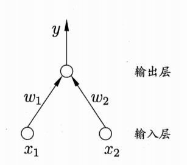
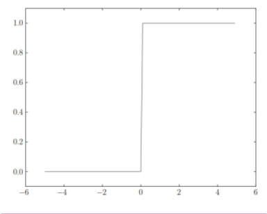
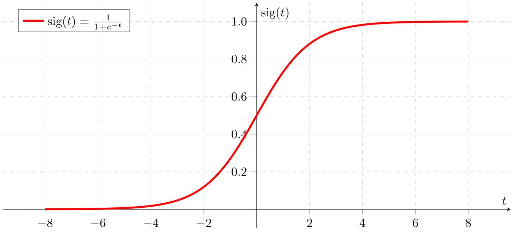
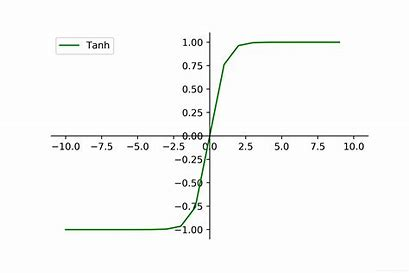
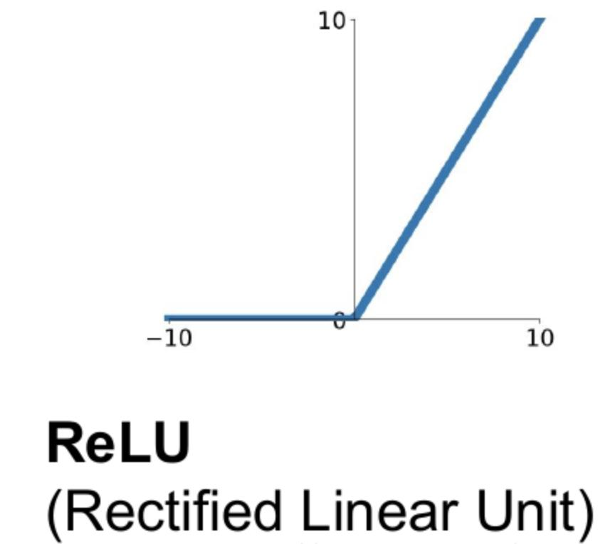
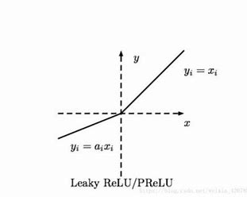

# 神经网络模型

## 神经元模型	

​	神经网络是有具有适应性的简单单元组成的广泛并行互联的网络，它的组织能够模拟生物神经系统对真实世界物体所作出的交互反应

​	神经网路中最基本的成分是 **神经元（neuron）模型** 。最经典的模型是 **M-P神经元模型** ，在这个模型中，神经元收到来自 n 个其他神经元传递过来的输入信号，这些输入信号通过带权重的 **链接（connection）** 进行传递，神经元接收到的总输入值将于神经元的阈值进行比较，然后通过 **激活函数（activation function）** 处理产生神经元的输出

## 多层感知机

**多层感知机**(MLP)是一种有监督学习算法，通过在数据集上训练来学习函数 $f(·):R^m\to R^o$​。其中 $m$​ 是输入的维数，$o$​ 是输出的维数。给定一组特征 $X=x_1,x_2,...,x_m$​ 和标签 $y$​​， 它可以对分类或者回归学习一个非线性函数.下列是最简单的两个输入神经元的感知机模型。

神经元的输出层有两个变量，输出层输出一个，




与逻辑回归不同，在输入层和输出层之间， 会存在一个层或者多层的非线性层， 称为隐藏层。

图1展示了一个带有标量输出的单层隐藏层的MLP。


​	最左边的层叫做输入层， 由一组代表输入特征的神经元组成。每个隐藏层中的神经元将前一层的值进行加权线性求和转换 $w_0x_0+w_1x_1+w_2x_2+...+w_mx_m$​, $w_n$​为权重,**$x_0$为偏置单元(bias unit)或偏置神经元(bias neruron)，一般为大小为1**，接着通过 **激活函数(activation function) 也称为 挤压函数(squashing function)** 处理产生神经元的输出

### 激活函数(activation function)

1. **阶跃函数**

   **图像**：

   **含义：** 大于0，输出为1，小于零输出为0

2. **sigmoid函数**

   **定义**：
   $$
   \frac{1}{1+e^{-x}}
   $$
   **图像：**

   **特点：**

   1. 其输出值落于[0,1]连续区间
   2. 在输入值从横坐标左移移动到右侧的过程中，其输出值呈现从平缓到加速再到平缓的特点
   3. **Sigmoid函数** 的倒数值落于[0,0.25]的连续区间

   **缺点：**

   ​	1.会严重影响深度学习中最终的权重调整幅度，产生 **梯度消失(vanishing Gradient)** 

   2. 在进行指数计算中会消耗更多的算力资源

   因此在平时的神经网络ANN模型中，它通常不被使用

3. **Tanh函数**

   **定义：**
   $$
   \frac{e^x-e^{-x}}{e^{x}+e^{-x}} 
   $$
   **图像：**

   **特点：**

   其值落于[-1,1]之间，另外其倒数值落于[0,1]区间，相比 **Sigmoid函数** 可以缓解梯度消失的问题

4. **ReLU(Rectified Linear Unit)函数** 

   **定义：**
   $$
   f(x)=max(0,x)
   $$
   **图像**：

   

   **特点：**

   1. 可以更好的解决梯度消失的问题
   2. 有更高的计算效率
   3. 可以在神经网络中拟合任何复杂的连续函数

   **缺点：**

   ​	在负数区域不会产生值，处于函数熄灭阶段，导致负数区域无法产生梯度调整值

5. **Leaky ReLU函数**

   **定义：**
   $$
   f(x)=max(0.1x,x)
   $$
   **图像：**

   **特点：**

   1. 在负数区间捏添加了一个较小斜率的线性部分，使负数区域也能产生梯度调整值

以上四种激活函数在隐藏层中的选择为：
$$
\begin{array}{c}
ReLU\\Leaky ReLU
\end{array} 
>Tanh>sigmoid
$$
在输出层中激活函数的选择

1. **二分类问题** 使用 **sigmoid函数** 返回是的概率
2. **多分类问题** 使用 **softMax函数** 它将返回属于每个类别的概率，概率和为1

$$
\frac{e^{Z_i}}{ {\textstyle \sum_{j=1}^{3}}e^{Z_j} }
$$

​	3.  **多标签问题** 使用 **sigmoid函数** 对每个类别的的概率进行单独的计算

​	 4. **线性回归问题** 使用 **线性函数** 作为激活函数

该模块下， 包含了公共的属性 `coefs_` 和 `intercepts_` 。 `coefs_`是一个权重矩阵的列表， 其中索引为的权重矩阵表示的第层和第层之间的之间的权重。`intercepts_`是偏置向量的列表， 其中索引为的向量表示的是添加到底层的偏置值。

多层感知机的优点是：

- 学习非线性模型的能力。
- 有使用 `partial_fit`在实时(在线学习)学习模型的能力。

多层感知机(MLP)的缺点包括：

- 具有隐藏层的 MLP 具有非凸的损失函数，它有不止一个的局部最小值。 因此不同的随机初始化权重会导致不同的验证集准确率。
- MLP 需要调试一些超参数，例如隐藏层神经元的数量、层数和迭代轮数。
- MLP对特征缩放是敏感的。

## 分类

[MLPClassifier](https://scikit-learn.org.cn/view/713.html)类通过使用 [Backpropagation](http://ufldl.stanford.edu/wiki/index.php/Backpropagation_Algorithm)进行训练实现了多层感知机（MLP）算法。

MLP 在两个数组上进行训练：大小为 (n_samples, n_features) 的数组 X，用来储存表示训练样本的浮点型特征向量; 大小为 (n_samples,) 的数组 y，用来储存训练样本的目标值（类别标签）：

```python
>>> from sklearn.neural_network import MLPClassifier
>>> X = [[0., 0.], [1., 1.]]
>>> y = [0, 1]
>>> clf = MLPClassifier(solver='lbfgs', alpha=1e-5,
...                     hidden_layer_sizes=(5, 2), random_state=1)
...
>>> clf.fit(X, y)
MLPClassifier(alpha=1e-05, hidden_layer_sizes=(5, 2), random_state=1,
              solver='lbfgs')
```

经过拟合(训练)，该模型可以预测新样品的标签：

```python
>>> clf.predict([[2., 2.], [-1., -2.]])
array([1, 0])
```

MLP可以拟合训练数据的非线性模型。`clf.coefs_`包含构成模型参数的权重矩阵：

```python
>>> [coef.shape for coef in clf.coefs_]
[(2, 5), (5, 2), (2, 1)]
```

目前， [MLPClassifier](https://scikit-learn.org.cn/view/713.html) 只支持交叉熵损失函数（ Cross-Entropy loss function），它通过运行 `predict_proba` 方法进行概率估计。

MLP 算法使用的是反向传播的方式。 更准确地说，它使用了某种形式的梯度下降来进行训练，其中的梯度是通过反向传播计算得到的。 对于分类问题而言，它最小化了交叉熵损失函数，为每个样本 给出一个向量形式的概率估计 。

```python
>>> clf.predict_proba([[2., 2.], [1., 2.]])
array([[1.967...e-04, 9.998...-01],
       [1.967...e-04, 9.998...-01]])
```

[MLPClassifier](https://scikit-learn.org.cn/view/713.html)通过应用 [Softmax](https://en.wikipedia.org/wiki/Softmax_activation_function)作为输出函数来支持多分类。

此外，该模型支持 [multi-label classification](http://scikit-learn.org.cn/view/91.html)，其中一个样本可以属于多个类别。 对于每个种类，原始输出经过 logistic 函数变换后，大于或等于 `0.5` 的值将为 `1`，否则为 `0`。 对于样本的预测输出，值为 `1` 的索引表示该样本的分类类别：

```python
>>> X = [[0., 0.], [1., 1.]]
>>> y = [[0, 1], [1, 1]]
>>> clf = MLPClassifier(solver='lbfgs', alpha=1e-5,
...                     hidden_layer_sizes=(15,), random_state=1)
...
>>> clf.fit(X, y)
MLPClassifier(alpha=1e-05, hidden_layer_sizes=(15,), random_state=1,
              solver='lbfgs')
>>> clf.predict([[1., 2.]])
array([[1, 1]])
>>> clf.predict([[0., 0.]])
array([[0, 1]])
```

**MLPclassifier类详解**

```python
MLPClassifier(solver=’sgd’, activation=’relu’,alpha=1e-4,hidden_layer_sizes=(50,50),random_state=1,max_iter=10,verbose=10,learning_rate_init=.1)
```

**常用参数说明**:

1. hidden_layer_sizes :例如hidden_layer_sizes=(50, 50)，表示有两层隐藏层，第一层隐藏层有50个神经元，第二层也有50个神经元。
2. activation :激活函数,{‘identity’, ‘logistic’, ‘tanh’, ‘relu’}, 默认relu

- identity：f(x) = x
- logistic：其实就是sigmod,f(x) = 1 / (1 + exp(-x)).
- tanh：f(x) = tanh(x).
- relu：f(x) = max(0, x)

3. solver： {‘lbfgs’, ‘sgd’, ‘adam’}, 默认adam，用来优化权重

- lbfgs：quasi-Newton方法的优化器
- sgd：随机梯度下降
- adam： Kingma, Diederik, and Jimmy Ba提出的机遇随机梯度的优化器
  注意：默认solver ‘adam’在相对较大的数据集上效果比较好（几千个样本或者更多），对小数据集来说，lbfgs收敛更快效果也更好。

4. alpha :float,可选的，默认0.0001,正则化项参数
5. batch_size : int , 可选的，默认’auto’,随机优化的minibatches的大小batch_size=min(200,n_samples)，如果solver是’lbfgs’，分类器将不使用minibatch
6. learning_rate :学习率,用于权重更新,只有当solver为’sgd’时使用，{‘constant’，’invscaling’, ‘adaptive’},默认constant

- ‘constant’: 有’learning_rate_init’给定的恒定学习率
- ‘incscaling’：随着时间t使用’power_t’的逆标度指数不断降低学习率learning_rate_ ，effective_learning_rate = learning_rate_init / pow(t, power_t)
- ‘adaptive’：只要训练损耗在下降，就保持学习率为’learning_rate_init’不变，当连续两次不能降低训练损耗或验证分数停止升高至少tol时，将当前学习率除以5.

1. max_iter: int，可选，默认200，最大迭代次数。
2. random_state:int 或RandomState，可选，默认None，随机数生成器的状态或种子。
3. verbose : bool, 可选, 默认False,是否将过程打印到stdout
   属性说明：

- classes_:每个输出的类标签
- loss_:损失函数计算出来的当前损失值
- coefs_:列表中的第i个元素表示i层的权重矩阵
- intercepts_:列表中第i个元素代表i+1层的偏差向量
- n_iter_ ：迭代次数
- n_layers_:层数
- n_outputs_:输出的个数
- out_activation_:输出激活函数的名称。

1.激活函数的选取
2.网络的层数
理论已经证明，具有偏差和至少一个S型隐层加上一个线性输出层的网络，能够逼近任何有理函数，增加层数可以进一步降低误差，提高精度，但同时也是网络 复杂化。另外不能用仅具有非线性激活函数的单层网络来解决问题，因为能用单层网络解决的问题，用自适应线性网络也一定能解决，而且自适应线性网络的 运算速度更快，而对于只能用非线性函数解决的问题，单层精度又不够高，也只有增加层数才能达到期望的结果。

3.隐层神经元的个数
网络训练精度的提高，可以通过采用一个隐含层，而增加其神经元个数的方法来获得，这在结构实现上要比增加网络层数简单得多。一般而言，我们用精度和 训练网络的时间来恒量一个神经网络设计的好坏：
（1）神经元数太少时，网络不能很好的学习，训练迭代的次数也比较多，训练精度也不高。
（2）神经元数太多时，网络的功能越强大，精确度也更高，训练迭代的次数也大，可能会出现过拟合(over fitting)现象。
由此，我们得到神经网络隐层神经元个数的选取原则是：在能够解决问题的前提下，再加上一两个神经元，以加快误差下降速度即可。

4.初始权值的选取
一般初始权值是取值在(−1,1)之间的随机数。另外威得罗等人在分析了两层网络是如何对一个函数进行训练后，提出选择初始权值量级为s√r的策略， 其中r为输入个数，s为第一层神经元个数。

5.学习速率
学习速率一般选取为0.01−0.8，大的学习速率可能导致系统的不稳定，但小的学习速率导致收敛太慢，需要较长的训练时间。对于较复杂的网络， 在误差曲面的不同位置可能需要不同的学习速率，为了减少寻找学习速率的训练次数及时间，比较合适的方法是采用变化的自适应学习速率，使网络在 不同的阶段设置不同大小的学习速率。

6.期望误差的选取
在设计网络的过程中，期望误差值也应当通过对比训练后确定一个合适的值，这个合适的值是相对于所需要的隐层节点数来确定的。一般情况下，可以同时对两个不同 的期望误差值的网络进行训练，最后通过综合因素来确定其中一个网络。
